# FootballPulse

FootballPulse là nền tảng tự động thu thập, phân tích và tổng hợp tin tức bóng
đá thành các dòng sự kiện có thể theo dõi theo thời gian. Hệ thống giữ nguyên
bài báo nguồn làm bằng chứng, dùng AI để hiểu nội dung tiếng Anh, gom các cập
nhật liên quan vào `Story`, tạo bản trình bày tiếng Việt và xuất bản qua quy
trình editorial review.

> Đồ án: Thiết kế và xây dựng nền tảng tự động thu thập, tổng hợp và xuất bản
> tin tức bóng đá theo kiến trúc service-oriented.

## Bài toán

Một sự kiện bóng đá thường được nhiều tòa soạn cập nhật ở những thời điểm khác
nhau. Các bài viết có thể trùng lặp, mâu thuẫn hoặc chỉ bổ sung một chi tiết mới.
Nếu chỉ hiển thị danh sách bài báo theo thời gian, người đọc phải tự ghép toàn bộ
diễn biến.

FootballPulse chuyển luồng bài báo rời rạc thành ba lớp dữ liệu:

- **Source Article**: nội dung gốc đã crawl, không bị sửa và luôn truy ngược được
  về nguồn.
- **Story**: một sự kiện bóng đá gồm entity, claim, evidence, mức xác thực và
  timeline sáu giờ.
- **Generated Article**: bài tổng hợp song ngữ được biên tập, duyệt và xuất bản
  cho giao diện.

## Luồng xử lý

```mermaid
flowchart LR
    A[RSS / News Sitemap] --> B[Collector]
    B --> C[Clean & Deduplicate]
    C --> D[Entity Extraction]
    D --> E[English Embedding]
    E --> F[Kaggle AI Enrichment]
    F --> G[Grounding Validation]
    G --> H[Story & Claims]
    H --> I[6-hour Timeline]
    I --> J[Editorial Review]
    J --> K[PostgreSQL Public Read Model]
    K --> L[API & Vietnamese Web UI]
```



Pipeline mặc định chạy theo cửa sổ `00:00`, `06:00`, `12:00` và `18:00` theo
múi giờ Việt Nam. Nếu một Story không có diễn biến mới, hệ thống không tạo thêm
timeline entry chỉ để lặp lại nội dung cũ.

## Điểm nổi bật

- Crawl dữ liệu thật từ RSS, news sitemap và HTML với giới hạn theo từng nguồn.
- Chuẩn hóa URL/nội dung, phát hiện duplicate và lưu raw article trong MongoDB.
- Nhận diện cầu thủ, câu lạc bộ, huấn luyện viên và giải đấu bằng GLiNER.
- Tạo embedding tiếng Anh bằng BGE để tìm nội dung liên quan.
- Chạy Qwen theo private batch trên Kaggle; dữ liệu nguồn vẫn nằm ở máy local.
- Chỉ chấp nhận claim có evidence khớp chính xác với nội dung đã crawl.
- Lưu dữ liệu xử lý bằng tiếng Anh; PostgreSQL giữ thêm projection tiếng Việt
  dành cho API và giao diện.
- Editorial workflow có các trạng thái draft, review, approve, reject và publish.
- Structured logging cho crawler, intelligence, Kaggle batch và API.

## Kiến trúc

| Thành phần | Trách nhiệm chính | Kho dữ liệu |
| --- | --- | --- |
| Crawler Service | Khám phá URL, tải HTML, làm sạch và bàn giao bài viết | PostgreSQL + MongoDB |
| Article Service | Versioning, duplicate và article event | MongoDB + Kafka |
| Intelligence Service | Entity resolution, embedding, Story và timeline | PostgreSQL + MongoDB |
| AI Content Service | Kaggle batch, enrichment, grounding và generation contract | MongoDB |
| Content Service | Editorial revision và publication | PostgreSQL |
| API Gateway | Public API, admin API và authentication boundary | PostgreSQL read model |
| Web App | Tin mới, tìm kiếm, entity, Story timeline và editorial UI | REST API |
| Airflow | Điều phối lịch batch sáu giờ | PostgreSQL metadata |

MongoDB là nơi giữ Source Article và kết quả xử lý linh hoạt. PostgreSQL là
nguồn dữ liệu có cấu trúc cho entity, Story, timeline, editorial và public API.
Kafka vận chuyển business event; Airflow chỉ điều phối lịch chạy, không chứa
business logic.

Trong trạng thái `version2` hien tai, local pipeline crawl/process/enrichment/
publish da chay 100% tu dong. MongoDB local giu raw + processed article;
Supabase PostgreSQL giu read model public cho API va frontend. Xem chi tiet va
cac lenh kiem tra tai [ADR version 2](docs/version2/adr-0001-version2-local-pipeline-supabase-serving.md).

## Công nghệ chính

- Python 3.12, FastAPI, Pydantic, SQLAlchemy và Alembic
- MongoDB, PostgreSQL/pgvector, Kafka và Redis
- GLiNER, BGE Small English và Qwen3
- Kaggle Notebooks cho GPU batch
- React, TypeScript và Vite
- Docker Compose và Apache Airflow

## Chạy dự án

Xem [tai lieu version 2](docs/version2/) de cau hinh moi truong, khoi dong
stack local, va doi chieu luong du lieu end-to-end.

Sau khi tạo `.env`, có thể khởi động toàn bộ stack bằng một command:

```bash
docker compose -f docker-compose.v2.yml up -d --build
```

Hướng dẫn local cũng có phương án chạy lần lượt từng lớp để dễ theo dõi log và
xác định lỗi.

Các địa chỉ mặc định sau khi stack khởi động:

| Dịch vụ | Địa chỉ |
| --- | --- |
| Web App | <http://localhost:8443> |
| Public API | <http://localhost:8000> |
| API docs | <http://localhost:8000/docs> |
| Airflow | <http://localhost:8080> |

## Cấu trúc repository

```text
footballpulse/
├── airflow/            # DAG điều phối batch
├── docs/               # Thiết kế, quyết định và hướng dẫn vận hành
├── frontend/           # React web app
├── infrastructure/     # MongoDB, Kafka và database bootstrap
├── kaggle/             # AI enrichment notebook/runner
├── packages/           # Python package dùng chung
├── scripts/            # Crawl, smoke check và công cụ vận hành
├── services/           # Các Python service
├── tests/              # Cross-service và infrastructure tests
└── docker-compose.v2.yml
```

## Tài liệu

- [ADR version 2](docs/version2/adr-0001-version2-local-pipeline-supabase-serving.md)
- [DB schema version 2](docs/version2/proposed-db-schema.md)
- [Technology stack version 2](docs/version2/proposed-technology-stack.md)
- [Pipeline flow version 2](docs/version2/proposed-pipeline-flow.md)
- [API contract version 2](docs/version2/proposed-api-contract.md)
- [Service boundary version 2](docs/version2/proposed-service-boundary.md)
- [Implementation plan version 2](docs/version2/refactor-implementation-plan.md)

## Nguyên tắc dữ liệu

- Không xuất bản thông tin không truy được về Source Article.
- Raw content và bản tiếng Anh là dữ liệu xử lý gốc; bản tiếng Việt là
  presentation projection.
- AI output không tự động trở thành sự thật: claim phải qua grounding validator
  và nội dung phải qua editorial workflow.
- Mọi batch, article version, Story, claim và publication có định danh để replay
  idempotent và điều tra lỗi.

## Tác giả

Phùng Minh Vũ — 20235252
