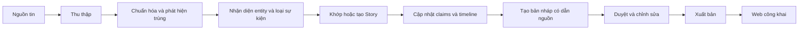

# FootballPulse

**FootballPulse — Automated Football News Intelligence Platform** là đồ án xây
dựng nền tảng tự động thu thập, tổng hợp và xuất bản tin tức bóng đá. Hệ thống
biến nhiều bài báo rời rạc thành các `Story` có diễn biến, bằng chứng và mức độ
xác thực rõ ràng, sau đó hỗ trợ biên tập viên tạo, duyệt và xuất bản bài tổng hợp.

> Tên đề tài: Thiết kế và xây dựng nền tảng tự động thu thập, tổng hợp và xuất
> bản tin tức bóng đá theo kiến trúc microservices<br>
> Sinh viên: Phùng Minh Vũ — 20235252

## Trạng thái tài liệu

Bộ tài liệu này mô tả **thiết kế mục tiêu của MVP**, không khẳng định hệ thống
đã được triển khai. Repository hiện có giao diện React/Vite dạng mock; các
backend service, tích hợp dữ liệu, hạ tầng và luồng end-to-end vẫn là công việc
tương lai. Python là ngôn ngữ chính dự kiến cho backend và worker.

## Bài toán

Tin bóng đá thường bị đăng lặp lại, phân tán giữa nhiều nguồn và thay đổi theo
thời gian. Một tin đồn chuyển nhượng có thể dần được nhiều nguồn xác nhận rồi
trở thành thông báo chính thức. FootballPulse cần giữ nguyên từng nguồn như
bằng chứng, nhận biết chúng nói về cùng một sự kiện và kể lại diễn biến mà
không làm sai lệch mức độ chắc chắn.

Ba khái niệm không được đồng nhất:

```text
Source Article != Story != Generated Article
```

- **Source Article**: bản ghi bất biến của bài viết gốc, dùng làm bằng chứng.
- **Story**: sự kiện bóng đá đang phát triển, liên kết nhiều nguồn và claims.
- **Generated Article**: nội dung tổng hợp được tạo từ Story và phải qua biên tập.

## Luồng MVP



## Phạm vi MVP

MVP ưu tiên một vertical slice chạy được hoàn toàn trên localhost và không cần
Internet hay khóa LLM bên ngoài. Luồng phải bao phủ thu thập, chuẩn hóa, exact/
near duplicate, entity, phân loại sự kiện, Story, tạo nội dung deterministic,
duyệt, publish và hiển thị web.

Các hạng mục như vector database, recommendation, social feature, Kubernetes,
live score, search engine nâng cao và tự động publish nội dung độ tin cậy thấp
không thuộc MVP.

## Bản đồ tài liệu

| Tài liệu | Nội dung |
| --- | --- |
| [Tổng quan](docs/overview.md) | Tầm nhìn, giá trị và ranh giới sản phẩm |
| [Yêu cầu](docs/requirements.md) | Yêu cầu chức năng, phi chức năng và tiêu chí thành công |
| [Kiến trúc](docs/architecture.md) | Thành phần, trách nhiệm, tương tác và reliability |
| [Mô hình dữ liệu](docs/data-model.md) | Entity logic, quan hệ và invariant |
| [Thiết kế Story](docs/story-design.md) | Matching, claims, timeline và confirmation |
| [Luồng nội dung](docs/content-flow.md) | Từ nguồn tin đến bài tổng hợp |
| [Thiết kế API](docs/api-design.md) | Các capability HTTP/event ở mức logic |
| [Luồng biên tập](docs/editorial-flow.md) | Revision, duyệt, từ chối và publish |
| [Triển khai](docs/deployment.md) | Mô hình localhost/offline và hướng mở rộng |
| [Kiểm thử](docs/testing.md) | Chiến lược test và kịch bản demo |
| [Câu hỏi mở](docs/open-questions.md) | Các quyết định cần xác nhận sau |

## Nguyên tắc thiết kế

- Story là trung tâm của trải nghiệm tổng hợp, nhưng Source Article mới là bằng
  chứng gốc.
- Không xóa nguồn chỉ vì trùng; chỉ ghi rõ quan hệ duplicate.
- Không nâng mức độ chắc chắn khi nguồn không hỗ trợ.
- Mỗi module có một trách nhiệm nghiệp vụ và sở hữu dữ liệu của mình.
- Luồng bất đồng bộ phải chịu được giao hàng lặp; không tuyên bố exactly-once.
- Mock source và mock generator deterministic là thành phần bắt buộc của demo.

## Hướng phát triển

Thiết kế được chia theo ba chặng: hoàn thiện ingestion và contracts; xây dựng
Story cùng editorial backend; cuối cùng nối web, hạ tầng localhost, kiểm thử
recovery và demo end-to-end. Các lệnh build, migration, khởi động và demo chỉ
được công bố là hỗ trợ sau khi đã được triển khai và chạy xác minh.
