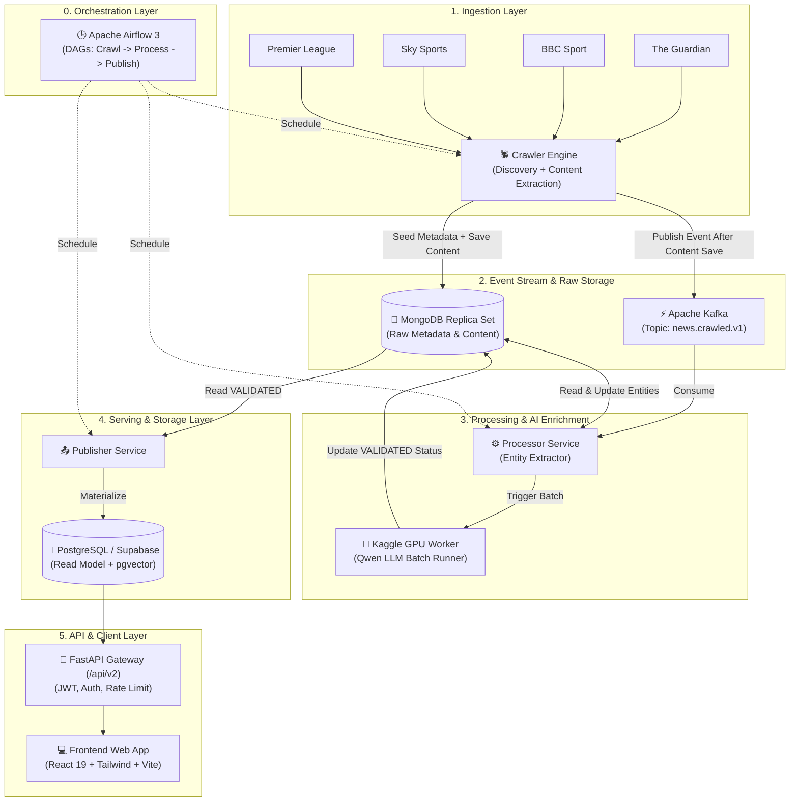

# ⚽ FootballPulse (Version 2)

> **Nền tảng tổng hợp, phân tích và làm giàu tin tức bóng đá đa nguồn ứng dụng Trí tuệ Nhân tạo (AI-Driven Football News Intelligence Platform)**

[](https://python.org)
[](https://fastapi.tiangolo.com)
[](https://react.dev)
[](https://kafka.apache.org)
[](https://mongodb.com)
[](https://postgresql.org)
[](https://airflow.apache.org)

---

## 🌐 Live Demo & Deployment

| Thành phần | Nền tảng | Trạng thái & Đường dẫn |
| :--- | :--- | :--- |
| **Frontend Web App** | **Vercel** | 🔗 **[https://your-footballpulse-app.vercel.app](https://your-footballpulse-app.vercel.app)** *(← Dán Vercel Deployment URL của bạn vào đây sau khi deploy)* |
| **Backend API Gateway** | **Render** / Local | `https://<your-render-backend-url>` / `http://localhost:8000/api/v2` |
| **Public Serving Database** | **Supabase** / Postgres | PostgreSQL 17 + pgvector Extension |
| **Data Pipeline Engine** | **Local / Docker** | Airflow 3 + Kafka + Mongo + Kaggle GPU (Qwen LLM) |

> 📌 **Vị trí cấu hình Vercel URL**: Sau khi deploy frontend lên Vercel, hãy thay thế đường link demo phía trên và cập nhật biến `VITE_API_BASE_URL` trỏ tới Backend API của bạn.

---

## 📖 Giới thiệu Dự án

**FootballPulse v2** là hệ thống tin tức bóng đá thông minh theo mô hình **Hybrid Data Platform**:
- **Tự động thu thập (Ingestion)**: Khám phá bài viết mới từ RSS, sitemap hoặc listing HTML; seed metadata vào Mongo trước khi crawl nội dung đầy đủ.
- **Xử lý sự kiện phân tán (Event-Driven Stream)**: Đẩy thông tin qua Apache Kafka (`news.crawled.v1`) để phân phối đến các worker xử lý bất đồng bộ.
- **Trích xuất thực thể & Làm giàu dữ liệu bằng AI (AI Enrichment)**: Trích xuất thực thể bóng đá (*CLB, Cầu thủ, Giải đấu*) và kết hợp **Kaggle GPU (Qwen LLM)** để tóm tắt thông tin, kiểm định sự thật và tạo các nhận định đa chiều.
- **Read Model tối ưu cho Serving**: Dữ liệu đã kiểm định (`VALIDATED`) được materialize sang PostgreSQL (hoặc Supabase) với `pgvector` phục vụ tìm kiếm ngữ nghĩa và Timeline sự kiện.
- **Phục vụ đa kênh**: Cung cấp dữ liệu qua **FastAPI Gateway** bảo mật cao (JWT, Rate Limiting, RBAC) và giao diện **React 19 + Tailwind CSS** hiện đại.

---

## 🏛️ Kiến trúc Hệ thống (System Architecture)

Hệ thống được thiết kế tách biệt hoàn toàn giữa **Data Pipeline (Local/Compute heavy)** và **Serving Layer (Cloud/Scalable)**:



---

## 🔄 Luồng Dữ Liệu Chi Tiết (Pipeline / Data Flow)

Hệ thống vận hành tuần tự qua 5 giai đoạn cốt lõi:

```text
[Nguồn Tin Tức]
       │
       ▼ (1a. Discovery / Metadata Seeding)
[MongoDB: news_metadata]
       │
       ▼ (1b. Content Extraction)
[MongoDB: news_content] ──(Bắn Event sau khi lưu content)──► [Kafka: news.crawled.v1]
                                                                  │
       ┌──────────────────────────────────────────────────────────┘
       ▼ (2. Process & Entity Extraction)
[MongoDB: news_entities]
       │
       ▼ (3. AI Enrichment via Kaggle GPU)
[MongoDB: news_enrichments (Trạng thái VALIDATED)]
       │
       ▼ (4. Publish / Materialize)
[PostgreSQL / Supabase (Bảng: articles, stories, sources, publications)]
       │
       ▼ (5. Serve)
[FastAPI Gateway (/api/v2)] ──► [React Frontend UI]
```

1. **Giai đoạn 1: Crawl tin tức (Crawler)**
   - Bước 1 discovery đọc RSS, sitemap hoặc listing HTML để lấy URL ứng viên mới.
   - Crawler canonicalize URL, sinh `article_id`, lọc trùng và seed metadata vào `news_metadata`.
   - Bước 2 lấy các record chưa có `news_content`, fetch HTML, extract text và lưu `news_content`.
   - Chỉ sau khi lưu content thành công mới phát sự kiện `news.crawled.v1` vào Kafka.
2. **Giai đoạn 2: Trích xuất thực thể (Entity Processing)**
   - Processor consume message từ Kafka.
   - Nhận diện CLB, Cầu thủ, Giải đấu (NER) và lưu vào `news_entities`.
3. **Giai đoạn 3: AI Làm giàu dữ liệu (AI Enrichment)**
   - Gom các bài viết chưa qua xử lý AI thành batch đẩy lên **Kaggle GPU**.
   - Model **Qwen LLM** tóm tắt bài báo, trích xuất sự kiện cốt lõi (claims) và phân tích ngữ nghĩa.
   - Đánh dấu trạng thái `validation_status = "VALIDATED"` vào MongoDB `news_enrichments`.
4. **Giai đoạn 4: Xuất bản dữ liệu (Publishing)**
   - Publisher đọc các bản ghi đã `VALIDATED` từ MongoDB.
   - Chuẩn hóa và ghi (materialize) vào PostgreSQL / Supabase theo mô hình quan hệ (`articles`, `stories`, `sources`, `publications`).
5. **Giai đoạn 5: Cung cấp API & Giao diện (Serving)**
   - FastAPI Gateway truy vấn từ PostgreSQL cung cấp RESTful endpoints chuẩn `/api/v2/...`.
   - Frontend hiển thị tin tức, bảng tin, timeline câu chuyện và bộ lọc thực thể.

---

## 📁 Cấu Trúc Thư Mục Dự Án

```text
footballpulse/
├── airflow/                  # Cấu hình & DAGs điều phối tự động (Apache Airflow 3)
│   └── dags/                 # Các DAGs: crawl, process, publish
├── contracts/                # Định nghĩa schema sự kiện Kafka (Avro / JSON Schema)
├── docs/                     # Tài liệu thiết kế, kiến trúc và hướng dẫn
│   ├── HUONG_DAN_CHAY.md     # 👉 HƯỚNG DẪN CHẠY CHI TIẾT (Docker, Localhost, All-in-one)
│   └── version2/             # Tài liệu chi tiết Version 2 (DB schema, API contract, ADR)
├── frontend/                 # Giao diện người dùng (React 19, Vite, Tailwind CSS)
├── infrastructure/           # Script khởi tạo cơ sở dữ liệu (MongoDB, PostgreSQL)
├── kaggle/                   # Mã nguồn & Notebook chạy AI Enrichment trên GPU Kaggle
├── packages/                 # Thư viện Python nội bộ dùng chung
│   ├── event-contracts/      # Event Envelopes & Kafka Message Models
│   ├── mongo-models/         # MongoDB Documents Schema
│   ├── pipeline/             # Core Pipeline CLI & V2 Enrichment Runtime
│   ├── runtime-config/       # Cấu hình Settings, Logging, ASGI helpers
│   └── shared/               # Identity, UUID & Utility helpers
├── scripts/                  # Scripts vận hành, smoke test & crawler thực tế
├── services/                 # Mã nguồn các Microservices
│   ├── ai-content-service/   # Logic xử lý Entity, Kafka Consumer & AI Backlog
│   ├── api-gateway/          # FastAPI Gateway (Public v2, Admin, Auth, Health)
│   ├── crawler-service/      # Logic Crawler đa nguồn
│   └── publisher-service/    # Logic đồng bộ Mongo sang PostgreSQL
├── supabase/                 # Database Migrations cho PostgreSQL / Supabase
├── docker-compose.v2.yml     # Docker Compose full-stack cho toàn bộ hệ thống
└── pyproject.toml            # Quản lý dependencies & Python Workspace (uv)
```

---

## 🚀 Hướng Dẫn Chạy Nhanh (Quick Start)

> 📘 **Xem tài liệu đầy đủ & chi tiết từng bước tại:** **[Hướng Dẫn Vận Hành & Chạy Dự Án](docs/HUONG_DAN_CHAY.md)**

### Cách 1: Chạy Full Dự Án trong 1 Command duy nhất (Khuyên dùng)

```bash
# 1. Tạo file cấu hình môi trường
cp .env.example .env

# 2. Khởi động toàn bộ stack bằng 1 lệnh duy nhất:
docker compose -f docker-compose.v2.yml up -d --build
```

### Các Endpoint chính sau khi khởi động:
- 🌐 **Frontend UI**: [http://localhost:5173](http://localhost:5173) (Chạy bằng `npm run dev` trong `frontend/`)
- 🚀 **Backend API Docs (Swagger)**: [http://localhost:8000/docs](http://localhost:8000/docs)
- 📊 **Airflow Orchestrator UI**: [http://localhost:8080](http://localhost:8080)
- 🍃 **MongoDB Replica Set**: `mongodb://localhost:27117/?replicaSet=rs0`
- 🐘 **PostgreSQL**: `localhost:15432` (`user: footballpulse`, `db: footballpulse_v2`)
- ⚡ **Apache Kafka**: `localhost:19092`

---

## 🛠️ Hướng Dẫn Deploy

### 1. Deploy Frontend lên Vercel
1. Đẩy code lên GitHub.
2. Truy cập [Vercel Dashboard](https://vercel.com) -> **Add New Project** -> Chọn repository.
3. Cấu hình cài đặt:
   - **Root Directory**: `frontend`
   - **Framework Preset**: `Vite`
   - **Build Command**: `npm run build`
   - **Output Directory**: `dist`
   - **Environment Variables**:
     ```ini
     VITE_API_BASE_URL=https://<your-backend-api-url>
     ```
4. Bấm **Deploy** và dán URL nhận được vào phần [Live Demo](#-live-demo--deployment) của README này!

### 2. Deploy Backend API lên Render
1. Tạo Web Service mới trên Render từ repo này.
2. Cấu hình:
   - **Root Directory**: Để trống (thư mục gốc).
   - **Environment**: `Python 3`
   - **Start Command**:
     ```bash
     PYTHONPATH=packages/pipeline/src:packages/runtime-config/src:packages/event-contracts/src:services/api-gateway/src:services/content-service/src:services/ai-content-service/src:services/crawler-service/src:services/intelligence-service/src:services/publisher-service/src python -m footballpulse_api_gateway.runtime_v2
     ```
   - **Environment Variables**: Điền thông tin kết nối Supabase PostgreSQL và API JWT keys từ file `.env.example`.

---

## 📜 Giấy phép & Đóng góp
Dự án phục vụ mục đích nghiên cứu, học tập và phát triển cá nhân. Mọi đóng góp và phản hồi vui lòng tạo Issue hoặc Pull Request.
