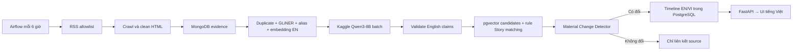

# FootballPulse

**FootballPulse — Automated Football News Intelligence Platform** là đồ án xây
dựng nền tảng tự động thu thập, hiểu, tổng hợp và xuất bản tin tức bóng đá.
Nhiều bài báo rời rạc được giữ làm bằng chứng, gom vào `Story`, chuyển thành
timeline có mức xác thực và bài tổng hợp qua editorial review.

> Tên đề tài: Thiết kế và xây dựng nền tảng tự động thu thập, tổng hợp và xuất
> bản tin tức bóng đá theo kiến trúc microservices<br>
> Sinh viên: Phùng Minh Vũ — 20235252

## Trạng thái

Tài liệu hiện mô tả **thiết kế mục tiêu đã chốt**, không khẳng định backend,
Kaggle integration, database, Kafka, Airflow hoặc Docker Compose đã hoạt động.
Frontend React/Vite hiện có vẫn là mock. Exact build/start/migration/demo command
chỉ được công bố sau khi implementation và verification tồn tại.

## Python workspace

Yêu cầu Python 3.12 và [`uv`](https://docs.astral.sh/uv/). Thiết lập môi trường
phát triển và chạy quality gates ở repository root:

```bash
uv sync --all-packages --locked
uv run pytest tests/smoke -q
uv run ruff format --check .
uv run ruff check .
uv run mypy
```

Root project chỉ quản lý workspace và công cụ phát triển, không chứa business
package. Package riêng của từng service sẽ được bổ sung ở phase tiếp theo.

## Invariant trung tâm

```text
Source Article != Story != Generated Article
```

- **Source Article**: evidence bất biến từ một article version của nguồn.
- **Story**: sự kiện bóng đá đang phát triển, có canonical entities, claims,
  confirmation và timeline.
- **Generated Article**: nội dung biên tập song ngữ, chỉ sinh từ supported claims.

## Pipeline local-first



English là dữ liệu chuẩn cho AI validation, search, embedding và Story logic.
Vietnamese được materialize trong PostgreSQL để API trả nhanh cho toàn bộ giao
diện. MongoDB giữ raw HTML, cleaned English content, immutable article versions
và enrichment; PostgreSQL giữ source config, entity catalog, Story, claims,
timeline, editorial và public read model.

## Công nghệ mục tiêu

- Python 3.12, FastAPI/Pydantic và sáu backend service.
- Kafka single-node KRaft; Airflow 3 chỉ điều phối batch.
- MongoDB replica set cho evidence; PostgreSQL + pgvector cho product data.
- Redis cho cache/rate limit tạm thời.
- Trafilatura/BeautifulSoup cho HTML extraction.
- GLiNER multi-v2.1 và `bge-small-en-v1.5` chạy local.
- Qwen3-8B 4-bit chạy batch trên Kaggle; Qwen3-4B GGUF local là fallback.
- React/Vite và Docker Compose profiles `core`, `airflow`, `demo`, `tools`.

## Quy tắc timeline

- Pipeline chạy các cửa sổ `00`, `06`, `12`, `18` giờ Việt Nam.
- Chỉ tạo entry khi có claim mới/thay đổi, correction hoặc confirmation đổi.
- Một Story có tối đa một aggregated entry cho mỗi cửa sổ 6 giờ.
- Article mới nhưng không có material change vẫn được lưu/liên kết; timeline
  không thêm dòng.
- Timeline hợp lệ tự hiển thị; Generated Article dài phải qua review/approve.

## Bản đồ tài liệu

| Tài liệu | Nội dung |
| --- | --- |
| [Tổng quan](docs/overview.md) | Tầm nhìn, người dùng và phạm vi |
| [Yêu cầu](docs/requirements.md) | Yêu cầu và tiêu chí chấp nhận |
| [Kiến trúc](docs/architecture.md) | Service, công nghệ, ownership, Airflow/Kafka |
| [Mô hình dữ liệu](docs/data-model.md) | MongoDB/PostgreSQL aggregates và invariants |
| [Story và timeline](docs/story-design.md) | pgvector hybrid matching, claims, cửa sổ 6 giờ |
| [Luồng nội dung](docs/content-flow.md) | Crawl, clean, Kaggle AI, validation và generation |
| [API và event](docs/api-design.md) | Public/admin capabilities và event catalog |
| [Biên tập](docs/editorial-flow.md) | Timeline automation và long-form review/publish |
| [Triển khai](docs/deployment.md) | Local topology, profiles, resources và offline mode |
| [Kiểm thử](docs/testing.md) | Deterministic acceptance, failure và recovery |
| [Open Questions](docs/open-questions.md) | Các quyết định còn cần benchmark/contract |
| [ADR local-first AI pipeline](docs/decisions/0001-local-first-ai-pipeline.md) | Lý do và hệ quả của thiết kế đã chốt |
| [Implementation plan](docs/plans/2026-08-06-footballpulse-implementation.md) | 9 phase, Work Packages và Collaboration Gates |

## Ngoài MVP

Arbitrary-site crawling, Kubernetes/cloud production, separate vector database,
recommendation, social features, comments, live scores, advanced search cluster,
full multilingual processing và autonomous long-form publication không thuộc MVP.
