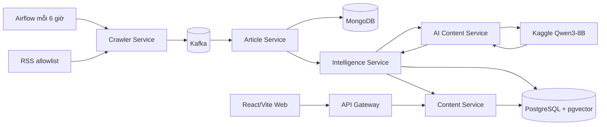
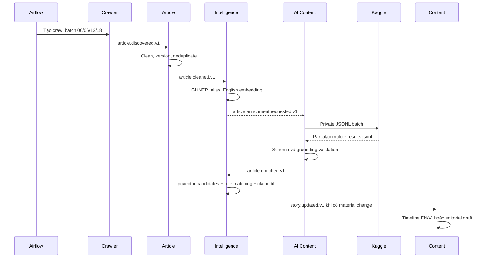

# Kiến trúc logic

## 1. Trạng thái và phạm vi

Đây là **kiến trúc mục tiêu local-first**, chưa mô tả một hệ thống đã được triển
khai hoặc smoke-test. FootballPulse chạy chủ yếu trên một máy bằng Docker
Compose; Kaggle là compute mở rộng cho AI batch và không phải nguồn dữ liệu
chuẩn. Mock AI bảo đảm demo vẫn chạy offline.

## 2. Pipeline tổng thể



Airflow điều phối **batch**, Kafka vận chuyển business event, còn Python worker
xử lý article liên tục. Không tạo Airflow task cho từng article và không giữ
Kafka consumer chờ một Kaggle job dài.

## 3. Sáu backend service

| Service | Trách nhiệm | Dữ liệu sở hữu |
| --- | --- | --- |
| `api-gateway` | Public/admin entry point, auth, RBAC, validation | Identity và cross-cutting HTTP state |
| `crawler-service` | RSS configuration, crawl batch, bounded HTTP fetching, retry | Source/crawl records trong PostgreSQL |
| `article-service` | Clean HTML, immutable versions, URL/exact/near duplicate | Source Article và duplicate links trong MongoDB |
| `intelligence-service` | GLiNER, alias, embedding, claims, Story matching, change detection | Entity, Story, claims và timeline state trong PostgreSQL |
| `ai-content-service` | Kaggle batch, Qwen output import/validation, local/mock fallback | Enrichment/generation attempts trong MongoDB/PostgreSQL theo aggregate |
| `content-service` | Timeline projection, drafts, revisions, editorial và publication | Content/public read model trong PostgreSQL |

`intelligence-service` thực hiện Story Engine vì entity, claim, matching và
Story update cần chung transaction. Không tách các helper này thành network
service riêng.

## 4. Công nghệ mục tiêu

| Capability | Lựa chọn |
| --- | --- |
| Backend | Python 3.12, FastAPI, Pydantic |
| Event | Apache Kafka single-node KRaft cho localhost |
| Workflow | Airflow 3 với executor local nhẹ, chưa chốt trước smoke test |
| Evidence | MongoDB single-node replica set |
| Product/read model | PostgreSQL + `pgvector` |
| Cache/rate limit | Redis, không làm source of truth |
| HTML extraction | Trafilatura; BeautifulSoup fallback theo source |
| Entity extraction | `urchade/gliner_multi-v2.1` chạy local |
| Embedding | `BAAI/bge-small-en-v1.5` chạy local, chỉ cho English |
| AI chính | Qwen3-8B quantized 4-bit chạy batch trên Kaggle |
| AI fallback | Qwen3-4B GGUF `Q4_K_M` chạy local, concurrency 1 |
| Web | React/Vite hiện có |

## 5. Luồng tương tác chính



## 6. Airflow workflows

- `footballpulse_collection`: chạy `00:00`, `06:00`, `12:00`, `18:00` theo
  `Asia/Ho_Chi_Minh`; tạo batch, trigger collector, chờ và đóng batch.
- `footballpulse_ai_enrichment`: chọn article `AI_PENDING`, tạo private Kaggle
  dataset, trigger/poll notebook, tải và validate output, phát event kết quả.
- `footballpulse_reprocess`: chạy thủ công theo article/story/model version;
  không query chéo database ngoài API/port của owner.

Một `batch_id` và `correlation_id` xuyên suốt crawl, AI, Story và timeline để
Admin Dashboard truy vết được từng outcome.

## 7. Ownership và ngôn ngữ

- MongoDB lưu raw HTML, cleaned English content, immutable article versions và
  English enrichment. Full evidence không được copy sang PostgreSQL.
- PostgreSQL lưu source configuration, canonical entities, Story, claims,
  embeddings, timeline English/Vietnamese, editorial và public read model.
- English là dữ liệu chuẩn cho search, embedding, matching và change detection.
- Vietnamese là projection được chuẩn bị sẵn trong PostgreSQL để API trả nhanh;
  không embed hoặc dùng bản Việt để quyết định Story.
- Frontend không query MongoDB và không gọi AI khi render trang.

## 8. Event và reliability

Topic diễn tả business event, không diễn tả database đích:

```text
article.discovered.v1
article.cleaned.v1
article.enrichment.requested.v1
article.enriched.v1
story.updated.v1
timeline.created.v1
```

Kafka được giả định giao ít nhất một lần. Consumer lưu `event_id`, dùng stable
business key, chỉ commit offset sau durable write. State change cần phát event
dùng outbox khi storage cho phép. Mỗi input retryable có tối đa một retry topic
và một DLQ; không tuyên bố global ordering hoặc exactly-once toàn hệ thống.

Crawler và Article Service bàn giao body qua local artifact spool, không qua
Kafka. Artifact ID là UUID opaque; directory write nguyên tử, HTML tối đa 5 MB,
projection tối đa 1 MB và read path xác minh SHA-256. Đây là adapter local-first;
deployment nhiều node phải thay bằng object storage mà giữ nguyên port/contract.

## 9. Local-first boundary

Compose được chia profile `core`, `airflow`, `demo`, `tools`. Kafka một broker,
MongoDB một replica set local và PostgreSQL một node là đủ cho đồ án, không phải
topology production chịu lỗi. Qwen3-8B chạy ngoài máy trên Kaggle; fallback 4B
chỉ được nạp khi cần. Credential Kaggle nằm trong secret/environment, tuyệt đối
không hard-code trong image hoặc repository.
