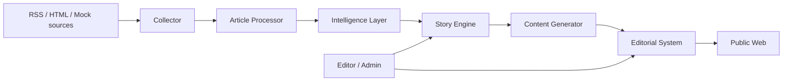
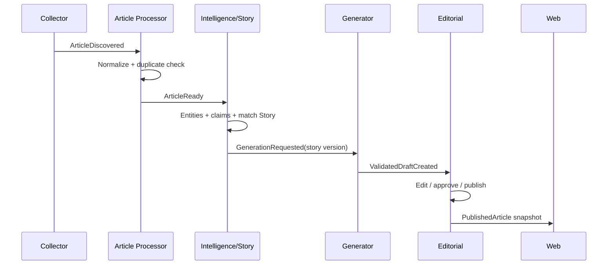

# Kiến trúc logic

## 1. Trạng thái và cách đọc

Đây là **kiến trúc mục tiêu**, không phải mô tả deployment đã hoạt động. Tên
service thể hiện ranh giới trách nhiệm; trong giai đoạn đầu, domain logic có thể
được kiểm thử bằng adapter in-memory trước khi nối hạ tầng thật.

## 2. Context tổng thể

Pipeline nghiệp vụ đi qua event bất đồng bộ để mỗi thành phần có thể xử lý,
retry và mở rộng độc lập. HTTP phù hợp với query hoặc command cần phản hồi ngay,
như mở draft hay approve; event phù hợp với thay đổi trạng thái giữa các service.

## 3. Các module chính

| Module logic | Trách nhiệm | Không chịu trách nhiệm |
| --- | --- | --- |
| API Gateway | Public/admin entry point, auth, RBAC, validation, routing | Article, Story hay publish logic |
| Collector | Source policy, crawl batch, bounded fetching, retry | Chuẩn hóa nghiệp vụ hoặc Story |
| Article Processor | Evidence, normalization, duplicate relationships | Phân loại sự kiện và viết bài |
| Intelligence Layer | Entity, alias, category, claims | Nội dung biên tập |
| Story Engine | Candidate matching, Story, timeline, confirmation | Lưu full source body |
| Content Generator | Draft có cấu trúc từ claims đã hỗ trợ | Tự quyết định publish |
| Editorial System | Revision, audit, state transition, publication | Sửa bằng chứng gốc |
| Web App | Public/admin experience | Sao chép business rule backend |

Trong deployment mục tiêu, Intelligence Layer và Story Engine có thể cùng nằm
trong `intelligence-service` vì chúng chia sẻ transaction và domain model.

## 4. Luồng tương tác

## 5. Ownership dữ liệu

- Collector sở hữu source configuration và crawl history.
- Article Processor sở hữu Source Article, processing record và duplicate link.
- Intelligence/Story sở hữu entity, alias, Story, claim và timeline.
- Generator sở hữu generation job, attempt và validation metadata.
- Editorial sở hữu draft, revision, editorial action và publication.
- Web chỉ đọc public projection; không trở thành nguồn dữ liệu chuẩn.

Service không query trực tiếp dữ liệu riêng của service khác. Nó nhận snapshot
cần thiết qua event hoặc gọi API được công bố. Redis, cache hay read model không
bao giờ là nguồn dữ liệu chuẩn.

## 6. Reliability model

Event được giả định giao **ít nhất một lần**. Consumer lưu `event_id`, áp dụng
unique constraint hoặc stable business key, chỉ xác nhận sau khi state bền vững
được ghi. Khi thay đổi state cần phát event, dùng transactional outbox ở ranh
giới storage hỗ trợ. Outbox có thể phát lặp nên consumer vẫn phải idempotent.

Lỗi được chia thành retryable, non-retryable và cần operator/editor. Retry có
giới hạn với backoff; poison message cuối cùng vào nơi inspect/replay được và
không chặn partition vô thời hạn. Không có cam kết global ordering hay
system-wide exactly-once.

## 7. Bảo mật và an toàn

Collector chỉ dùng HTTP/HTTPS và domain allowlist, kiểm tra IP sau DNS và mỗi
redirect, giới hạn redirect/body/timeout. Loopback/private address chỉ được
cho phép trong mock mode rõ ràng. API admin dùng authentication, RBAC, body
limit, rate limit và error envelope nhất quán. Log không chứa secret hoặc toàn
bộ nội dung bài scrape.

## 8. Lựa chọn kiến trúc

Kiến trúc microservices được dùng để thể hiện ownership và pipeline bất đồng
bộ của đề tài, nhưng MVP giữ số service nhỏ. Không tách helper thành network
service, không thêm vector store/search cluster, và không dùng hai queue cho
cùng một job. Khi triển khai, Python domain code nên phụ thuộc vào protocol nhỏ
để adapter HTTP, Kafka, database và mock có thể thay thế mà không đổi nghiệp vụ.
