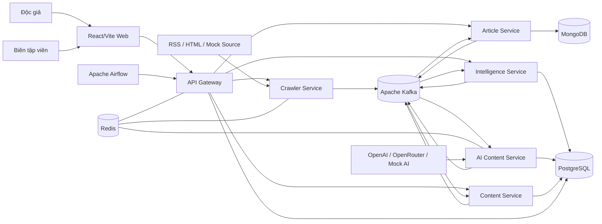
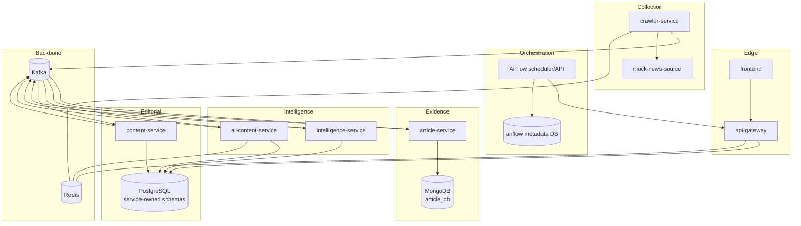
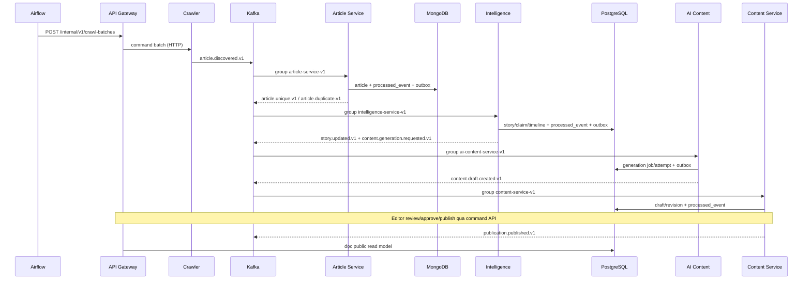

# Kiến trúc đề xuất cho FootballPulse

Tài liệu này là thiết kế mục tiêu, chưa mô tả hệ thống đã được triển khai. Kế
hoạch tổng và thứ tự triển khai nằm tại
[`implementation-plan.md`](./implementation-plan.md).

## 1. Các quyết định kiến trúc

| Quyết định | Lựa chọn | Lý do và đánh đổi |
| --- | --- | --- |
| Backend runtime | Python 3.12 | Được Airflow hiện tại hỗ trợ, hệ sinh thái NLP/AI tốt, ít rủi ro tương thích hơn việc dùng phiên bản Python mới nhất ngay trong dự án ba tuần. Cần xác nhận bằng lockfile khi khởi tạo. |
| Quản lý Python | `uv` workspace, một `uv.lock` | Các service vẫn có `pyproject.toml` và dependency riêng, nhưng cùng một lockfile để tái lập môi trường. `uv` hỗ trợ workspace nhiều package và chạy theo package. |
| HTTP framework | FastAPI + Pydantic | Async phù hợp I/O, OpenAPI tự động, validation tại boundary, dễ test bằng ASGI client. Không đặt business logic trong route. |
| Kafka client | `confluent-kafka` | Client được duy trì bởi Confluent/librdkafka, có delivery callback, idempotent producer và manual commit. Poll loop là synchronous nên mỗi consumer chạy trong worker process/thread riêng, không chia sẻ consumer giữa thread. |
| Event schema | JSON Schema Draft 2020-12 + Pydantic models | Dễ đọc, version trong Git, phù hợp ba tuần và không cần Schema Registry. Trade-off: kém compact hơn Protobuf; Schema Registry là P1. |
| MongoDB client | PyMongo Async (`AsyncMongoClient`) | MongoDB khuyến nghị thay Motor bằng PyMongo Async; phù hợp FastAPI. Không dùng ODM để tránh thêm lớp abstraction và migration không rõ ràng cho document. |
| PostgreSQL | SQLAlchemy 2 async + `psycopg` + Alembic | Transaction rõ ràng, ORM/Core linh hoạt, migration có ownership theo service. Tránh implicit lazy load trong async. |
| Redis | `redis-py` asyncio | Một client chính thức, hỗ trợ async và pool; dùng cho rate limit/cache, không làm nguồn dữ liệu chuẩn. |
| HTTP client | HTTPX async | Pool, timeout, redirect control và test transport thuận tiện cho crawler/provider adapters. |
| AI provider | Adapter riêng cho OpenAI, OpenRouter và Mock | Domain không phụ thuộc SDK; mọi response được parse sang cùng Pydantic schema. Mock là mặc định cho demo. |
| ARQ | Không dùng trong MVP | Kafka consumer trực tiếp đơn giản hơn và tránh hai queue cùng sở hữu lifecycle. Chỉ đánh giá lại nếu một generation job thật sự cần fan-out nội bộ bền vững. |
| Frontend | Giữ React 19 + Vite 8 + React Router 8 hiện có | Repo đã có public/admin UI và `pnpm-lock.yaml`. Không chuyển sang Next.js trong MVP vì sẽ tốn thời gian và không tạo giá trị cho pipeline. SEO SSR là P2. |
| Airflow | Airflow 3, scheduler + API server, executor nhẹ cho local | DAG chỉ gọi API/command cấp batch. Không tạo task theo article. Airflow có metadata DB riêng. Cấu hình executor cụ thể phải được xác nhận khi Compose được triển khai. |
| Publication schedule | Loại khỏi MVP | State chính là `DRAFT → NEEDS_REVIEW → APPROVED/REJECTED → PUBLISHED`. `SCHEDULED` là P1. |
| Observability local | JSON logs + health/readiness + operational read models | Không dùng Prometheus hoặc Grafana. Admin dashboard đọc counters/failures từ PostgreSQL; Kafka UI chỉ là công cụ local tùy chọn. |

Nguồn chính thức đã đối chiếu:

- [uv workspaces](https://docs.astral.sh/uv/concepts/projects/workspaces/) dùng
  một lockfile cho nhiều package.
- [FastAPI async](https://fastapi.tiangolo.com/async/) và
  [middleware](https://fastapi.tiangolo.com/tutorial/middleware/).
- [Confluent Kafka Python client](https://docs.confluent.io/kafka-clients/python/current/overview.html)
  mô tả delivery guarantee và manual offset handling.
- [PyMongo Async migration](https://www.mongodb.com/docs/languages/python/pymongo-driver/current/reference/migration/)
  nêu PyMongo Async thay thế Motor.
- [SQLAlchemy asyncio](https://docs.sqlalchemy.org/en/20/orm/extensions/asyncio.html)
  và [redis-py asyncio](https://redis.readthedocs.io/en/stable/examples/asyncio_examples.html).
- [Airflow DAG](https://airflow.apache.org/docs/apache-airflow/stable/core-concepts/dags.html)
  và [Airflow prerequisites](https://airflow.apache.org/docs/apache-airflow/stable/installation/prerequisites.html).
- [OpenRouter structured outputs](https://openrouter.ai/docs/guides/features/structured-outputs).

Các phiên bản package chính xác chưa được chọn hoặc cài. Chúng phải được pin
bằng `uv.lock` trong Task 1 của kế hoạch.

## 2. Context diagram



## 3. Container/service diagram và data ownership



Một PostgreSQL server local chứa các schema riêng:

- `identity_schema`: user, role và refresh-session cho gateway.
- `source_schema`: source configuration, crawl batch/run/attempt.
- `intelligence_schema`: entity, alias, story, claim, timeline và source refs.
- `ai_content_schema`: generation job/attempt và provider usage.
- `content_schema`: draft, revision, editorial action, publication, public read
  model và search.
- `airflow`: metadata do Airflow sở hữu, không được service nghiệp vụ query.

`Article Service` sở hữu MongoDB. Các service khác chỉ nhận source snapshot cần
thiết trong event; khi cần full evidence thì gọi internal Article API, không
query collection trực tiếp.

## 4. Luồng chính



Quy tắc:

- Airflow quyết định workflow nào chạy và khi nào.
- Kafka vận chuyển từng business event giữa service.
- HTTP chỉ dùng cho command/query cần phản hồi tức thời hoặc lấy chi tiết.
- Không có service poll database của service khác để tìm việc mới.
- Không có chuỗi synchronous xuyên nhiều service cho mỗi public page load.

## 5. Service responsibility matrix

| Service | Trách nhiệm và data sở hữu | Input | Output | Worker/dependency | Reliability và health | Test chính |
| --- | --- | --- | --- | --- | --- | --- |
| `api-gateway` | Auth/RBAC, public/admin API façade, middleware; `identity_schema`; đọc `content_schema.public_*` | HTTP public/admin/internal | HTTP; crawl command tới Crawler; domain command tới owners | FastAPI, PostgreSQL, Redis | Timeout downstream; idempotency key cho command; `/health/live`, `/health/ready` kiểm tra PG/Redis có phân loại | Middleware, auth/RBAC, error envelope, pagination, rate limit, API contract |
| `crawler-service` | Source config/crawl batch trong `source_schema`; bounded async fetch; SSRF/rate limit | `POST /internal/v1/crawl-batches`; source config | `article.discovered.v1`, crawl status | HTTPX, Kafka producer, PostgreSQL, Redis | Producer delivery callback trước khi đánh dấu queued; retry 429/5xx/timeout; `/ready` kiểm Kafka/PG | URL safety, backoff, Retry-After, concurrency, failure fixtures |
| `article-service` | Evidence, normalize, duplicate trong MongoDB | `article.discovered.v1`; internal GET/reprocess | `article.unique.v1`, `article.duplicate.v1`, failure events | Kafka consumer/outbox publisher, PyMongo Async | Manual commit sau DB transaction/outbox; event idempotency; `/ready` Mongo/Kafka | normalization, indexes, duplicate, outbox crash recovery |
| `intelligence-service` | Entity/alias/story/claim/timeline trong `intelligence_schema` | `article.unique.v1`; correction/merge commands | `story.created.v1`, `story.updated.v1`, `content.generation.requested.v1` | Kafka consumer/outbox publisher, PostgreSQL | Unique fingerprint + optimistic version; processed event; retry serialization/version conflict | alias, extraction, score, merge, concurrent story update |
| `ai-content-service` | Generation job/attempt/usage trong `ai_content_schema` | `content.generation.requested.v1` | `content.draft.created.v1`, `content.generation.failed.v1` | Direct Kafka consumer, provider adapters, PostgreSQL, Redis | Job idempotency `(story_id, story_version, prompt_version)`; bounded concurrency/RPM; mock fallback only by explicit config | provider contract, invalid output, claim validation, 429/timeout |
| `content-service` | Draft/revision/editorial/publication/public read model trong `content_schema` | `content.draft.created.v1`; editorial HTTP commands; story/publication events | `content.draft.updated.v1`, `publication.published.v1` | FastAPI, Kafka consumer/outbox, PostgreSQL | Conditional state/version update; unique publication idempotency; manual commit | state machine, revision conflict, simultaneous publish, read model |
| `mock-news-source` | Deterministic RSS/HTML/failure state, không có production data | HTTP scenario controls | RSS/HTML/429/500/slow | Lightweight FastAPI hoặc static+state server | Resettable scenario; health endpoint | fixture snapshot, deterministic progression |
| `frontend` | Public/admin UX hiện có; không sở hữu business data | Gateway HTTP | User actions | React/Vite/React Router | Loading/empty/error/stale states | Type/API adapter, component, browser E2E |
| `airflow` | Schedule/batch/backfill/demo orchestration; metadata DB | Schedule/manual trigger | Internal batch API calls | Scheduler + API server; executor nhẹ | DAG retry/timeout, workflow status | DAG import, task mapping cấp source/batch, manual/backfill |

### Source Service

Không tạo `source-service` riêng trong MVP. Source configuration và crawl
history đủ gắn kết với Crawler để cùng một bounded context. Tách service chỉ
khi source management có lifecycle/scale độc lập. Điều này giảm một container
và một synchronous hop nhưng vẫn giữ `source_schema` rõ ownership.

## 6. Airflow DAG plan

### `footballpulse_collection`

- Schedule dự kiến: `0 */2 * * *`, timezone được chốt là `Asia/Bangkok`;
  `catchup=False` cho lịch thường.
- `max_active_runs=1` để tránh hai batch mặc định chồng nhau.
- Tasks:
  1. `create_crawl_batch`: gọi internal Gateway/Crawler API, trả về `batch_id`.
  2. `start_enabled_sources`: một command cấp batch; Crawler tự fan-out bounded,
     không tạo task Airflow theo article.
  3. `wait_for_batch`: sensor có timeout/poll interval giới hạn, đọc batch status.
  4. `assert_batch_policy`: thành công nếu đạt policy (ví dụ không có lỗi fatal;
     partial source failures được ghi rõ).
  5. `record_summary`: log metric/tóm tắt, không xử lý article.
- Airflow retry command tạo batch bằng stable key
  `airflow:{dag_run_id}:collection`, vì vậy không tạo batch lặp.
- Manual backfill truyền `from`, `to`, `sourceIds`; Crawler tạo source attempts
  idempotent cho khoảng đó.

### `footballpulse_reprocess`

- Không schedule; chỉ manual.
- Nhận `sourceArticleIds` hoặc `storyIds`, `targetStage`, `reason`.
- Gọi command API có audit actor và idempotency key.
- Không đọc trực tiếp MongoDB/PostgreSQL.

### `footballpulse_demo`

- Không schedule; reset mock scenario, tạo batch, chờ các checkpoint, và xác
  nhận draft xuất hiện.
- Publish vẫn là hành động editor qua admin, trừ chế độ demo rõ ràng có một
  task riêng và actor `demo-editor`.

Airflow metadata dùng DB riêng. Local deployment ưu tiên cấu hình resource nhẹ;
không chọn CeleryExecutor vì Redis/Kafka đã đủ thành phần và Celery làm tăng
thêm queue. Executor chính xác được xác nhận khi Compose được thử nghiệm.

## 7. AI và NLP plan

### Pipeline deterministic-first

```text
normalize text
→ extract keywords bằng vocabulary/rules
→ longest-match entity aliases
→ optional structured provider extraction
→ resolve canonical entity
→ validate type/confidence
→ classify event
→ extract claims
→ retrieve/score story candidates
→ update story
```

- `Keyword` là normalized phrase dùng cho search/classification/similarity;
  không phải entity.
- `EntityMention` giữ surface text, offsets, extraction method, confidence.
- `Entity` là canonical record kiểu `PLAYER|COACH|CLUB|COMPETITION|OTHER`.
- Alias dictionary là nguồn quyết định đầu tiên. AI chỉ đề xuất mention/entity
  chưa biết; kết quả không chắc chắn chuyển `NEEDS_REVIEW`.
- Event classification dùng rule weights theo keyword/entity/source. Structured
  AI chỉ là fallback, không tự nâng confirmation.
- Claim có `subject`, `predicate`, `object`, qualifier, confirmation level và
  source IDs. Mỗi câu generated phải map tới ít nhất một claim/source.

### Provider abstraction

Interface logic dự kiến:

- `generate(request: GenerationRequest) -> GenerationResult`
- adapters: `MockProvider`, `OpenAIProvider`, `OpenRouterProvider`.
- Config: provider, model, base URL, API key secret, timeout, RPM, max
  concurrency, max attempts, token/cost budget, prompt version.
- Structured output: Pydantic model xuất JSON Schema; provider được yêu cầu
  strict JSON schema khi hỗ trợ, sau đó vẫn validate cục bộ.
- Retry chỉ cho 429, timeout và selected 5xx; exponential backoff full jitter;
  không retry validation error giống hệt quá số lần sửa định trước.
- Record input story version, claim/source IDs, prompt/model/provider, latency,
  tokens/cost, raw response reference đã redaction, validation result.
- Hallucination guard:
  - reject unknown `claimId`/`sourceArticleId`;
  - câu fact-bearing phải có citation mapping;
  - confirmation trong output không cao hơn story/claim;
  - không xuất bản nếu validation không `VALID`;
  - mọi draft bắt đầu `NEEDS_REVIEW`.

Mock provider deterministic theo `story_id + story_version + prompt_version`,
có modes `success`, `invalid_schema`, `unsupported_claim`, `429`, `timeout`,
`5xx`.

## 8. Middleware, authentication và security

### Gateway middleware order

1. Trusted proxy/host policy cho local known hosts.
2. Request body-size guard.
3. Request ID (`X-Request-ID`) và correlation ID (`X-Correlation-ID`).
4. Structured access logging và trace context.
5. Exception recovery thành error envelope thống nhất.
6. CORS allowlist.
7. Security headers.
8. Request timeout.
9. Authentication.
10. API rate limit.
11. Route authorization/RBAC và Pydantic validation.

Error envelope:

```json
{
  "error": {
    "code": "STORY_VERSION_CONFLICT",
    "message": "Story đã được cập nhật bởi tiến trình khác.",
    "details": {},
    "requestId": "uuid",
    "correlationId": "uuid"
  }
}
```

Roles MVP:

- `PUBLIC`: read-only public endpoints, không cần token.
- `EDITOR`: review/edit/approve/reject, entity/story corrections.
- `ADMIN`: source config, manual crawl/reprocess/retry, user management.
- `PUBLISHER`: publish; trong demo có thể cùng account admin nhưng permission
  vẫn tách.

Auth MVP: email/password hash mạnh, short-lived access token và refresh session
server-side. Internal endpoints chỉ expose trong Compose network và yêu cầu
`X-Internal-Token`; đây là giải pháp local, không phải production-grade service
identity. Không hard-code token, không log Authorization/API keys.

### Crawler safety

- Chỉ `http`/`https`; source domain phải được admin cấu hình/allowlist.
- Resolve DNS, reject loopback/private/link-local/multicast/reserved IP; mock
  source được bật qua explicit `ALLOW_PRIVATE_MOCK_SOURCE=true` và exact host.
- Re-resolve và validate mỗi redirect; giới hạn redirect, response bytes,
  connect/read/total timeout.
- Không execute JavaScript, không tải assets; explicit `User-Agent`.
- Public API không nhận arbitrary target. Admin source change được audit.

### Redis outage

- Public API limiter: fail closed cho login/admin mutations/manual crawl/
  publish; fail open có local conservative fallback cho public GET, kèm metric.
- Crawler distributed limiter: tạm dừng source fetch nếu cần coordinate nhiều
  replica; một-replica demo có in-process limiter nhưng readiness degraded.
- AI limiter: pause generation để tránh vượt provider quota.
- Cache miss: query PostgreSQL; Redis không ảnh hưởng dữ liệu chuẩn.

## 9. Target repository structure

`frontend/` là thư mục **đã tồn tại**. Các mục còn lại là **dự kiến tạo dần**,
không scaffold đồng loạt.

```text
project3/
├── AGENTS.md                         # existing
├── README.md                         # existing, chưa đầy đủ
├── frontend/                         # existing React/Vite mock UI
├── docs/                             # planning docs, created by this task
│   ├── implementation-plan.md
│   ├── architecture.md
│   ├── data-model.md
│   ├── event-catalog.md
│   ├── api-plan.md
│   ├── reliability-plan.md
│   ├── testing-plan.md
│   └── demo-plan.md
├── pyproject.toml                    # planned uv workspace root
├── uv.lock                           # planned, commit
├── packages/
│   ├── event-contracts/              # generated/validated envelope models only
│   ├── observability/                # logging/correlation primitives only
│   └── test-support/                 # fixtures/helpers, test-only
├── services/
│   ├── api-gateway/
│   ├── crawler-service/
│   ├── article-service/
│   ├── intelligence-service/
│   ├── ai-content-service/
│   └── content-service/
├── airflow/
│   └── dags/
├── contracts/
│   ├── events/
│   └── openapi/
├── mock-news-source/
├── infrastructure/
│   ├── docker/
│   ├── kafka/
│   ├── mongodb/
│   ├── postgres/
│   └── monitoring/
├── tests/
│   ├── contract/
│   ├── integration/
│   ├── end-to-end/
│   ├── failure/
│   ├── load/
│   └── fixtures/
├── scripts/
├── docker-compose.yml                # planned
├── .env.example                      # planned
└── Makefile                          # planned verified entry points
```

Không đặt entity/story/business rules vào `packages/shared`. Shared package chỉ
chứa cross-cutting primitives hoặc models sinh từ contract. Mỗi service giữ
domain, repository, migration và adapters của mình.
