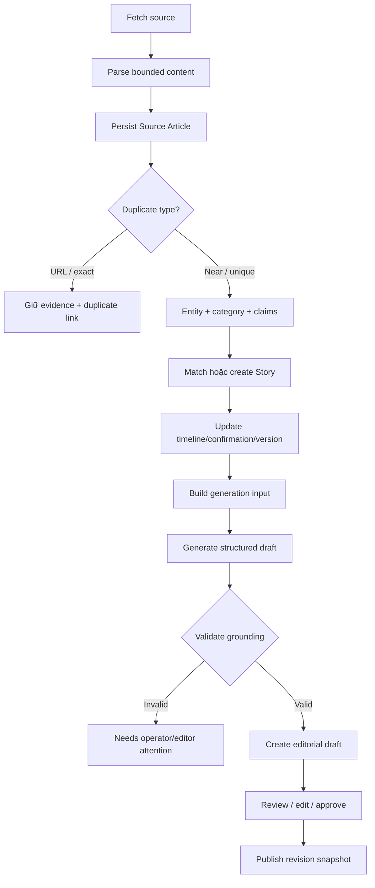

# Luồng nội dung

## 1. Luồng end-to-end

## 2. Thu thập

Collector chạy theo source/batch với concurrency và queue hữu hạn. Nó dùng một
HTTP client được tái sử dụng, deadline, response-size limit, redirect limit và
retry policy. `Retry-After` được tôn trọng khi hợp lệ. Kết quả phát hiện mang
snapshot đã parse và giới hạn kích thước, không mang full raw HTML không kiểm
soát.

## 3. Chuẩn hóa và duplicate

Canonical URL loại fragment và tracking parameter đã biết, chuẩn hóa scheme/
host và trailing slash an toàn. Text normalization phải deterministic trước khi
tạo content hash. URL/exact duplicate vẫn được lưu và liên kết với evidence
chính; near duplicate tiếp tục sang Intelligence vì có thể bổ sung chi tiết.

## 4. Hiểu nội dung và tạo Story

Entity extraction ưu tiên alias dictionary và rules. Category cùng structured
claims được tạo trước khi matching. Story Engine lấy candidate, chấm điểm và
ghi reason. Article chỉ được attach khi vượt policy; nếu không, tạo Story mới.
Mọi thay đổi được bảo vệ khỏi event lặp và concurrent update.

## 5. Chuẩn bị generation input

Generator chỉ nhận snapshot gồm Story ID/version, category, confirmation,
entities, claims và source references cần thiết. Nó không được suy luận từ full
web page ngoài tập bằng chứng đã duyệt. Mock generator deterministic là mặc
định cho test/demo; external provider là adapter tùy chọn.

## 6. Validation nội dung sinh

Output phải có schema rõ ràng cho headline, description, body sections và
citation mapping. Validation từ chối hoặc gắn cờ khi:

- tham chiếu claim/source không tồn tại;
- câu factual không có support;
- confirmation bị nâng quá mức;
- output thiếu trường hoặc sai cấu trúc;
- input Story version đã stale theo policy editorial.

Không tự động chuyển sang provider khác hoặc mock để che lỗi production. Failure
được ghi cùng attempt và error context đã redact.

## 7. Editorial và publication

Draft hợp lệ bắt đầu ở `NEEDS_REVIEW` theo góc nhìn editorial, được sửa thành
revision mới và chỉ publish khi revision hiện hành đã `APPROVED`. Publication
lưu snapshot riêng để public page ổn định. Story update sau đó tạo nhu cầu draft
mới hoặc đánh dấu nội dung cũ cần xem lại, không rewrite bài đã publish.
