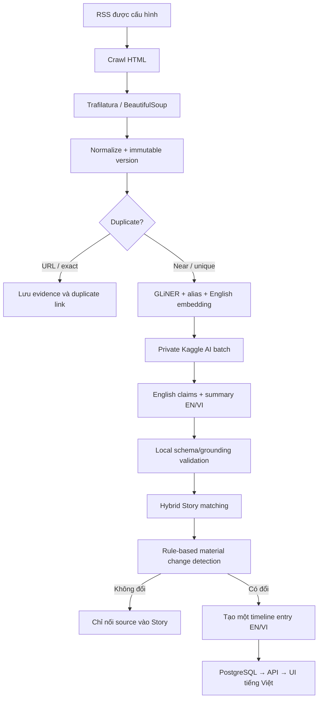

# Luồng nội dung

## 1. Luồng end-to-end



## 2. RSS và crawl HTML

Admin cấu hình trước RSS URL, allowed domains, reliability tier và crawl policy
trong PostgreSQL. Airflow tạo batch mỗi 6 giờ; Crawler đọc các source đang bật,
lấy URL từ RSS rồi tải HTML của từng bài.

Collector dùng global/per-domain concurrency hữu hạn, client tái sử dụng,
connect/read timeout, redirect và response-size limit. `429` tôn trọng
`Retry-After`; selected `5xx` và timeout được retry có backoff. Public user không
được cung cấp crawl target.

Trước mỗi request và mỗi redirect, crawler chỉ chấp nhận HTTP/HTTPS trên port
80/443, không cho URL credentials, bắt buộc hostname thuộc allowlist và từ chối
nếu **bất kỳ** địa chỉ DNS nào là loopback/private/link-local/multicast/reserved.
RSS tối đa 2 MiB, tối đa 3 redirect và 200 entries; response được đọc streaming,
không nạp vô hạn vào memory. Discovery chỉ giữ GUID, title, URL và publish time;
HTML content thuộc WP 2.3.

MVP còn residual risk DNS rebinding giữa bước resolve để kiểm tra và bước HTTP
client tự resolve để kết nối (TOCTOU). Vì source do Admin cấu hình và hệ thống
chạy local, rủi ro này được chấp nhận có ghi nhận; trước khi cho user nhập URL
hoặc chạy trong network nhạy cảm cần pin IP đã kiểm tra hoặc đặt egress proxy có
network policy.

## 3. Clean và version

Article HTML dùng cùng SSRF/redirect/retry policy với RSS, chỉ nhận `text/html`
hoặc XHTML và có response cap 5 MiB. Output trước persistence giữ raw HTML bytes,
requested/final URL, MIME và cleaned projection để WP 2.4 tạo immutable version.

Trafilatura trích nội dung chính với comments/tables bị tắt và ưu tiên precision;
BeautifulSoup là fallback deterministic khi primary không có content hữu ích.
Primary thành công có trạng thái `SUCCESS`; fallback có `PARTIAL`; cả hai không
lấy được bài trả `FAILED` kèm diagnostics thay vì tạo empty article. Cleaner:

- chuyển newline, tab và nhóm whitespace thành một dấu cách;
- decode HTML entity và normalize Unicode;
- loại control/zero-width character, menu, quảng cáo và paragraph trùng;
- giữ dấu câu, ký hiệu tiền tệ và số liệu như `€180m`.

Normalization chỉ chuẩn hóa representation, không dịch, sửa câu hoặc diễn giải
nội dung. Source-specific parser chưa thuộc MVP và chỉ được thêm khi fixture từ
RSS thực tế chứng minh extractor chung không đủ.

Không overwrite bài khi cùng canonical URL thay đổi. Mỗi content hash mới tạo
một immutable article version với `previous_version_id`. Nếu ETag/Last-Modified
hoặc hash không đổi, không chạy lại AI.

## 4. Duplicate trước AI

- URL duplicate: canonicalize scheme/host, bỏ fragment và tracking parameter.
  Nếu canonical URL và cleaned hash trùng version mới nhất thì chỉ ghi processed
  observation với reason `same_canonical_url_and_content_hash`; không tạo version
  hoặc outbox mới nên không chạy AI.
- Exact duplicate: so SHA-256 của cleaned English content với các URL khác. Bài
  vẫn tạo immutable evidence/version, liên kết về primary version sớm nhất và
  phát `article.cleaned.v1` với `duplicate_type=EXACT`; consumer dừng trước AI.
- Near duplicate: xét tối đa 50 bài từ URL khác trong 72 giờ. MVP dùng Jaccard
  deterministic sau Unicode/token normalization với score
  `0.25 × title + 0.65 × content + 0.10 × time`; ngưỡng `0.65`. Near vẫn phát
  event và tiếp tục AI vì có thể bổ sung claim mới.

Mỗi quyết định `EXACT`/`NEAR` lưu primary article/version, tổng score, ba component,
threshold và reason để audit. Entity/embedding chưa tham gia duplicate ở Phase 2;
chúng có thể bổ sung candidate/scoring ở Phase 3 mà không thay đổi các loại kết quả.
Fixture injury và match là negative controls để tránh gộp sai chỉ vì cùng cầu thủ/CLB.

Duplicate/syndicated copy không được tính thành nguồn độc lập để nâng
confirmation.

## 5. Entity và English embedding

`urchade/gliner_small-v2.1` chạy local bằng CPU, nhận lần lượt English `title` và
`cleaned_content` với labels `football player`, `football club`, `football coach`,
`football competition`. Mỗi field được chia khoảng 300 từ, overlap 40 từ; offset
được quy đổi về field gốc và mention trùng ở vùng overlap chỉ giữ score cao nhất.
Model được load một lần, worker mặc định concurrency 1 và không được vượt 2.

Detection threshold mặc định là `0.50` và có thể cấu hình. Resolver chỉ chấp nhận
normalized exact match với alias `APPROVED` có cùng entity type. Mention resolve
được gắn canonical entity ID; mention chưa resolve vẫn nằm trong extraction result.
Nếu score từ `0.75`, mention còn được ghi idempotent vào
`unresolved_entity_mentions` để Admin review. Model không tự tạo entity hoặc alias;
lỗi runtime trả `ENTITY_EXTRACTION_FAILED`, không tự chuyển sang mock.

Catalog normalize alias bằng Unicode casefold, bỏ khác biệt dấu/punctuation nhẹ
và collapse whitespace. Alias seed/admin có thể được approve có kiểm soát; alias
chỉ được tạo sau khi Admin chọn canonical entity cho unresolved mention. Chỉ admin
mới approve/reject hoặc disable, mọi thay đổi giữ audit actor/reason và không
hard-delete evidence. Mock adapter deterministic dùng cho test/demo offline.

`BAAI/bge-small-en-v1.5` tạo vector English 384 chiều bằng CPU. Input WP 3.3 là
chuỗi deterministic theo thứ tự `title`, canonical entity names đã sort/deduplicate,
rồi `cleaned_content`; raw HTML, unresolved entity và tiếng Việt không tham gia.
Tokenizer đúng model giữ tối đa 512 tokens nên title/entity luôn được ưu tiên ở đầu.
Metadata giữ full input hash, token count trước/sau và trạng thái truncated.

Model load một lần, encode batch mặc định 16, worker concurrency mặc định 1 và tối
đa 2. Vector bắt buộc finite, đúng dimension và L2-normalized. Runtime lỗi trả
`EMBEDDING_FAILED`, không tự chuyển mock. Khi WP 3.4 có validated claims/event type,
input builder version mới sẽ tạo embedding version mới thay vì overwrite.
Similarity chỉ retrieval candidate; nó không tự quyết định merge Story.

## 6. Kaggle AI batch

AI Content Service gom các article `AI_PENDING` thành private JSONL dataset:

```json
{
  "article_id": "article-version-2",
  "input_hash": "sha256",
  "title": "English title",
  "cleaned_content": "English evidence text",
  "known_entities": []
}
```

Không upload raw HTML, secret hoặc database endpoint. Qwen3-8B 4-bit xử lý bài
dài theo `chunk → extract claims → merge duplicates → final summary`. Article
enrichment output có English structured claims, `summary_en`, model/prompt
version và evidence quote. Partial output hợp lệ được import; article còn thiếu
quay lại `AI_PENDING`.

Qwen3-4B GGUF local là fallback khi Kaggle không sẵn sàng. Mock provider dùng
cùng schema để test/demo offline.

## 7. Validation output

Local validator kiểm tra từng claim:

1. JSON đúng schema và input hash đúng manifest.
2. Entity ID tồn tại hoặc được đánh dấu unresolved.
3. Predicate thuộc vocabulary đã version.
4. Evidence quote xuất hiện trong cleaned content.
5. Số tiền, ngày, tỷ số và qualifier có trong evidence.
6. Certainty không mạnh hơn ngôn ngữ nguồn.
7. English summary chỉ dùng claim hợp lệ.
8. Khi tạo timeline/content, Vietnamese projection không thêm fact so với English.

Cho phép partial success: giữ claim hợp lệ, reject claim lỗi kèm reason. Không
còn claim hợp lệ thì article chuyển `NEEDS_CONTENT_REVIEW`.

## 8. Story và timeline 6 giờ

PostgreSQL lọc cứng theo event type/time, dùng pgvector lấy candidate gần nhất,
rồi rule engine chấm entity, predicate, qualifier và source independence.
Vector chỉ retrieval; nó không tự quyết định merge.

Change Detector deterministic so sánh claim mới với Story hiện tại. Material
change gồm claim mới, claim thay đổi, correction hoặc confirmation thay đổi.
Nếu không đổi, hệ thống chỉ nối Source Article; không gọi timeline generator.

Mỗi Story có tối đa một aggregated timeline entry trong cửa sổ
`00–06`, `06–12`, `12–18`, `18–24`. Entry lưu `summary_en`, `summary_vi`, claim
IDs, source IDs, confirmation và window timestamps. Timeline Generator dùng
validated material changes để tạo hai bản trong cùng structured output; local
validator so sánh số liệu/entity trước khi ghi. API chỉ trả projection tiếng
Việt cho giao diện.

## 9. Generated Article

Long-form draft chỉ được tạo khi Story lần đầu đạt `MULTI_SOURCE`, đạt
`OFFICIAL`, có milestone lớn hoặc editor yêu cầu. Business key là
`story_id + story_version + prompt_version`. Timeline hợp lệ có thể tự hiển thị;
bài dài luôn đi qua editorial review trước publish.
