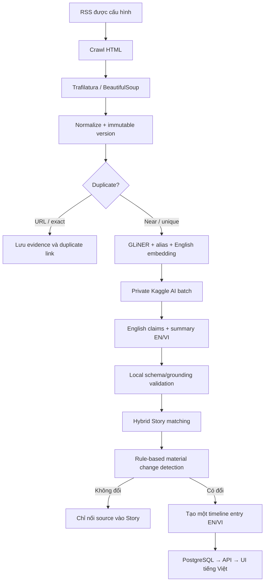

# Luồng nội dung

## 1. Luồng end-to-end



## 2. RSS và crawl HTML

Admin cấu hình trước RSS URL, allowed domains, reliability tier và crawl policy
trong PostgreSQL. Airflow tạo batch mỗi 6 giờ; Crawler đọc các source đang bật,
lấy URL từ RSS rồi tải HTML của từng bài.

Collector dùng global/per-domain concurrency hữu hạn, client tái sử dụng,
connect/read timeout, redirect và response-size limit. `429` tôn trọng
`Retry-After`; selected `5xx` và timeout được retry có backoff. Public user không
được cung cấp crawl target.

## 3. Clean và version

Trafilatura trích nội dung chính; BeautifulSoup là fallback cho source có cấu
trúc đặc biệt. Cleaner:

- chuyển newline, tab và nhóm whitespace thành một dấu cách;
- decode HTML entity và normalize Unicode;
- loại control/zero-width character, menu, quảng cáo và paragraph trùng;
- giữ dấu câu, ký hiệu tiền tệ và số liệu như `€180m`.

Không overwrite bài khi cùng canonical URL thay đổi. Mỗi content hash mới tạo
một immutable article version với `previous_version_id`. Nếu ETag/Last-Modified
hoặc hash không đổi, không chạy lại AI.

## 4. Duplicate trước AI

- URL duplicate: canonicalize scheme/host, fragment và tracking parameter.
- Exact duplicate: SHA-256 trên cleaned content; vẫn lưu evidence nhưng không
  gửi Kaggle.
- Near duplicate: title/content/entity/time similarity; vẫn xử lý AI vì có thể
  bổ sung claim mới.

Duplicate/syndicated copy không được tính thành nguồn độc lập để nâng
confirmation.

## 5. Entity và English embedding

GLiNER local nhận cleaned English content với labels `football player`,
`football club`, `football coach`, `football competition`. Alias resolver ánh
xạ mention về canonical entity ID trong PostgreSQL. Entity chưa resolve được
đưa vào `NEEDS_ENTITY_REVIEW`, không tự tạo canonical record.

`bge-small-en-v1.5` tạo embedding từ English title, event type, entity và claim
text. Vietnamese không tham gia embedding hoặc similarity.

## 6. Kaggle AI batch

AI Content Service gom các article `AI_PENDING` thành private JSONL dataset:

```json
{
  "article_id": "article-version-2",
  "input_hash": "sha256",
  "title": "English title",
  "cleaned_content": "English evidence text",
  "known_entities": []
}
```

Không upload raw HTML, secret hoặc database endpoint. Qwen3-8B 4-bit xử lý bài
dài theo `chunk → extract claims → merge duplicates → final summary`. Article
enrichment output có English structured claims, `summary_en`, model/prompt
version và evidence quote. Partial output hợp lệ được import; article còn thiếu
quay lại `AI_PENDING`.

Qwen3-4B GGUF local là fallback khi Kaggle không sẵn sàng. Mock provider dùng
cùng schema để test/demo offline.

## 7. Validation output

Local validator kiểm tra từng claim:

1. JSON đúng schema và input hash đúng manifest.
2. Entity ID tồn tại hoặc được đánh dấu unresolved.
3. Predicate thuộc vocabulary đã version.
4. Evidence quote xuất hiện trong cleaned content.
5. Số tiền, ngày, tỷ số và qualifier có trong evidence.
6. Certainty không mạnh hơn ngôn ngữ nguồn.
7. English summary chỉ dùng claim hợp lệ.
8. Khi tạo timeline/content, Vietnamese projection không thêm fact so với English.

Cho phép partial success: giữ claim hợp lệ, reject claim lỗi kèm reason. Không
còn claim hợp lệ thì article chuyển `NEEDS_CONTENT_REVIEW`.

## 8. Story và timeline 6 giờ

PostgreSQL lọc cứng theo event type/time, dùng pgvector lấy candidate gần nhất,
rồi rule engine chấm entity, predicate, qualifier và source independence.
Vector chỉ retrieval; nó không tự quyết định merge.

Change Detector deterministic so sánh claim mới với Story hiện tại. Material
change gồm claim mới, claim thay đổi, correction hoặc confirmation thay đổi.
Nếu không đổi, hệ thống chỉ nối Source Article; không gọi timeline generator.

Mỗi Story có tối đa một aggregated timeline entry trong cửa sổ
`00–06`, `06–12`, `12–18`, `18–24`. Entry lưu `summary_en`, `summary_vi`, claim
IDs, source IDs, confirmation và window timestamps. Timeline Generator dùng
validated material changes để tạo hai bản trong cùng structured output; local
validator so sánh số liệu/entity trước khi ghi. API chỉ trả projection tiếng
Việt cho giao diện.

## 9. Generated Article

Long-form draft chỉ được tạo khi Story lần đầu đạt `MULTI_SOURCE`, đạt
`OFFICIAL`, có milestone lớn hoặc editor yêu cầu. Business key là
`story_id + story_version + prompt_version`. Timeline hợp lệ có thể tự hiển thị;
bài dài luôn đi qua editorial review trước publish.
