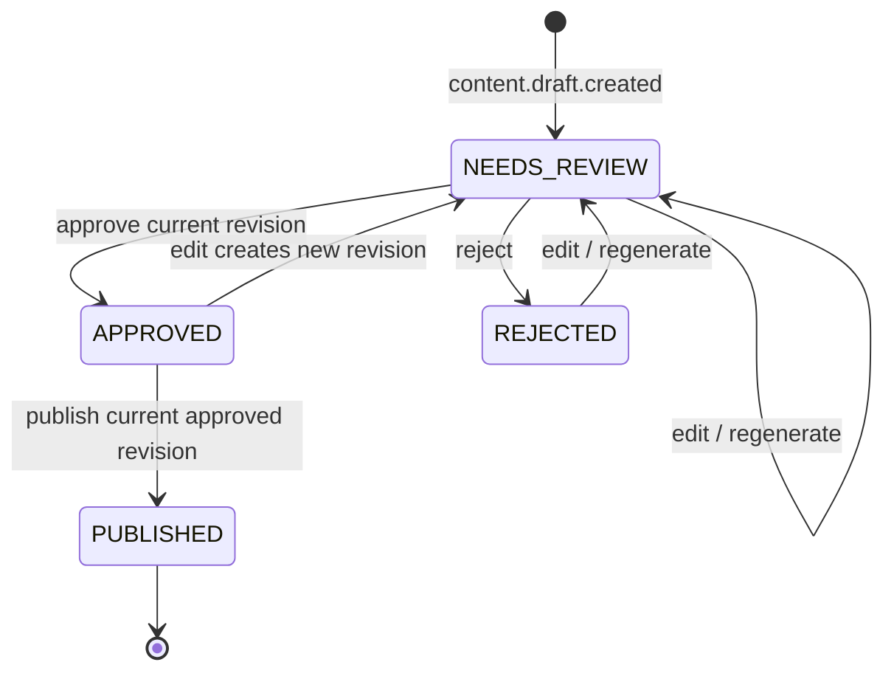

# Kế hoạch dữ liệu FootballPulse

Đây là thiết kế dự kiến. Tên field dùng `snake_case` trong database; API public
dùng `camelCase`. Mọi thời điểm lưu UTC (`timestamptz` trong PostgreSQL, BSON
UTC datetime trong MongoDB), ID nghiệp vụ dùng UUIDv7 khi thư viện được xác
nhận, nếu không dùng UUIDv4.

## 1. MongoDB do Article Service sở hữu

Database dự kiến: `footballpulse_articles`.

### 1.1. `source_articles`

Một document cho **mỗi lần phát hiện source article**, kể cả duplicate:

```json
{
  "_id": "uuid",
  "source_id": "uuid",
  "crawl_batch_id": "uuid",
  "crawl_attempt_id": "uuid",
  "discovered_event_id": "uuid",
  "original_url": "https://mock/source/a?utm_source=x",
  "canonical_url": "https://mock/source/a",
  "source_name": "Mock Sport A",
  "source_type": "RSS",
  "original_title": "Man Utd quan tâm ...",
  "normalized_title": "man utd quan tam ...",
  "raw_payload": {
    "content_type": "text/html",
    "body_ref": "inline-or-gridfs-not-needed-for-mvp",
    "headers_allowlist": {}
  },
  "parsed": {
    "content": "...",
    "normalized_content": "...",
    "author": null,
    "published_at": "2026-07-30T02:00:00Z",
    "language": "vi"
  },
  "content_hash": "sha256:...",
  "simhash": "unsigned-64-bit-as-string",
  "duplicate": {
    "kind": "NONE|URL|EXACT|NEAR",
    "primary_article_id": null,
    "score": null,
    "reasons": []
  },
  "processing": {
    "status": "RECEIVED|NORMALIZED|UNIQUE|DUPLICATE|FAILED|REPROCESSING",
    "attempt": 1,
    "last_error_code": null,
    "updated_at": "UTC"
  },
  "created_at": "UTC",
  "updated_at": "UTC",
  "retention_class": "EVIDENCE"
}
```

Quy tắc:

- Không unique trực tiếp `canonical_url` hoặc `content_hash` vì phải giữ từng
  source record. Một collection phụ quản lý key uniqueness.
- `raw_payload` giới hạn kích thước; response vượt giới hạn bị từ chối trước
  khi phát event. Không lưu secrets/cookies.
- Near duplicate vẫn có thể phát `article.unique` với metadata
  `near_duplicate_of` nếu có khả năng thêm claim/source. Chỉ URL/exact
  duplicate bị chặn khỏi intelligence mặc định; editor có thể reprocess.

Indexes:

- `{source_id: 1, canonical_url: 1, created_at: -1}`.
- `{content_hash: 1, created_at: -1}`.
- `{crawl_batch_id: 1, created_at: 1}`.
- `{processing.status: 1, processing.updated_at: 1}`.
- `{duplicate.primary_article_id: 1}`.
- TTL **không áp dụng** cho evidence trong MVP.

### 1.2. `article_identities`

Giữ stable identity để exact idempotent claim:

```json
{
  "_id": "URL|CONTENT:<digest>",
  "primary_article_id": "uuid",
  "identity_type": "CANONICAL_URL|CONTENT_HASH",
  "created_at": "UTC"
}
```

Unique `_id`. Khi insert conflict, article mới vẫn được lưu trong
`source_articles` và trỏ về primary. URL identity được thử trước, sau đó content
hash. Transaction đảm bảo identity, evidence, processed event và outbox cùng
commit.

### 1.3. `processed_events`

```json
{
  "_id": "event_id",
  "event_type": "article.discovered",
  "consumer_group": "article-service-v1",
  "aggregate_id": "article-id",
  "processed_at": "UTC",
  "result": "UNIQUE|DUPLICATE|NOOP",
  "business_record_id": "uuid"
}
```

Unique `_id`. Không TTL trong ba tuần để demo redelivery. Retention dài hạn có
thể là 90 ngày nếu business uniqueness đã được bảo vệ độc lập.

### 1.4. `outbox_events`

```json
{
  "_id": "event_id",
  "event_type": "article.unique",
  "aggregate_id": "article-id",
  "partition_key": "article-id",
  "envelope": {},
  "status": "PENDING|PUBLISHING|PUBLISHED|FAILED",
  "attempts": 0,
  "next_attempt_at": "UTC",
  "last_error": null,
  "created_at": "UTC",
  "published_at": null,
  "lease_owner": null,
  "lease_until": null
}
```

Indexes:

- unique `_id`;
- `{status: 1, next_attempt_at: 1}`;
- `{lease_until: 1}`.

Outbox publisher claim document bằng conditional update/lease, produce với
delivery callback, rồi mark `PUBLISHED`. Crash sau Kafka ack nhưng trước mark
gây publish lại; consumer downstream phải idempotent.

### 1.5. `processing_history`

Append-only audit cho reprocess/failure, gồm `article_id`, stage, status,
attempt, event_id, code, redacted message, timestamps. Index
`{article_id: 1, occurred_at: 1}`.

### MongoDB transaction và local topology

MVP dùng transaction cho `source_articles + article_identities +
processed_events + outbox_events`; vì vậy local MongoDB cần single-node replica
set. Nếu việc khởi tạo replica set làm Compose không ổn định vào Milestone 1,
fallback có kiểm soát là:

1. upsert evidence/idempotency;
2. insert outbox;
3. reconciliation tìm article `UNIQUE` không có outbox.

Fallback phải có failure test và không được mô tả là atomic.

## 2. PostgreSQL schemas và migration ownership

Mỗi service có Alembic environment riêng và chỉ được cấp quyền schema của nó.
Migration không chứa cross-schema foreign key. ID từ service khác được lưu như
opaque UUID cùng snapshot cần thiết.

### 2.1. `source_schema` — Crawler Service

#### `sources`

- `id` PK, `name`, `type RSS|HTML|MOCK`.
- `base_url`, `feed_url`, `allowed_domains text[]`.
- `is_enabled`, `is_paused`, `pause_reason`.
- `requests_per_second`, `max_concurrency`, `timeout_ms`, `max_attempts`.
- `parser_config jsonb` (validated, không arbitrary executable code).
- `version`, `created_at`, `updated_at`.
- Unique lower-case `name`; index enabled sources.

#### `crawl_batches`

- `id` PK; `trigger_type AIRFLOW|MANUAL|BACKFILL|DEMO`.
- `idempotency_key` unique.
- `requested_by`, `correlation_id`, interval start/end.
- status `REQUESTED|RUNNING|PARTIAL|SUCCEEDED|FAILED|CANCELLED`.
- counts, `started_at`, `completed_at`, timestamps.

#### `crawl_attempts`

- `id` PK; `batch_id`, `source_id`, `attempt_no`.
- status `PENDING|RUNNING|RETRY_WAIT|SUCCEEDED|FAILED|RATE_LIMITED|TIMED_OUT`.
- HTTP status, discovered/queued counts, retry_at, error code.
- Unique `(batch_id, source_id, attempt_no)`.
- Index `(batch_id, status)`, `(source_id, started_at desc)`.

`source_schema` cũng có `outbox_events` nếu batch/source status cần emit và audit
table cho source changes.

### 2.2. `identity_schema` — API Gateway

- `users(id, email unique, password_hash, is_active, created_at, updated_at)`.
- `roles(id, code unique)`.
- `user_roles(user_id, role_id, unique pair)`.
- `refresh_sessions(id, user_id, token_hash unique, expires_at, revoked_at)`.
- `audit_actions(id, actor_id, action, resource_type, resource_id,
  correlation_id, details_json, occurred_at)`.

### 2.3. `intelligence_schema`

#### Entities

- `entities`: `id`, `type`, `canonical_name`, `slug`, optional `country`,
  `current_club_id` opaque/self reference where valid, `metadata_json`,
  `version`, timestamps. Unique `(type, slug)`.
- `entity_aliases`: `id`, `entity_id` FK, `alias`, `normalized_alias`,
  `language`, `source MANUAL|SEED|RULE|AI`, `is_verified`, timestamps.
  Unique `(normalized_alias, entity_id)`; trigram index on normalized alias.
- `article_entity_mentions`: `id`, `source_article_id`, `entity_id` FK nullable
  cho unresolved, surface/normalized text, offsets, method, confidence,
  `is_primary`, timestamps. Unique stable mention key.
- `keywords`: `id`, `normalized_text` unique, `display_text`.
- `article_keywords`: article ID + keyword ID + score, unique pair.

#### Stories

- `stories`: `id`, `slug`, `working_title`, `category`, `fingerprint`,
  `confirmation_level`, `summary`, `status ACTIVE|NEEDS_REVIEW|MERGED|CLOSED`,
  `version >= 1`, `merged_into_story_id`, `first_event_at`, `last_event_at`,
  timestamps. Partial unique active `fingerprint`; indexes category/time,
  confirmation/time, trigram title.
- `story_source_articles`: `story_id`, `source_article_id`, `source_id`,
  `relationship PRIMARY|SUPPORTING|NEAR_DUPLICATE`, `attached_by`,
  `attached_at`; unique source article ID (một article thuộc một active story).
- `story_entities`: story/entity, role `PRIMARY|SECONDARY|MENTIONED`,
  confidence, unique pair.
- `claims`: `id`, `story_id`, `fingerprint`, subject/predicate/object,
  qualifiers JSONB, `confirmation_level`, `status ACTIVE|RETRACTED|DISPUTED`,
  first/last seen, version; unique `(story_id, fingerprint)`.
- `claim_sources`: claim/source article, support type
  `SUPPORTS|DISPUTES|OFFICIALIZES`, excerpt locator—not large content;
  unique pair.
- `timeline_items`: `id`, `story_id`, `claim_id`, event time, text, level,
  sort key, created_at; unique stable fingerprint.
- `story_versions`: append-only snapshot/diff, `(story_id, version)` unique,
  reason/event_id/actor/timestamp.
- `story_assignment_history`: from/to story, article, reason, actor, timestamp.
- `processed_events`, `outbox_events` theo pattern chuẩn.

#### Concurrency

- Candidate retrieval chạy trước transaction.
- Trong transaction: advisory lock theo deterministic fingerprint bucket hoặc
  unique active fingerprint; re-read candidates; attach/create; insert claim
  bằng unique constraints; update `stories ... WHERE version=:old_version`.
- Zero updated row → retry tối đa ba lần với jitter; sau đó retry topic/operator
  action.
- Merge lock hai story theo thứ tự ID để tránh deadlock, chuyển links/claims,
  mark source `MERGED`, increment target version và audit.

### 2.4. `ai_content_schema`

- `generation_jobs`: `id`, `story_id`, `story_version`, `prompt_version`,
  provider/model, status `QUEUED|RUNNING|SUCCEEDED|RETRY_WAIT|FAILED|INVALID`,
  unique `idempotency_key`, timestamps.
- `generation_attempts`: job/attempt unique, request hash, response reference,
  status/error, latency, input/output tokens, estimated cost, timestamps.
- `provider_usage_windows`: optional durable usage audit; Redis vẫn giữ
  short-lived limiter.
- `processed_events`, `outbox_events`.

Unique business key:
`(story_id, story_version, prompt_version, generation_kind)`. Một story update
không tạo hai draft cùng input version.

### 2.5. `content_schema`

- `drafts`: `id`, story ID/version, current revision ID, status
  `DRAFT|NEEDS_REVIEW|APPROVED|REJECTED|PUBLISHED`, `version`, generator job ID,
  timestamps. Unique `(story_id, input_story_version, prompt_version)`.
- `draft_revisions`: `id`, draft ID, revision number, headline, summary, body,
  source refs JSONB, entity refs JSONB, validation snapshot, created_by/type,
  timestamps. Unique `(draft_id, revision_no)`.
- `editorial_actions`: append-only draft/revision, action, actor, reason,
  from/to status, timestamp.
- `publications`: `id`, draft/revision, slug, status, idempotency_key,
  published_at, unpublished_at; unique idempotency key, unique successful
  `(draft_id)`, unique active slug.
- `published_articles`: immutable/current public projection with headline,
  summary, body, story/source/entity snapshots, source count, timestamps.
- `featured_entities`: `entity_id`, `entity_type`, `is_featured`,
  `featured_rank`, `featured_from`, `featured_until`; unique entity.
- `public_story_read_model`: story title/status/confirmation/timeline/entity
  snapshot, source count, latest publication.
- `search_documents`: `resource_type`, `resource_id`, slug/title/body/aliases,
  `tsvector`, ranking signals, published/featured timestamps; unique resource.
- `processed_events`, `outbox_events`.

Search indexes:

- GIN trên `search_vector` (`simple` hoặc Vietnamese-compatible normalization
  được kiểm thử; không giả định stemming tiếng Việt).
- `pg_trgm` GIN/GiST trên `normalized_title`, canonical name và aliases.
- B-tree cho `published_at desc`, `(entity_id, published_at desc)`,
  featured rank/time.

## 3. State machines

### Editorial



- Không có `SCHEDULED` trong MVP.
- Approve ghi chính xác `revision_id`; edit sau approve làm mất approval.
- Publish dùng conditional update và unique publication key.
- Unpublish là P1 và không xóa lịch sử.

### Confirmation

Cho phép tăng khi có evidence:

```text
RUMOUR → REPORTED → MULTI_SOURCE → OFFICIAL
```

Không tự giảm; downgrade/retraction chỉ qua editor action có audit. Quy tắc:

- `REPORTED`: ít nhất một claim từ source configured đáng tin, không chỉ suy
  diễn.
- `MULTI_SOURCE`: cùng claim được ít nhất hai source độc lập hỗ trợ.
- `OFFICIAL`: source/claim được đánh dấu official và nội dung hỗ trợ đúng claim.
- Official cho một update không tự biến mọi claim khác trong story thành
  official.

## 4. Story clustering

### Candidate retrieval

1. Lọc active stories cùng category trong time window:
   `TRANSFER` 30 ngày; `INJURY` 14 ngày; `MATCH` 3 ngày;
   `PRESS_CONFERENCE` 3 ngày; `OFFICIAL_ANNOUNCEMENT` 14 ngày.
2. Yêu cầu ít nhất một primary entity overlap, hoặc competition + clubs đối với
   MATCH.
3. Tìm exact `fingerprint` trước.
4. Lấy tối đa 50 candidate gần nhất, không full scan.

Các window là giá trị khởi đầu cần hiệu chỉnh bằng fixture, không phải kết quả
benchmark.

### Fingerprint

```text
category | sorted(primary entity IDs) | normalized event anchor | time bucket
```

`event anchor` là deterministic keyword/claim predicate, không dùng headline
nguyên văn. Fingerprint hỗ trợ concurrency guard nhưng không tự quyết định
matching.

### Score 0–100

| Signal | Điểm tối đa |
| --- | ---: |
| Category exact | 15 |
| Primary player overlap | 25 |
| Primary club overlap | 20 |
| Coach/competition overlap | 10 |
| Normalized title token similarity | 10 |
| Keyword/Jaccard overlap | 10 |
| Time proximity | 5 |
| Claim predicate overlap | 5 |

- Attach tự động khi `score >= 70` và có primary entity/category compatible.
- `55–69`: tạo/giữ riêng và flag `NEEDS_REVIEW` với candidate suggestions.
- `<55`: tạo story mới.
- Với `MATCH`, hai club + competition + match date có trọng số quyết định riêng.

Threshold được lưu version trong rule config và phải có golden fixtures. Editor
có thể reassign article hoặc merge story; mọi correction cập nhật alias/rule
suggestion nhưng không âm thầm rewrite evidence.

### Khi article mới vào story

1. Attach source link idempotently.
2. Upsert mentions, keywords, claims, claim-source refs.
3. Recompute source diversity và confirmation từng claim/story.
4. Append timeline item mới; không overwrite lịch sử.
5. Increment story version và snapshot.
6. Emit `story.updated`.
7. Emit `content.generation.requested` nếu có claim/timeline/confirmation thay
   đổi mang ý nghĩa; duplicate source không có claim mới thì không regenerate.

Near duplicate vẫn được claim extraction. Nếu nó không thêm claim nhưng thêm
source độc lập, nó có thể nâng `MULTI_SOURCE` và trigger generation. Exact
duplicate cùng source không làm tăng source diversity.

## 5. Retention, backup và recovery

- Source evidence: giữ toàn bộ trong MVP; raw body có thể chuyển sang 90 ngày
  sau demo, parsed/metadata/hash giữ lâu dài.
- Audit, story versions, revisions, publications: không TTL.
- Processed events: giữ suốt demo; policy 90 ngày là P1.
- Outbox `PUBLISHED`: cleanup chỉ sau thời gian an toàn và metric reconciliation.
- Demo backup: export deterministic fixtures, không coi DB dump là source code.
- Recovery: rebuild `content_schema` public read model từ publication/story
  events hoặc reconciliation command; không rebuild evidence từ PostgreSQL.
