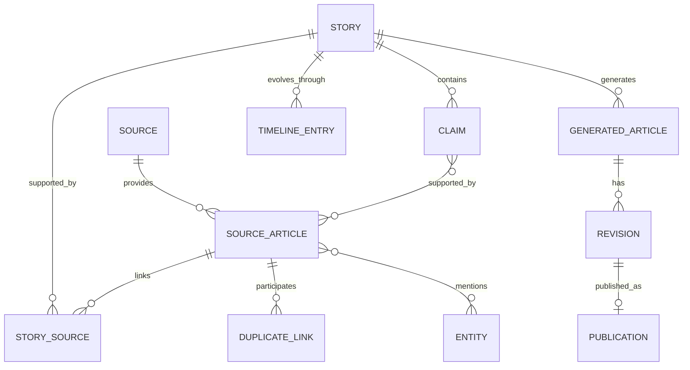

# Mô hình dữ liệu logic

## 1. Invariant trung tâm

```text
Source Article != Story != Generated Article
```

Ba aggregate có lifecycle, ownership và mục đích khác nhau. Không overwrite
Source Article bằng nội dung sinh; không dùng Generated Article làm bằng chứng;
không xóa evidence chỉ vì nó là duplicate.

## 2. Quan hệ chính



## 3. Aggregate và trường cốt lõi

### Source và Crawl

`Source` giữ tên, domain, kiểu RSS/HTML/mock, trạng thái và policy. `CrawlBatch`
và `CrawlAttempt` giữ trigger, khoảng thời gian, outcome, attempt và lỗi đã
redact. Chúng mô tả quá trình thu thập, không sở hữu nội dung bài.

### Source Article

Giữ stable ID, source/crawl reference, original URL, canonical URL, original
title, parsed content, author/publication time nếu có, collected time, normalized
hash, processing status và metadata cần truy vết. Record evidence là bất biến;
kết quả xử lý bổ sung được lưu dưới record/version liên quan.

`DuplicateLink` nối hai article với loại `URL`, `EXACT_CONTENT` hoặc
`NEAR_DUPLICATE`, score, reason và thời điểm phát hiện. Near duplicate không mặc
định bị loại khỏi Story processing vì có thể chứa claim mới.

### Entity và Alias

`Entity` có loại `PLAYER`, `COACH`, `CLUB`, `COMPETITION`, canonical name và
metadata tối thiểu. `EntityAlias` ánh xạ normalized alias tới entity, lưu nguồn
của quyết định và trạng thái correction. Mention trong từng article giữ surface
text, vị trí, phương pháp và confidence.

### Story, Claim và Timeline

`Story` giữ headline làm việc, category, canonical entities, confirmation,
editorial status, stable fingerprint, version và timestamps. `StorySource` là
liên kết duy nhất giữa Story và Source Article.

`Claim` biểu diễn một phát biểu có cấu trúc: subject, predicate, object,
qualifier, confirmation và tập source ID. Claim giống nhau có stable key để
chống insert lặp. `TimelineEntry` ghi điều gì thay đổi, khi nào, dựa trên claims
nào; timeline không chỉ là danh sách ngày publish của báo.

### Generated Article, Revision và Publication

`GeneratedArticle` giữ story ID/version đầu vào, prompt/provider/model metadata,
validation result và trạng thái biên tập. Nội dung editable nằm trong các
`Revision`; mỗi revision giữ headline, description, body, citation mapping,
editor và timestamp.

`Publication` là snapshot bất biến của đúng revision được publish, có slug,
published time và stable idempotency key. Sửa draft sau publish không làm thay
đổi snapshot cũ.

## 4. Identity, version và thời gian

- ID ổn định, không suy ra từ title có thể đổi.
- Timestamp lưu UTC; UI tự chuyển timezone hiển thị.
- Story và draft dùng optimistic version cho conditional update.
- Business key bảo vệ link, claim, generation request và publication khỏi lặp.
- Event ID phục vụ delivery idempotency, không thay thế business key.

## 5. Invariant dữ liệu

1. Source Article luôn truy được về Source và crawl context.
2. StorySource không lặp cùng cặp Story–Article.
3. Claim không có source support không được dùng làm factual content.
4. Confirmation mới không cao hơn bằng chứng tốt nhất theo policy đã duyệt.
5. Generation gắn với đúng Story version; draft stale không được tự publish.
6. Chỉ một successful publication cho cùng revision/idempotency key.
7. Mọi merge, reassign, approve, reject và publish đều có audit actor.
