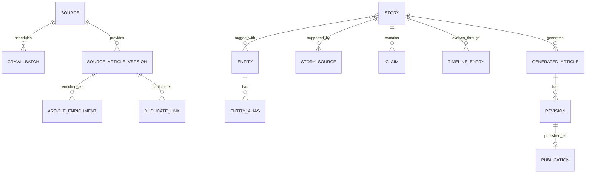

# Mô hình dữ liệu logic

## 1. Invariant trung tâm

```text
Source Article != Story != Generated Article
```

Source Article là evidence bất biến; Story là sự kiện đang phát triển;
Generated Article là sản phẩm biên tập. Không overwrite evidence bằng AI output
và không dùng bản dịch tiếng Việt làm dữ liệu quyết định nghiệp vụ.

## 2. Data ownership



### MongoDB: evidence và enrichment

#### `source_articles`

Mỗi document là một immutable version:

```json
{
  "_id": "article-version-2",
  "canonical_article_id": "bbc-article-123",
  "version": 2,
  "previous_version_id": "article-version-1",
  "source_id": "bbc-sport",
  "original_url": "...",
  "canonical_url": "...",
  "raw_html": "...",
  "cleaned_content": "English text",
  "content_hash": "sha256",
  "published_at": "UTC",
  "collected_at": "UTC",
  "status": "AI_PENDING"
}
```

Raw HTML được giữ để reprocess cleaner mà không crawl lại; retention/compression
chỉ được chốt sau khi đo dung lượng.

#### `article_enrichments`

Lưu kết quả theo input/model/prompt version, không overwrite lần chạy cũ:

```json
{
  "_id": "enrichment-456",
  "article_id": "article-version-2",
  "input_hash": "sha256",
  "model": "Qwen3-8B-4bit",
  "prompt_version": "article-enrichment-v1",
  "summary_en": "...",
  "entities": [],
  "claims": [],
  "validation_status": "VALIDATED",
  "processed_at": "UTC"
}
```

MongoDB không cần giữ `summary_vi` làm source of truth. Vietnamese timeline và
content projection được materialize trong PostgreSQL.

#### `duplicate_links`

Giữ `article_id`, `primary_article_id`, loại `URL|EXACT_CONTENT|NEAR_DUPLICATE`,
score, reason và timestamp. Duplicate vẫn là evidence và không bị xóa.

### PostgreSQL: product và API data

#### Source/crawl

`sources` giữ RSS URL, allowed domains, source type, reliability tier, enabled,
crawl interval/concurrency và operational timestamps. `crawl_batches` và
`crawl_attempts` giữ schedule window, counts, outcome và redacted failure.

#### Entity catalog

`entities` có loại `PLAYER|COACH|CLUB|COMPETITION`, canonical name và stable
slug. `entity_aliases` ánh xạ normalized alias tới entity, kèm resolver version,
actor/source và review status. Catalog được seed có kiểm soát và mở rộng qua
Admin review.

#### Story và claims

`stories` giữ category, working headline English, confirmation tổng quan,
fingerprint, English embedding, version và timestamps. `story_entities` và
`story_sources` là link duy nhất; source link chỉ giữ Mongo article ID và bounded
snapshot.

`story_claims` giữ:

```json
{
  "subject_id": "club-arsenal",
  "predicate": "SUBMITTED_BID",
  "object_id": "player-vinicius-junior",
  "qualifiers": {"amount": 180000000, "currency": "EUR"},
  "confirmation": "MULTI_SOURCE",
  "source_article_ids": []
}
```

Claim có stable key từ subject/predicate/object/qualifiers để chống duplicate
delivery. Confirmation thuộc từng claim; Story confirmation chỉ là projection
tổng quan.

#### Timeline

`timeline_entries` giữ một entry tối đa cho mỗi `(story_id, window_start)`:

```json
{
  "story_id": "story-789",
  "window_start": "UTC",
  "window_end": "UTC",
  "summary_en": "Arsenal have submitted ...",
  "summary_vi": "Arsenal đã gửi ...",
  "confirmation": "MULTI_SOURCE",
  "used_claim_ids": [],
  "source_article_ids": [],
  "translation_model": "Qwen3-8B",
  "translation_status": "VALIDATED"
}
```

English là bản chuẩn cho search/change/retranslation; Vietnamese là projection
API đã chuẩn bị sẵn. Nếu không có material change thì không có row cho cửa sổ.

#### Editorial

`generated_articles`, `revisions`, `editorial_actions`, `publications` giữ bản
EN/VI, citation mapping, input Story version, generation metadata và audit.
Publication là immutable snapshot của đúng approved revision.

## 3. AI batch và failures

`ai_batch_jobs` giữ job/crawl batch ID, manifest hash, model/prompt version và
state `PREPARING → UPLOADED → RUNNING → DOWNLOADING → VALIDATING → COMPLETED`.
Partial result được ghi theo article. Failure/review record giữ stage, attempt,
error code, retryability và redacted context; không chứa secret hoặc raw HTML.

## 4. Identity, version và thời gian

- Stable ID không suy ra từ title có thể đổi.
- Timestamp lưu UTC; batch schedule dùng `Asia/Ho_Chi_Minh` và API đổi timezone.
- Article, enrichment, Story, draft và translation đều có version rõ ràng.
- Story/draft dùng optimistic version; publication dùng stable idempotency key.
- Event ID chống delivery lặp; business key chống state nghiệp vụ lặp.

## 5. Invariant dữ liệu

1. Mọi article version truy được về source, crawl batch và previous version.
2. URL/exact duplicate không chạy AI lại; near duplicate vẫn có thể bổ sung claim.
3. Entity trong claim phải canonical hoặc có review state rõ ràng.
4. Evidence quote và factual qualifier phải tồn tại trong cleaned content.
5. Claim confirmation không cao hơn nguồn hỗ trợ; duplicate không là nguồn độc lập.
6. Vector chỉ retrieval, không phải quyết định merge.
7. Không tạo timeline row nếu material change là false.
8. Chỉ một timeline entry cho mỗi Story/window và một successful publication
   cho mỗi revision/idempotency key.
