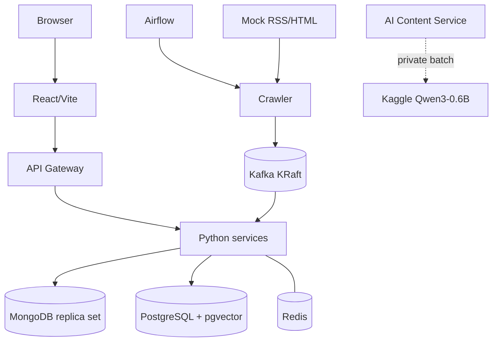

# Thiết kế triển khai local-first

## 1. Mục tiêu

FootballPulse chủ yếu chạy trên một máy local bằng Docker Compose. Topology này
ưu tiên tái lập, quan sát được và demo offline; nó không đại diện production
cluster chịu lỗi. WP 1.1 mới hiện thực bốn dependency nền, chưa gồm application.

## 2. Topology



Kaggle chỉ xử lý compute batch. MongoDB/PostgreSQL local vẫn là nguồn dữ liệu
chuẩn; Kaggle outage không làm mất crawl data.

## 3. Docker Compose profiles

| Profile | Thành phần |
| --- | --- |
| `core` | Hiện có Kafka, MongoDB, PostgreSQL+pgvector, Redis; service/frontend sẽ được thêm dần |
| `airflow` | Airflow scheduler/API và metadata database cần thiết |
| `demo` | Mock News Source, mock Kaggle/AI results và deterministic scenario control |
| `tools` | Kafka UI hoặc database admin tool tùy chọn |

Sử dụng thường ngày sau MVP là `core + airflow`; demo offline là
`core + airflow + demo`.

### Dependency baseline đã xác minh

| Dependency | Image | Host port |
| --- | --- | --- |
| Kafka KRaft | `apache/kafka:4.3.1` | `127.0.0.1:9092` |
| MongoDB replica set | `mongo:7.0.37-jammy` | `127.0.0.1:27017` |
| PostgreSQL + pgvector | `pgvector/pgvector:0.8.5-pg17-bookworm` | `127.0.0.1:5432` |
| Redis | `redis:7.2.14-alpine` | `127.0.0.1:6379` |

MongoDB 7 được pin vì MongoDB 8.x gặp lỗi đã biết trên kernel Linux 6.19 của máy
local. Khi nâng version phải chạy lại transaction smoke test trên kernel đích.

## 4. Resource strategy

Máy tham chiếu hiện có Ryzen 7 7735HS (8C/16T), 26 GiB RAM, Radeon 680M và không
có CUDA/ROCm. Vì vậy:

- Qwen3-0.6B Transformers chạy trên Kaggle theo batch;
- Qwen3-4B GGUF `Q4_K_M` chỉ là local fallback, nạp khi cần, concurrency 1;
- `urchade/gliner_small-v2.1` và `bge-small-en-v1.5` chạy CPU local;
- Kafka một broker, database pool và worker concurrency đều nhỏ/có giới hạn;
- Airflow dùng executor local nhẹ, không dùng CeleryExecutor cho MVP.

Compose hiện giới hạn lần lượt Kafka 1 GiB/1.5 CPU, MongoDB 1 GiB/1 CPU,
PostgreSQL 768 MiB/1 CPU và Redis 256 MiB/0.5 CPU. Các giới hạn sẽ được đo lại
khi full stack chạy.

GLiNER và BGE là optional model dependencies, không bắt buộc cho mock/offline
test. Cài runtime thật bằng:

```bash
uv sync --package footballpulse-intelligence-service --extra models --group dev --locked
```

Local Qwen cũng là optional và không kéo vào môi trường Kaggle/mock mặc định:

```bash
uv sync --package footballpulse-ai-content-service --extra local-model --group dev --locked
```

Lệnh này cài `llama-cpp-python` CPU và có thể cần compiler nếu không dùng được
prebuilt wheel. File GGUF phải được tải riêng, đặt ngoài Git, rồi cấu hình
`FOOTBALLPULSE_LOCAL_MODEL_PATH` và SHA-256 nếu muốn pin artifact. Service lazy-load
model, concurrency 1, batch tối đa 20 article và unload sau 15 phút idle.

Workspace pin `torch` vào PyTorch CPU index; lockfile không kéo CUDA/NVIDIA hay
Triton trên máy local. Trọng số model được Hugging Face tải vào cache người dùng ở
lần chạy thật đầu tiên; worker không tải lại model theo từng article. BGE dùng
batch 16, context 512 tokens và concurrency 1 mặc định/tối đa 2.

## 5. Kaggle execution

AI Enrichment DAG tạo private dataset gồm `manifest.json` và `articles.jsonl`,
trigger private kernel, poll status, tải `results.jsonl`/`job-report.json`, validate và
import partial results. State:

```text
PREPARING → DATASET_UPLOADED → KERNEL_SUBMITTED → RUNNING
→ DOWNLOADING → IMPORTING → COMPLETED|PARTIAL
```

CLI/network/timeout chuyển `FAILED_RETRYABLE`; manifest/report/output conflict
chuyển `FAILED_TERMINAL`. Article chưa có output đi vào retry batch. Mongo lease có
expiry chỉ cho một job chạy; artifact local mặc định ở `.footballpulse/ai-batches`.
Kaggle credentials chỉ ở local secret/environment. Không hard-code username/key
trong Dockerfile, kernel metadata hoặc Git.

Kernel dùng Qwen3-0.6B Transformers attachment đã pin, `is_private=true`, GPU bật và Internet
tắt. Dataset phải được tạo private trước lần version đầu tiên. Real smoke cần kiểm
tra lại privacy trên Kaggle UI/CLI trước khi upload nội dung thật.

Provider mặc định là `kaggle`. Fallback sang local chỉ áp dụng cho lỗi
network/service/quota/GPU/kernel timeout hoặc infrastructure đã phân loại; lỗi
credential/privacy/integrity/schema/grounding không fallback. `mock` chỉ được bật
rõ trong môi trường `test|demo` và bắt buộc có fixture JSONL.

## 6. Offline demo

- Mock source cung cấp RSS/HTML, versions, aliases, duplicates và failure modes.
- Mock AI trả cùng JSON schema như Qwen/Kaggle, gồm partial/invalid output.
- Deterministic clock chạy các cửa sổ 00/06/12/18.
- Không cần Internet, Kaggle quota, Hugging Face download hoặc API credential.
- Dữ liệu MongoDB/PostgreSQL dùng local volumes để restart không làm mất state.
- Crawler và Article Service cùng mount artifact spool tại
  `FOOTBALLPULSE_FETCH_ARTIFACT_ROOT`; `.local-data/` bị Git ignore. Spool chỉ là
  handoff local, retention/compression vẫn cần benchmark trước khi tự động dọn.

## 7. Startup và shutdown

Tạo `.env` local rồi chạy smoke test idempotent:

```bash
cp .env.example .env
./scripts/smoke-dependencies.sh
```

Script thực hiện health wait, bootstrap quyền volume Kafka, khởi tạo MongoDB
replica set, tạo Kafka smoke topic bằng `--if-not-exists`, commit MongoDB
transaction, kiểm tra extension `vector` và Redis `PONG`.

Sau khi PostgreSQL healthy, từng service owner tự chạy migration của mình:

```bash
uv run alembic -c services/crawler-service/alembic.ini upgrade head
uv run alembic -c services/api-gateway/alembic.ini upgrade head
uv run alembic -c services/intelligence-service/alembic.ini upgrade head
```

Có thể đặt `FOOTBALLPULSE_DATABASE_URL` để override connection URL; nếu không,
Alembic dùng các biến `FOOTBALLPULSE_POSTGRES_*`. Crawler ghi version vào
`source_schema.alembic_version_source`, API Gateway ghi vào
`identity_schema.alembic_version_identity`, còn Intelligence ghi vào
`intelligence_schema.alembic_version_intelligence`.

Crawler Source API yêu cầu `FOOTBALLPULSE_CRAWLER_ADMIN_TOKEN` và
`FOOTBALLPULSE_CRAWLER_INTERNAL_TOKEN`; service từ chối khởi động nếu thiếu một
trong hai. Giá trị trong `.env.example` chỉ dùng local. Sau migration, chạy:

```bash
uv run footballpulse-crawler-service
```

Mặc định service bind `127.0.0.1:8011`; có thể đổi bằng
`FOOTBALLPULSE_CRAWLER_PORT`.

### Chạy crawl thật một cửa sổ

Runner local đăng ký sẵn catalog RSS, sitemap và HTML trong danh sách nguồn của
FootballPulse, sau đó đọc link bài, tải HTML, clean nội dung và ghi vào MongoDB
(`source_articles`). Mỗi source có batch riêng; nội dung không đổi sẽ không tạo
article version mới.

Xem catalog:

```bash
./.venv/bin/python scripts/run-real-crawl.py --list-sources
```

Chạy thử một nguồn, tối đa 10 bài:

```bash
FOOTBALLPULSE_POSTGRES_PORT=5432 \
FOOTBALLPULSE_MONGODB_URL='mongodb://127.0.0.1:27017/?replicaSet=rs0&directConnection=true' \
./.venv/bin/python scripts/run-real-crawl.py \
  --source 'The Guardian Football' \
  --max-articles 10
```

Chạy tất cả nguồn trong catalog:

```bash
FOOTBALLPULSE_POSTGRES_PORT=5432 \
FOOTBALLPULSE_MONGODB_URL='mongodb://127.0.0.1:27017/?replicaSet=rs0&directConnection=true' \
./.venv/bin/python scripts/run-real-crawl.py --max-articles 10
```

Chạy toàn bộ stack bằng Docker và theo dõi crawl log:

```bash
docker compose --env-file .env --profile core --profile app up -d --build
docker compose --env-file .env --profile core --profile app logs -f crawler-worker
```

`crawler-worker` là batch container nên chuyển sang `Exited (0)` sau khi chạy hết
catalog; log vẫn được giữ trong Docker. Frontend ở `127.0.0.1:8443`, API Gateway
ở `127.0.0.1:8000`, Crawler API ở `127.0.0.1:8011` và AI Content ở
`127.0.0.1:8002`.

Các source HTML/sitemap chỉ dùng trang listing để lấy URL bài; crawler vẫn tải
HTML từng bài và áp dụng allowlist domain, redirect limit, response limit và
SSRF safety policy. Một số nguồn có thể chặn datacenter/IP hoặc yêu cầu
JavaScript; khi đó batch ghi `failed` và không làm mất các bài đã tải thành công.

Có thể khởi động thủ công:

```bash
docker compose --env-file .env --profile core up -d --wait kafka mongodb postgres redis
docker compose --env-file .env --profile core run --rm mongodb-init
```

Dừng container nhưng giữ dữ liệu:

```bash
docker compose --env-file .env --profile core down
```

Không dùng `down -v` nếu muốn giữ local state. MongoDB hiện không bật auth và
toàn bộ port chỉ bind loopback; PostgreSQL/Redis dùng development credential từ
`.env`, không tái sử dụng cho môi trường ngoài máy cá nhân.

Thứ tự mở rộng mục tiêu:

1. Kafka, MongoDB, PostgreSQL và Redis health.
2. Init Kafka topics, Mongo replica set và owner migrations.
3. Python API/workers và mock adapters.
4. Gateway/frontend.
5. Airflow profile khi cần schedule/demo.

Để chạy Collection DAG local, dùng `docker compose --profile airflow up -d`.
Profile này khởi tạo metadata Airflow trong PostgreSQL và mở API server tại
`127.0.0.1:${FOOTBALLPULSE_AIRFLOW_PORT:-8080}`.

### Chạy enrichment hoàn toàn offline

AI service có chế độ worker deterministic để phát triển local, không cần Kaggle
hay tải model. Bật `FOOTBALLPULSE_AI_OFFLINE_WORKER=true` (Compose đã bật mặc
định), rồi chạy:

```bash
uv run python scripts/run-offline-enrichment.py
```

Worker này tạo summary tiếng Anh ổn định từ nội dung đã làm sạch và trả về
đúng `article-enrichment.v1`; khi cần chất lượng model thật, tắt cờ này và
chọn `FOOTBALLPULSE_AI_PROVIDER=local` cùng đường dẫn GGUF Qwen.

`depends_on` không thay application retry. Readiness chỉ true khi dependency
bắt buộc usable. Shutdown ngừng nhận việc mới, không acknowledge việc chưa ghi
bền vững, flush outbox/producer cần thiết và đóng resource.

## 8. Health và vận hành

Mỗi long-running component có liveness/readiness và structured log với service,
batch/correlation/event/article/story IDs. PostgreSQL operational read model giữ
counts crawl, duplicate, AI pending/completed/failed, Story create/update,
timeline, review và DLQ. MVP không thêm Prometheus/Grafana.
