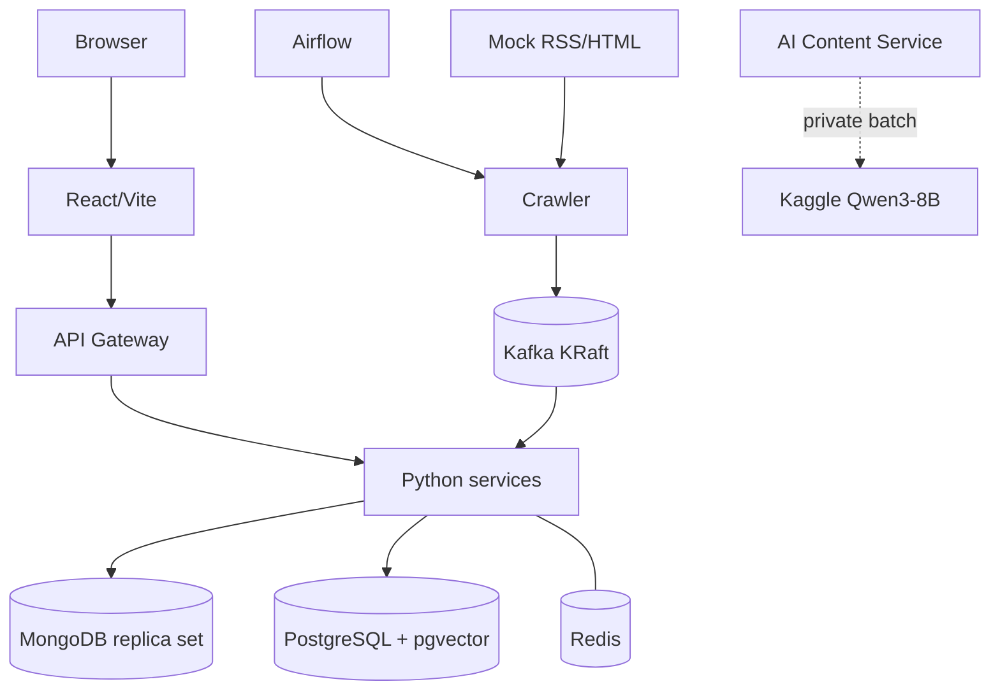

# Thiết kế triển khai local-first

## 1. Mục tiêu

FootballPulse chủ yếu chạy trên một máy local bằng Docker Compose. Topology này
ưu tiên tái lập, quan sát được và demo offline; nó không đại diện production
cluster chịu lỗi. WP 1.1 mới hiện thực bốn dependency nền, chưa gồm application.

## 2. Topology



Kaggle chỉ xử lý compute batch. MongoDB/PostgreSQL local vẫn là nguồn dữ liệu
chuẩn; Kaggle outage không làm mất crawl data.

## 3. Docker Compose profiles

| Profile | Thành phần |
| --- | --- |
| `core` | Hiện có Kafka, MongoDB, PostgreSQL+pgvector, Redis; service/frontend sẽ được thêm dần |
| `airflow` | Airflow scheduler/API và metadata database cần thiết |
| `demo` | Mock News Source, mock Kaggle/AI results và deterministic scenario control |
| `tools` | Kafka UI hoặc database admin tool tùy chọn |

Sử dụng thường ngày sau MVP là `core + airflow`; demo offline là
`core + airflow + demo`.

### Dependency baseline đã xác minh

| Dependency | Image | Host port |
| --- | --- | --- |
| Kafka KRaft | `apache/kafka:4.3.1` | `127.0.0.1:9092` |
| MongoDB replica set | `mongo:7.0.37-jammy` | `127.0.0.1:27017` |
| PostgreSQL + pgvector | `pgvector/pgvector:0.8.5-pg17-bookworm` | `127.0.0.1:5432` |
| Redis | `redis:7.2.14-alpine` | `127.0.0.1:6379` |

MongoDB 7 được pin vì MongoDB 8.x gặp lỗi đã biết trên kernel Linux 6.19 của máy
local. Khi nâng version phải chạy lại transaction smoke test trên kernel đích.

## 4. Resource strategy

Máy tham chiếu hiện có Ryzen 7 7735HS (8C/16T), 26 GiB RAM, Radeon 680M và không
có CUDA/ROCm. Vì vậy:

- Qwen3-8B 4-bit chạy trên Kaggle theo batch;
- Qwen3-4B GGUF `Q4_K_M` chỉ là local fallback, nạp khi cần, concurrency 1;
- GLiNER và `bge-small-en-v1.5` chạy CPU local;
- Kafka một broker, database pool và worker concurrency đều nhỏ/có giới hạn;
- Airflow dùng executor local nhẹ, không dùng CeleryExecutor cho MVP.

Compose hiện giới hạn lần lượt Kafka 1 GiB/1.5 CPU, MongoDB 1 GiB/1 CPU,
PostgreSQL 768 MiB/1 CPU và Redis 256 MiB/0.5 CPU. Các giới hạn sẽ được đo lại
khi full stack chạy.

## 5. Kaggle execution

AI Enrichment DAG tạo private dataset gồm `manifest.json` và `articles.jsonl`,
trigger notebook, poll status, tải `results.jsonl`/`job-report.json`, validate và
import partial results. State:

```text
PREPARING → UPLOADED → RUNNING → DOWNLOADING → VALIDATING → COMPLETED
```

Lỗi chuyển `RETRY_PENDING` hoặc `FAILED`; article chưa có output quay lại
`AI_PENDING`. Kaggle credentials chỉ ở local secret/environment. Không hard-code
username/key trong Dockerfile, notebook metadata hoặc Git.

## 6. Offline demo

- Mock source cung cấp RSS/HTML, versions, aliases, duplicates và failure modes.
- Mock AI trả cùng JSON schema như Qwen/Kaggle, gồm partial/invalid output.
- Deterministic clock chạy các cửa sổ 00/06/12/18.
- Không cần Internet, Kaggle quota, Hugging Face download hoặc API credential.
- Dữ liệu MongoDB/PostgreSQL dùng local volumes để restart không làm mất state.
- Crawler và Article Service cùng mount artifact spool tại
  `FOOTBALLPULSE_FETCH_ARTIFACT_ROOT`; `.local-data/` bị Git ignore. Spool chỉ là
  handoff local, retention/compression vẫn cần benchmark trước khi tự động dọn.

## 7. Startup và shutdown

Tạo `.env` local rồi chạy smoke test idempotent:

```bash
cp .env.example .env
./scripts/smoke-dependencies.sh
```

Script thực hiện health wait, bootstrap quyền volume Kafka, khởi tạo MongoDB
replica set, tạo Kafka smoke topic bằng `--if-not-exists`, commit MongoDB
transaction, kiểm tra extension `vector` và Redis `PONG`.

Sau khi PostgreSQL healthy, từng service owner tự chạy migration của mình:

```bash
uv run alembic -c services/crawler-service/alembic.ini upgrade head
uv run alembic -c services/api-gateway/alembic.ini upgrade head
```

Có thể đặt `FOOTBALLPULSE_DATABASE_URL` để override connection URL; nếu không,
Alembic dùng các biến `FOOTBALLPULSE_POSTGRES_*`. Crawler ghi version vào
`source_schema.alembic_version_source`, còn API Gateway ghi vào
`identity_schema.alembic_version_identity`.

Crawler Source API yêu cầu `FOOTBALLPULSE_CRAWLER_ADMIN_TOKEN` và
`FOOTBALLPULSE_CRAWLER_INTERNAL_TOKEN`; service từ chối khởi động nếu thiếu một
trong hai. Giá trị trong `.env.example` chỉ dùng local. Sau migration, chạy:

```bash
uv run footballpulse-crawler-service
```

Mặc định service bind `127.0.0.1:8011`; có thể đổi bằng
`FOOTBALLPULSE_CRAWLER_PORT`.

Có thể khởi động thủ công:

```bash
docker compose --env-file .env --profile core up -d --wait kafka mongodb postgres redis
docker compose --env-file .env --profile core run --rm mongodb-init
```

Dừng container nhưng giữ dữ liệu:

```bash
docker compose --env-file .env --profile core down
```

Không dùng `down -v` nếu muốn giữ local state. MongoDB hiện không bật auth và
toàn bộ port chỉ bind loopback; PostgreSQL/Redis dùng development credential từ
`.env`, không tái sử dụng cho môi trường ngoài máy cá nhân.

Thứ tự mở rộng mục tiêu:

1. Kafka, MongoDB, PostgreSQL và Redis health.
2. Init Kafka topics, Mongo replica set và owner migrations.
3. Python API/workers và mock adapters.
4. Gateway/frontend.
5. Airflow profile khi cần schedule/demo.

`depends_on` không thay application retry. Readiness chỉ true khi dependency
bắt buộc usable. Shutdown ngừng nhận việc mới, không acknowledge việc chưa ghi
bền vững, flush outbox/producer cần thiết và đóng resource.

## 8. Health và vận hành

Mỗi long-running component có liveness/readiness và structured log với service,
batch/correlation/event/article/story IDs. PostgreSQL operational read model giữ
counts crawl, duplicate, AI pending/completed/failed, Story create/update,
timeline, review và DLQ. MVP không thêm Prometheus/Grafana.
