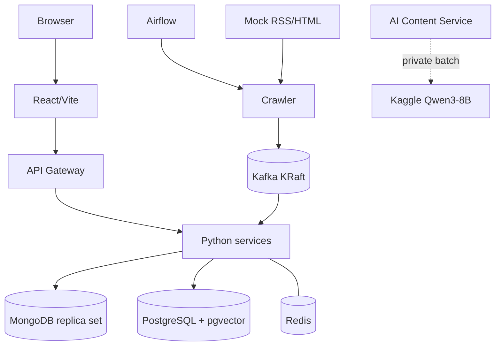

# Thiết kế triển khai local-first

## 1. Mục tiêu

FootballPulse chủ yếu chạy trên một máy local bằng Docker Compose. Topology này
ưu tiên tái lập, quan sát được và demo offline; nó không đại diện production
cluster chịu lỗi. Chưa có Compose startup hoặc smoke command được xác minh.

## 2. Topology



Kaggle chỉ xử lý compute batch. MongoDB/PostgreSQL local vẫn là nguồn dữ liệu
chuẩn; Kaggle outage không làm mất crawl data.

## 3. Docker Compose profiles

| Profile | Thành phần |
| --- | --- |
| `core` | Kafka, MongoDB, PostgreSQL+pgvector, Redis, sáu backend service, frontend |
| `airflow` | Airflow scheduler/API và metadata database cần thiết |
| `demo` | Mock News Source, mock Kaggle/AI results và deterministic scenario control |
| `tools` | Kafka UI hoặc database admin tool tùy chọn |

Sử dụng thường ngày là `core + airflow`; demo offline là
`core + airflow + demo`. Tên command cụ thể vẫn TBD tới khi Compose được tạo và
smoke-test.

## 4. Resource strategy

Máy tham chiếu hiện có Ryzen 7 7735HS (8C/16T), 26 GiB RAM, Radeon 680M và không
có CUDA/ROCm. Vì vậy:

- Qwen3-8B 4-bit chạy trên Kaggle theo batch;
- Qwen3-4B GGUF `Q4_K_M` chỉ là local fallback, nạp khi cần, concurrency 1;
- GLiNER và `bge-small-en-v1.5` chạy CPU local;
- Kafka một broker, database pool và worker concurrency đều nhỏ/có giới hạn;
- Airflow dùng executor local nhẹ, không dùng CeleryExecutor cho MVP.

Con số RAM/CPU limit cuối cùng phải được đo khi full stack chạy, không dự đoán.

## 5. Kaggle execution

AI Enrichment DAG tạo private dataset gồm `manifest.json` và `articles.jsonl`,
trigger notebook, poll status, tải `results.jsonl`/`job-report.json`, validate và
import partial results. State:

```text
PREPARING → UPLOADED → RUNNING → DOWNLOADING → VALIDATING → COMPLETED
```

Lỗi chuyển `RETRY_PENDING` hoặc `FAILED`; article chưa có output quay lại
`AI_PENDING`. Kaggle credentials chỉ ở local secret/environment. Không hard-code
username/key trong Dockerfile, notebook metadata hoặc Git.

## 6. Offline demo

- Mock source cung cấp RSS/HTML, versions, aliases, duplicates và failure modes.
- Mock AI trả cùng JSON schema như Qwen/Kaggle, gồm partial/invalid output.
- Deterministic clock chạy các cửa sổ 00/06/12/18.
- Không cần Internet, Kaggle quota, Hugging Face download hoặc API credential.
- Dữ liệu MongoDB/PostgreSQL dùng local volumes để restart không làm mất state.

## 7. Startup và shutdown mục tiêu

1. Kafka, MongoDB, PostgreSQL và Redis health.
2. Init Kafka topics, Mongo replica set và owner migrations.
3. Python API/workers và mock adapters.
4. Gateway/frontend.
5. Airflow profile khi cần schedule/demo.

`depends_on` không thay application retry. Readiness chỉ true khi dependency
bắt buộc usable. Shutdown ngừng nhận việc mới, không acknowledge việc chưa ghi
bền vững, flush outbox/producer cần thiết và đóng resource.

## 8. Health và vận hành

Mỗi long-running component có liveness/readiness và structured log với service,
batch/correlation/event/article/story IDs. PostgreSQL operational read model giữ
counts crawl, duplicate, AI pending/completed/failed, Story create/update,
timeline, review và DLQ. MVP không thêm Prometheus/Grafana.
