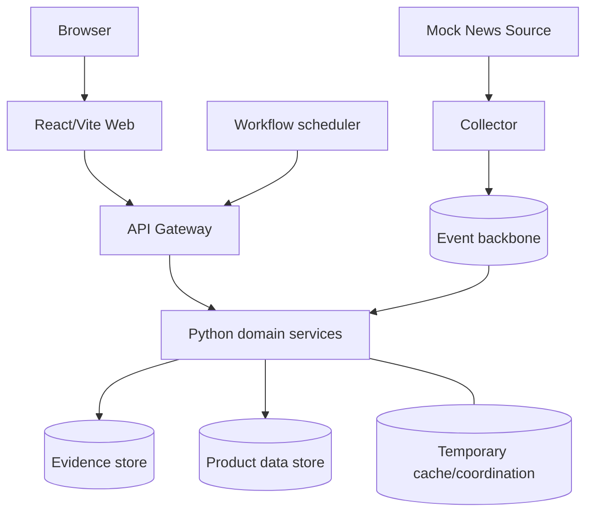

# Thiết kế triển khai

## 1. Mục tiêu triển khai MVP

MVP phải tái lập trên một máy local và demo offline. Tài liệu này mô tả topology
mục tiêu; chưa khẳng định image, Compose profile, migration hay startup command
đã được xác minh.

## 2. Topology logic

Thiết kế nền tảng đã chấp thuận dùng Kafka cho event backbone, MongoDB cho
Source Article, PostgreSQL cho dữ liệu normalized thuộc các service và Redis
cho cache/rate limit tạm thời. Airflow chỉ orchestration batch/backfill/demo,
không chứa business logic per article.

## 3. Local/offline mode

- Mock News Source cung cấp RSS/HTML và scenario progression deterministic.
- Mock Generator sinh structured output từ Story snapshot mà không cần API key.
- Fixture chứa transfer nhiều giai đoạn, aliases, duplicates, injury, match,
  429, 500, slow response và timeout.
- Clock/IDs đầu vào ổn định để test và demo cho cùng kết quả.
- External network và real AI provider là tùy chọn, không phải prerequisite.

## 4. Trình tự khởi động mục tiêu

1. Các data/event dependency sẵn sàng.
2. Init/migration do đúng owner chạy.
3. Backend API và worker khởi động, readiness chỉ true khi dependency cần thiết
   dùng được.
4. Mock source và mock generator mode sẵn sàng.
5. Gateway và frontend nhận traffic.
6. Scheduler/orchestrator được bật theo profile riêng nếu demo cần.

Startup ordering không thay thế retry kết nối có budget trong application.
Shutdown phải ngừng nhận việc mới, hoàn tất hoặc trả lại việc chưa acknowledge,
flush event cần thiết và đóng resource.

## 5. Cấu hình và secret

Configuration đi qua environment với safe placeholder trong `.env.example` khi
được triển khai. Credential thật không commit và không log. Mock mode phải được
biểu thị rõ; loopback chỉ hợp lệ cho source đã cấu hình trong local demo.

## 6. Health và quan sát

Mỗi long-running component có liveness và readiness. Structured log mang service,
request/correlation/event identity, outcome và error code. Operational read model
hoặc counter cục bộ theo dõi crawl outcome, retry, duplicate rate, Story update,
generation validation, draft/publication và DLQ. MVP không cần Prometheus hoặc
Grafana.

## 7. Hướng scale sau MVP

Có thể tăng worker trong cùng consumer group, điều chỉnh partition theo đo đạc,
tách read model hoặc dùng managed dependencies. Mọi thay đổi phải giữ aggregate
ordering cần thiết, ownership và idempotency. Không đưa ra con số throughput hay
resource trước khi có load test trên cấu hình máy được ghi lại.
