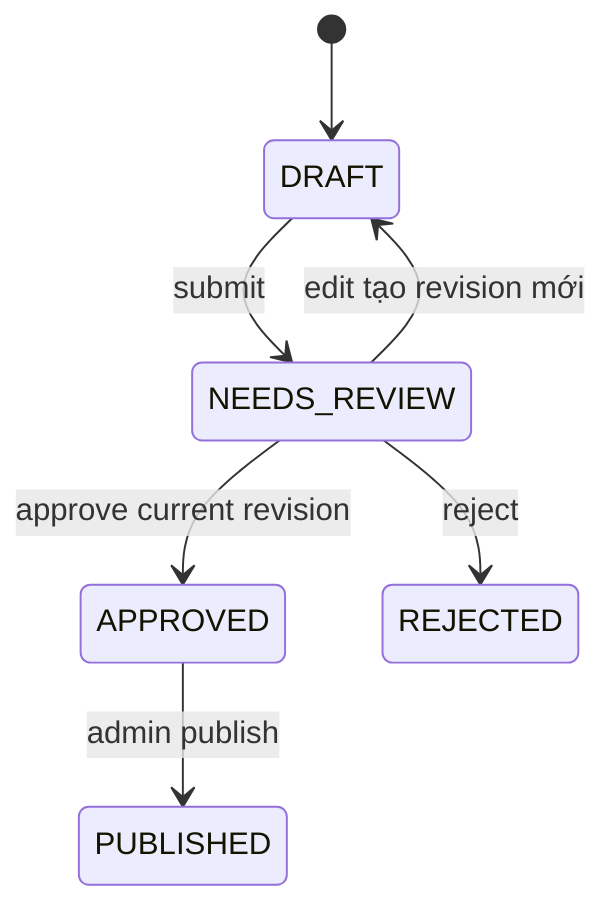

# Luồng biên tập và xuất bản

## 1. Mục tiêu

Editorial System là hàng rào giữa nội dung máy tạo và thông tin công khai. AI
không có quyền approve hoặc publish. Editor kiểm tra claim/source support; Admin
chịu trách nhiệm publication.

## 2. State machine MVP

MVP không có scheduled publication. Correction/re-review của bài đã publish cần
policy riêng và chưa được tự suy diễn; được ghi trong Open Questions.

## 3. Draft và revision

Draft là aggregate workflow; revision là snapshot nội dung. Mỗi lần edit tạo
revision mới thay vì overwrite lịch sử. Revision giữ headline, description,
body, source/citation mapping, story version, author và thời gian.

Nếu Story thay đổi sau khi draft được tạo, hệ thống hiển thị draft là stale.
Việc có bắt buộc regenerate hay cho editor rebase thủ công phụ thuộc policy,
nhưng stale revision không được publish âm thầm.

## 4. Review checklist

Editor cần thấy cạnh nội dung:

- confirmation hiện tại và lịch sử thay đổi;
- từng claim cùng Source Articles hỗ trợ;
- nguồn official và duplicate cluster;
- cảnh báo unsupported claim hoặc citation thiếu;
- input Story version và generation metadata;
- khác biệt giữa các revision.

Approve áp dụng cho **một revision cụ thể**, không phải toàn bộ draft mãi mãi.
Edit sau approve tạo revision mới và làm mất hiệu lực approval cũ.

## 5. Reject

Reject kết thúc nhánh review hiện tại và lưu actor, reason, revision, timestamp.
Nó không xóa draft, Story hoặc Source Article. Nếu muốn làm lại nội dung, hệ
thống tạo generation/revision mới theo một hành động audit được.

## 6. Publish

Publish chỉ thành công khi:

1. actor có role `ADMIN`;
2. revision được yêu cầu là current revision;
3. revision đó đang `APPROVED`;
4. Story version/staleness thỏa policy;
5. idempotency key chưa tạo publication khác.

Conditional update, transaction và unique successful-publication constraint
bảo vệ hai request đồng thời. Kết quả là immutable publication snapshot phục vụ
public web. Retry cùng key trả lại kết quả cũ thay vì tạo bài thứ hai.

## 7. Audit

Các action create, edit, submit, approve, reject và publish lưu actor, action ID,
reason, from/to state, revision và correlation ID. Audit history chỉ append;
không chứa secret hoặc raw provider response không cần thiết.
