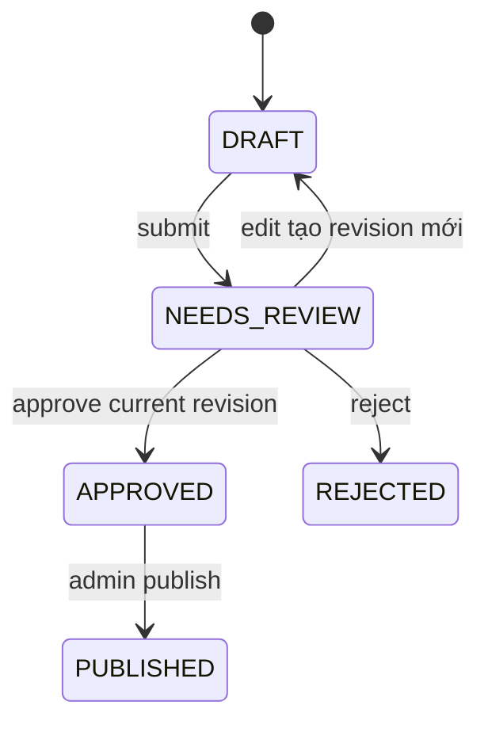

# Luồng biên tập và xuất bản

## 1. Hai loại nội dung

- **Timeline entry ngắn**: tự động hiển thị khi claims, English/Vietnamese output
  và source grounding đều valid; lỗi chuyển `NEEDS_CONTENT_REVIEW`.
- **Generated Article dài**: luôn qua editor review; AI không có quyền approve
  hoặc publish.

## 2. Khi nào tạo long-form draft

Draft được yêu cầu khi Story lần đầu đạt `MULTI_SOURCE`, đạt `OFFICIAL`, có
milestone lớn như `SUBMITTED_BID|BID_ACCEPTED|TRANSFER_COMPLETED`, hoặc editor
yêu cầu thủ công. Không tạo lại chỉ vì duplicate source hoặc câu chữ thay đổi.

Business key:

```text
story_id + story_version + prompt_version
```

Input gồm structured claims, timeline, confirmation và source references; không
gồm arbitrary raw pages. Output giữ headline/description/body bằng English và
Vietnamese cùng citation mapping.

## 3. State machine



MVP không có scheduled publication.

## 4. Draft và revision song ngữ

Draft là workflow aggregate; mỗi edit tạo immutable revision mới. Revision giữ
EN/VI headline, description, body, claim/source citations, Story version,
generation/translation metadata, editor và timestamp. English là nội dung chuẩn;
Vietnamese là bản public. Sửa sau approve tạo revision mới và làm approval cũ
hết hiệu lực.

Story update sau generation đánh dấu draft stale. Stale revision không được
publish âm thầm; policy rebase/regenerate chi tiết vẫn cần chốt trước implementation.

## 5. Review checklist

Editor thấy cạnh nội dung:

- confirmation của từng claim và lịch sử thay đổi;
- evidence quote và Source Articles hỗ trợ;
- official source, duplicate/syndication cluster;
- EN/VI comparison và cảnh báo bản dịch thêm fact;
- model, prompt, input Story version và validation result;
- diff giữa revisions.

Approve áp dụng cho đúng revision hiện hành.

## 6. Reject và publish

Reject lưu actor, reason, revision và timestamp; không xóa evidence, Story hoặc
draft. Publish chỉ thành công khi actor là `ADMIN`, revision hiện hành đã
`APPROVED`, staleness policy thỏa và idempotency key chưa được dùng. Transaction,
conditional update và unique successful-publication constraint bảo vệ request
đồng thời. Kết quả là immutable public snapshot.

## 7. Audit

Create, edit, submit, approve, reject, publish, timeline override, alias correction
và Story merge/reassign đều append audit action với actor, reason, before/after,
revision/version và correlation ID. Audit không chứa secret, raw provider output
không cần thiết hoặc full scraped body.
