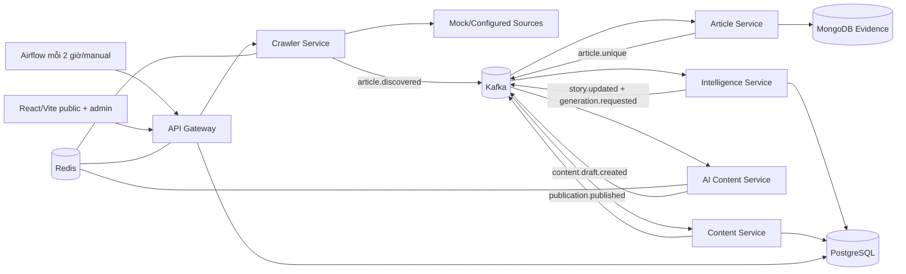

# FootballPulse — Kế hoạch triển khai

> Tài liệu này mô tả thứ tự triển khai từ trạng thái repository ngày
> 2026-07-31. Trong lần cập nhật này không triển khai application feature,
> không cài dependency và không chạy Docker.

**Mục tiêu:** Trong 3 tuần, khoảng 4–8 giờ/ngày, xây dựng một vertical slice
localhost/offline từ thu thập nguồn đến story, draft, review, publication và
frontend, đồng thời chứng minh at-least-once correctness, retry, DLQ, outbox và
worker recovery.

**Kiến trúc:** Sáu Python backend services có ownership rõ ràng, Kafka là
inter-service event backbone, Airflow chỉ orchestration cấp workflow, MongoDB
lưu source evidence, PostgreSQL lưu normalized product/editorial data, Redis
chỉ rate limit/cache/coordination. Frontend React/Vite hiện hữu được nối dần vào
Gateway/read models.

**Technology direction:** Python 3.12 (đã chốt), `uv`, FastAPI, Pydantic,
HTTPX, `confluent-kafka`, PyMongo Async, SQLAlchemy 2, `psycopg`, Alembic,
`redis-py`, Apache Kafka, Airflow, MongoDB, PostgreSQL, Redis, React/Vite.

---

## 1. Project identity và nguyên tắc không đổi

- Tên: **FootballPulse**.
- Tiêu đề tiếng Việt: **Thiết kế và xây dựng nền tảng tự động thu thập, tổng
  hợp và xuất bản tin tức bóng đá theo kiến trúc microservices**.
- English: **FootballPulse — Automated Football News Intelligence Platform**.
- Thời gian: 21 ngày, 4–8 giờ/ngày.
- Chạy localhost bằng Docker Compose và offline demo vẫn là P0 của toàn dự án,
  nhưng theo ADR-0002 mọi task Docker được gom vào phase cuối.
- Không dùng Go, Prometheus hoặc Grafana.
- Không dùng MongoDB polling để kích hoạt Intelligence.
- Không dùng ARQ trong MVP.
- Không thêm Elasticsearch/OpenSearch/vector DB/Kubernetes.
- Invariant:

```text
Source Article != Story != Published News Article
```

## 2. Repository assessment

Kiểm tra lại ngày 2026-07-31 cho thấy:

### Đã tồn tại

- Root đã có `AGENTS.md`, `.gitignore`, `README.md`, `.python-version`,
  `pyproject.toml`, `uv.lock`, `.env.example`, `Makefile` và
  `docker-compose.yml`.
- Python 3.12 và root `uv` workspace đã được thiết lập; Ruff, mypy, pytest và
  pytest-asyncio đã có cấu hình.
- `packages/event-contracts/` đã có Pydantic model cho
  `article.discovered.v1`; JSON Schema và valid fixture tương ứng nằm dưới
  `contracts/events/` và `tests/contract/`.
- `mock-news-source/static/` đã có deterministic RSS/HTML tối thiểu.
- `infrastructure/` đã có Kafka topic init, Mongo replica-set init và
  PostgreSQL schema init scripts.
- `docker-compose.yml` và infrastructure smoke script đã được tạo nhưng lần
  start/smoke hoàn chỉnh chưa được xác nhận; không được coi stack là hoạt động.
- `.gitignore` đã có Python/uv, test/build, frontend và env rules.
- `.venv/` local tồn tại nhưng ignored; chưa có root `pyproject.toml` hay
  `uv.lock`.
- `frontend/` là React 19 + Vite 8 + TypeScript strict + Tailwind CSS 4 +
  React Router 8, dùng pnpm và có lockfile.
- Public routes hiện có: homepage, Tin mới, Player/Club/Coach list/detail,
  article detail, search, 404.
- Admin routes hiện có: login, dashboard, sources, source articles, stories,
  drafts, published, failures.
- `frontend/src/data/mock.ts` và arrays trong admin pages cung cấp toàn bộ dữ
  liệu; chưa có API client.
- UI đã có loading skeleton/empty components và một số hard-coded error/loading
  states; chưa có data-fetch lifecycle thật.
- Thiết kế Figma import mô tả public/admin screens chi tiết.

### Chưa tồn tại

- Không có Python application service hoặc business logic service.
- Không có backend/API/Kafka producer/consumer.
- Không có MongoDB/PostgreSQL/Redis schemas, migrations hay repositories.
- Chưa có OpenAPI contracts; mới chỉ có event contract đầu tiên.
- Không có service Dockerfile hoặc Airflow DAG/profile.
- Không có backend/frontend tests hoặc CI.
- Chưa có verified Docker startup, migration, integration, E2E hoặc demo
  command. Quality/contract commands phải được chạy lại ở checkpoint Phase 0
  trước khi ghi là verified hiện tại.
- Frontend `package.json` có `dev`, `build`, `preview`, `format`, nhưng trong
  task này không chạy/install nên vẫn chưa xác nhận.

### Mâu thuẫn và cách giải quyết

| Mâu thuẫn | Quyết định kế hoạch |
| --- | --- |
| `AGENTS.md` initialization nói root chỉ có ba file, nhưng hiện có `frontend/` | Coi đoạn đó là lịch sử; cập nhật khi implementation phase bắt đầu. |
| Kiến trúc cũ nói Next.js, repo thực tế là React/Vite | Giữ React/Vite trong MVP; migration Next.js là P2. |
| Chỉ dẫn cũ coi PostgreSQL authoritative cho source articles; yêu cầu mới giao source evidence cho MongoDB | MongoDB là authoritative cho Source Article; PostgreSQL chỉ lưu opaque source refs/snapshots cho story/content. |
| Layout cũ có Source Service riêng | Gộp source config/crawl history vào Crawler Service để tránh microservice giả. |
| UI có external Unsplash URLs | Demo offline phải thay bằng local placeholders/assets trước final demo. |
| UI có năm 2025/static credentials | Wire config/API thật; demo credential từ `.env`, không hard-code production path. |

## 3. Bộ tài liệu thiết kế

- [Kiến trúc, service matrix, Airflow, AI/NLP, security](./architecture.md)
- [MongoDB, PostgreSQL, state machines, story clustering](./data-model.md)
- [Kafka event catalog](./event-catalog.md)
- [Reliability, outbox, retry, DLQ, recovery](./reliability-plan.md)
- [Public/admin/internal API và frontend mapping](./api-plan.md)
- [Testing, failure và load plan](./testing-plan.md)
- [Docker Compose và deterministic demo](./demo-plan.md)

Các tài liệu trên là một phần của plan này; implementation chỉ bắt đầu sau khi
được duyệt.

## 4. Final proposed architecture



Synchronous:

- Web ↔ Gateway.
- Airflow → internal crawl/reprocess command.
- Gateway → đúng một owning service cho admin detail/command.
- Intelligence/Content → Article internal GET chỉ khi event snapshot không đủ.

Asynchronous:

- Mọi individual article/story/generation/publication work qua Kafka.
- Transactional outbox phát event sau durable state.
- Consumer manual commit sau durable processing.

Public page đọc `content_schema` read models qua Gateway; tránh synchronous
fan-out. Chi tiết đầy đủ ở `architecture.md`.

## 5. Phased delivery strategy

### Phase 0 — Foundation không Docker (Days 1–2)

Chốt conventions, uv workspace, quality tools, configuration, first event
contract và deterministic fixtures. Không tạo/chạy container và không scaffold
toàn bộ services.

**Gate:** root quality/contract commands chạy được; schema valid/invalid được
test; mock fixtures deterministic; mọi Docker command vẫn được ghi rõ là
deferred/unverified.

**Status 2026-07-31:** hoàn thành. Workspace/lockfile, event contract, runtime
configuration, fixture catalog, port conventions và non-Docker quality gates
đã có. Docker/integration gate vẫn chưa bắt đầu.

### Phase 1 — Ingestion domain slice (Days 3–6)

```text
Mocked HTTP → Crawler use case → validated event port
→ Article use case → repository/outbox ports
```

**Gate:** crawler safety/retry/concurrency và article normalization/dedup/
idempotency/outbox được chứng minh bằng unit/contract tests với deterministic
fakes. Chưa tuyên bố Kafka/MongoDB integration hoạt động.

### Phase 2 — Intelligence/story domain slice (Days 7–11)

```text
article.unique fixture → Intelligence use case → entity/alias/keyword
→ claim/story/timeline → repository/outbox ports → generation request
```

**Gate:** multi-source transfer vào một story; injury/match tách; concurrent
use cases dùng optimistic-version/unique-conflict semantics không tạo duplicate
story trong fake concurrency tests. PostgreSQL behavior chờ phase cuối xác minh.

### Phase 3 — AI, editorial và API contracts (Days 12–16)

```text
story fixture → Mock AI → validated draft
→ review/approve/publish use cases → API contracts → frontend client boundary
```

**Gate:** mock AI grounding, editorial invariants, auth/RBAC/middleware và
frontend contract mapping có focused tests. Chưa gọi đây là full-stack.

### Phase 4 — Docker integration, orchestration và final demo (Days 17–21)

```text
Docker dependencies → real adapters/migrations/topics
→ services → Airflow schedule/manual/demo
→ retry/DLQ/outbox/reconcile → offline E2E/load → documentation
```

**Gate:** Compose sạch start/stop được; Kafka/Mongo/Postgres/Redis/Airflow thật
được smoke/integration test; full offline demo, restart và failure scenarios
pass; scope/limitations/measurements được ghi trung thực.

## 6. Roadmap 21 ngày

Mỗi ngày là một checkpoint 4–8 giờ. Nếu mục tiêu chưa đạt, dùng scope fallback
ngay trong ngày thay vì chuyển sang breadth mới.

### Day 1 — Chốt foundation và contracts đầu tiên

- **Objective:** Biến quyết định TBD tối thiểu thành cấu hình có thể kiểm tra.
- **Tasks:** ADRs/README skeleton; root uv workspace; Python 3.12; Ruff/mypy/
  pytest config; `event-contracts` package; envelope + `article.discovered.v1`
  JSON Schema.
- **Expected files:** `pyproject.toml`, `uv.lock`, `.python-version`,
  `contracts/events/...`, `packages/event-contracts/...`, docs decisions.
- **Tests:** schema valid/invalid fixture; format/lint/type/unit smoke.
- **Dependencies:** user duyệt plan; network chỉ khi implementation được phép
  cài dependency.
- **DoD:** commands được chạy và ghi vào README/AGENTS; không có service giả.
- **Risk:** Airflow dependency conflict trong shared workspace.
- **Fallback:** Airflow giữ environment/image riêng, app services vẫn một uv
  workspace.

### Day 2 — Contract/config và deterministic fixtures

- **Objective:** Hoàn thành foundation có thể kiểm tra mà không cần container.
- **Tasks:** chuẩn hóa event envelope; invalid fixtures; config model đọc env;
  mock RSS/HTML datasets cho transfer/duplicate/injury/match và failure scripts;
  repository/producer protocols tối thiểu cho Milestone 1.
- **Expected:** `contracts/events/`, `packages/event-contracts/`,
  `tests/fixtures/`, config tests và mock-source fixture manifest.
- **Tests:** JSON Schema/Pydantic compatibility; unknown field/timezone/size
  rejection; fixture snapshot; config secret không xuất hiện trong repr/log.
- **Dependencies:** Day 1.
- **DoD:** fixtures ổn định, tests offline pass, không có container được chạy.
- **Risk:** contract quá rộng trước use case.
- **Fallback:** chỉ giữ envelope và `article.discovered.v1`; bổ sung event khác
  đúng lúc vertical slice cần.

### Day 3 — Crawler fetch một source

- **Objective:** Manual command fetch RSS/HTML mock an toàn.
- **Tasks:** Crawler package; source/crawl policy domain model; HTTP client
  protocol; URL allowlist/SSRF guard; one-source use case.
- **Expected:** `services/crawler-service` chỉ gồm package cần cho slice và
  focused tests; migration để sau adapter phase.
- **Tests:** RSS parse, allowed mock host, private target reject, timeout/size.
- **Dependencies:** Day 2 fixtures/contracts.
- **DoD:** một source tạo bounded article candidates, chưa cần broad parsers.
- **Risk:** over-generalized crawler.
- **Fallback:** chỉ support explicit fixture RSS + simple HTML selectors.

### Day 4 — Bounded concurrency, rate/retry và event producer port

- **Objective:** Crawler tạo đúng `article.discovered` và chỉ acknowledge sau
  khi producer port xác nhận delivery.
- **Tasks:** global/per-domain semaphore/rate policy; 429/5xx/timeout retry;
  producer protocol/delivery result; fake producer; batch counters.
- **Expected:** crawler adapters/domain policies, event fixtures.
- **Tests:** concurrency bound, Retry-After, delivery failure, only confirmed
  event increments queued.
- **Dependencies:** Day 3; không cần broker thật.
- **DoD:** multi-source crawl không vượt limit; deterministic failures pass.
- **Risk:** fake producer không phản ánh callback semantics của client Kafka.
- **Fallback:** định nghĩa contract delivery/timeout rõ và đánh dấu integration
  proof là bắt buộc ở Day 18.

### Day 5 — Article normalization và evidence model

- **Objective:** Xử lý discovered event thành immutable Source Article qua
  repository port.
- **Tasks:** Article use case/repository protocol; URL/title/content
  normalization; hash; processed-event/idempotency model; `article.unique`
  contract.
- **Expected:** `services/article-service`, pure domain modules, contracts và
  fake repository tests.
- **Tests:** normalization tables; invalid event no repository call; duplicate
  event no repeated state/outbox intent.
- **Dependencies:** Day 4.
- **DoD:** one discovered fixture → one evidence aggregate + trace metadata +
  outbox intent trong fake atomic boundary.
- **Risk:** fake atomic boundary che giấu Mongo transaction constraint.
- **Fallback:** giữ transaction contract nhỏ và xác minh bắt buộc Day 18.

### Day 6 — Duplicate và Article outbox semantics

- **Objective:** Chứng minh ingestion idempotent và recoverable.
- **Tasks:** URL/exact/near duplicate; identities; outbox state machine;
  retry/DLQ classification; fake publisher scenario.
- **Expected:** duplicate model, outbox protocol/state transitions và Milestone
  1 domain tests.
- **Tests:** duplicate race model, redelivery, simulated crash after commit,
  outbox replay/idempotency.
- **Dependencies:** Day 5.
- **DoD:** Milestone 1 domain gate đạt; duplicate evidence preserved trong
  model/fake repository. Real Mongo/Kafka gate vẫn mở tới Day 18.
- **Risk:** near-duplicate tuning.
- **Fallback:** URL + exact P0; near duplicate simple title/SimHash flag nhưng
  không auto-suppress.

### Day 7 — Intelligence model và seed aliases

- **Objective:** Domain model cho entities/stories/claims và curated seed.
- **Tasks:** entity/alias/story/claim models; repository protocols; fixtures;
  processed-event/outbox contracts.
- **Expected:** `services/intelligence-service`, domain modules và seed data.
- **Tests:** unique alias/fingerprint/link invariants bằng fake repository;
  model validation.
- **Dependencies:** article.unique contract.
- **DoD:** ownership boundary rõ; aliases deterministic; migration chưa được
  tuyên bố verified.
- **Risk:** data model breadth.
- **Fallback:** chỉ fields/indexes P0 trong `data-model.md`.

### Day 8 — Keyword/entity/category pipeline

- **Objective:** `article.unique` tạo normalized mentions/keywords/category.
- **Tasks:** dictionary longest match, alias resolution, event rules, unresolved
  review result.
- **Expected:** pure domain modules + golden fixtures.
- **Tests:** aliases, overlaps, accents, category examples.
- **Dependencies:** Day 7.
- **DoD:** mock articles có entity/category đúng, không phụ thuộc LLM.
- **Risk:** NLP ambiguity.
- **Fallback:** curated aliases/rules cho deterministic demo; OTHER/manual for
  unknown.

### Day 9 — Claims và story candidate scoring

- **Objective:** Structured claims và explainable story choice.
- **Tasks:** deterministic claim extractors cho five categories; candidate
  query; score/fingerprint; threshold result.
- **Expected:** claim/story matching modules, score explanation.
- **Tests:** score boundaries, transfer evolution, injury/match separation.
- **Dependencies:** Day 8.
- **DoD:** fixtures có expected candidate + reasons.
- **Risk:** claim extraction scope.
- **Fallback:** template rules cho demo categories; optional structured LLM P1.

### Day 10 — Concurrent story update/outbox use case

- **Objective:** Atomic create/attach/update/version.
- **Tasks:** unit-of-work protocol; unique fingerprint conflict; optimistic
  version retry; timeline/confirmation; story outbox intent.
- **Expected:** consumer use case, repository ports, fake concurrency harness.
- **Tests:** same story race, no lost claim/timeline, duplicate event.
- **Dependencies:** Day 9.
- **DoD:** fake contention giữ one active story và consistent version/history;
  database proof được deferred.
- **Risk:** PostgreSQL isolation/locking khác fake harness.
- **Fallback:** unique constraints + bounded retry design phải được integration
  test Day 18 trước khi tiếp tục E2E.

### Day 11 — Editor corrections và Milestone 2

- **Objective:** Merge/reassign/entity correction and generation trigger.
- **Tasks:** minimal internal/admin Intelligence APIs; audit; trigger only
  meaningful story update.
- **Expected:** OpenAPI slice, command handlers.
- **Tests:** merge order, stale version, reassignment, regeneration condition.
- **Dependencies:** Day 10.
- **DoD:** Milestone 2 and correction workflow pass.
- **Risk:** admin breadth.
- **Fallback:** APIs and tests first; UI wiring moves to Day 16.

### Day 12 — AI job/provider abstraction

- **Objective:** Generation consumer use case theo direct-Kafka design và
  deterministic mock provider; Kafka adapter thật để Phase 4.
- **Tasks:** job/attempt model; adapter protocol; lease/restart; MockProvider;
  provider request schema.
- **Expected:** `services/ai-content-service`, domain/use-case code và fixtures;
  migrations được viết ở Day 17.
- **Tests:** job idempotency, expired lease, deterministic result.
- **Dependencies:** generation event.
- **DoD:** same story/version produces one successful job.
- **Risk:** introducing ARQ.
- **Fallback:** explicitly stay direct Kafka; no ARQ.

### Day 13 — Grounding validation và real provider adapters

- **Objective:** Valid draft event; optional OpenAI/OpenRouter config.
- **Tasks:** strict structured response, claim/source validation, retry/limiter,
  usage metadata; provider adapters behind opt-in.
- **Expected:** adapters/config contracts, invalid/failure events.
- **Tests:** invalid schema, unsupported claim, 429/timeout/5xx, no key mock path.
- **Dependencies:** Day 12.
- **DoD:** invalid result cannot become reviewable/publishable draft.
- **Risk:** API/model changes/cost.
- **Fallback:** keep adapters config-tested, final demo uses mock only.

### Day 14 — Content state/revisions/publication use cases

- **Objective:** Durable editorial workflow.
- **Tasks:** consume draft event use case; revisions/actions;
  approve/reject/publish commands; publication outbox/read model.
- **Expected:** `services/content-service`, OpenAPI slice và fake repositories.
- **Tests:** state matrix, stale edit, simultaneous/idempotent publish.
- **Dependencies:** draft event.
- **DoD:** exactly one successful publication per approved draft.
- **Risk:** state edge cases.
- **Fallback:** no schedule/unpublish; five-state MVP only.

### Day 15 — Gateway public/admin API

- **Objective:** Stable API façade, auth/RBAC/middleware/read endpoints.
- **Tasks:** identity/auth domain model và repository port; login;
  request/correlation/error/CORS/security/body/time/rate middleware; public
  news/detail/search/entities; admin commands needed for demo.
- **Expected:** `services/api-gateway`, OpenAPI, contract tests.
- **Tests:** middleware order/headers/error, RBAC, rate limits, pagination.
- **Dependencies:** Content/Intelligence APIs/read models.
- **DoD:** curl/API tests can review/publish/read.
- **Risk:** too many endpoints.
- **Fallback:** implement exact demo/UI endpoints P0; leave full CRUD P1.

### Day 16 — Frontend contract integration và Milestone 3

- **Objective:** Existing React screens dùng typed API boundary; runtime
  full-stack được xác minh ở phase Docker.
- **Tasks:** API client/types/auth; homepage/article/search/entity; admin
  sources/story/draft/failure priority screens; route guards; states; local
  assets; mock transport chỉ bật trong test/dev contract mode.
- **Expected:** frontend data/adapters/hooks and focused page updates.
- **Tests:** component states, frontend build, browser happy path.
- **Dependencies:** Gateway OpenAPI.
- **DoD:** frontend contract/component tests pass; không có silent mock fallback
  trong cấu hình demo cuối.
- **Risk:** UI contract mismatch.
- **Fallback:** wire homepage/article/search + draft review only; remaining
  admin lists use API next.

### Day 17 — Docker baseline và real persistence adapters

- **Objective:** Bắt đầu phase Docker; đưa dependency services lên từ clean
  state và gắn migrations/repositories thật.
- **Tasks:** review/finalize Compose cho Kafka KRaft, Mongo replica set,
  PostgreSQL, Redis và mock source; service Dockerfiles khi cần; health/init;
  Alembic migrations; Mongo indexes; real repository adapters.
- **Expected:** Compose profiles, Dockerfiles tối thiểu, migrations/index
  definitions và integration test configuration.
- **Tests:** `docker compose config`; clean start/stop; health; Mongo
  transaction; PostgreSQL migration; Redis auth; mock-source snapshot.
- **Dependencies:** Phase 0–3 contracts/use cases.
- **DoD:** dependency stack clean-start được và real repository contract tests
  pass.
- **Risk:** dồn lỗi version/network/init race về cuối.
- **Fallback:** bật từng dependency profile để debug; không bỏ real integration
  hoặc thay bằng SQLite.

### Day 18 — Kafka adapters, retry/DLQ và Milestone 1 thật

- **Objective:** Xác minh ingestion qua Kafka/MongoDB thật và recovery loop.
- **Tasks:** producer/consumer adapters; topic init; manual offset commit;
  Mongo atomic processed-event/evidence/outbox; outbox publisher; retry
  dispatcher; DLQ/failure read model/replay.
- **Expected:** worker entry points, topic config, integration/failure tests.
- **Tests:** `acks=all` delivery; produce/consume; redelivery; crash before
  commit; crash after DB commit; poison message; outbox replay.
- **Dependencies:** Day 17.
- **DoD:** thin Milestone 1 chạy thật; exhausted failure visible/replayable.
- **Risk:** client callback/offset/outbox semantics.
- **Fallback:** giảm test dataset/worker count, không giảm invariants.

### Day 19 — Service stack, Airflow và full offline E2E

- **Objective:** Chạy tất cả service adapters và orchestration thật.
- **Tasks:** service Compose; Airflow 3 lightweight profile; collection DAG
  `0 */2 * * *`; manual/backfill/demo DAG; migrations/seeds; happy/evolving/
  unrelated scenario; frontend/gateway wiring.
- **Expected:** `airflow/dags`, complete local profiles,
  `tests/end-to-end` và fixture control scripts.
- **Tests:** DAG import/run; full mock-source→publish→public page; duplicate DAG
  run; worker restart.
- **Dependencies:** Day 18.
- **DoD:** repeatable offline from clean volumes; Airflow không chứa per-article
  business logic.
- **Risk:** Airflow RAM/startup và flaky timing.
- **Fallback:** Airflow profile chỉ bật cho orchestration test/demo; dùng
  deadline polling, không arbitrary sleep.

### Day 20 — Failure, load/concurrency và resource tuning

- **Objective:** Đo baseline localhost, không invent.
- **Tasks:** dependency outage/worker kill tests; crawler/Kafka/Intelligence/API
  experiments; Docker resource tuning; record percentiles/lag/invariants.
- **Expected:** load scripts + dated results.
- **Tests:** final invariant validation after each run.
- **Dependencies:** stable E2E.
- **DoD:** at least one recorded run per critical concurrency concern.
- **Risk:** laptop resource limit.
- **Fallback:** smaller datasets/duration, vẫn ghi rõ machine/config.

### Day 21 — Docker reproducibility, docs và demo

- **Objective:** Một người mới chạy/hiểu/demo được project.
- **Tasks:** clean Compose rebuild; migrations/seeds; README/architecture/API/
  event/testing/demo/limitations; screenshots optional; final code review.
- **Expected:** verified commands, demo checklist, known limitations.
- **Tests:** full narrow→broad validation; offline/no-key run.
- **Dependencies:** all gates.
- **DoD:** project-level Definition of Done bên dưới đạt hoặc deviations được ghi.
- **Risk:** late failures.
- **Fallback:** cắt P1/P2, không cắt core story/reliability/offline path.

## 7. Prioritized backlog

### P0 — MVP bắt buộc

- Root uv/config/verified commands.
- Compose Kafka/Mongo replica/Postgres/Redis.
- Mock source + mock AI deterministic.
- Crawler bounded concurrency/rate/retry/SSRF.
- Versioned event contracts, manual commits, processed events, outbox, DLQ.
- Mongo source evidence + exact/near duplicate relationships.
- Entity/alias/category/claim/story/timeline/version/concurrency.
- Direct Kafka AI worker + grounded validation.
- Draft/revision/review/approve/reject/idempotent publish.
- Gateway middleware/auth/RBAC/rate limit.
- Public news/entity/search and essential admin APIs.
- Existing frontend integration.
- Airflow 2-hour/manual/demo workflow.
- Unit/integration/contract/E2E/failure/restart tests and docs.

### P1 — Nếu còn thời gian

- Full admin CRUD/details cho tất cả mock screens.
- Kafka UI local profile.
- More robust near-duplicate scoring/config UI.
- `SCHEDULED` publication/unpublish.
- OpenAPI TS code generation automation.
- CI, richer operational dashboard/counters.
- Schema Registry và retry tooling nâng cao.
- Real source adapters ngoài 1–2 configured examples.

### P2 — Future

- Next.js/SSR migration.
- Embeddings/vector clustering.
- Elasticsearch/OpenSearch.
- Kubernetes/cloud/production service identity.
- Recommendations/comments/personalization/live scores/social publishing.
- Full multilingual NLP.
- External image licensing pipeline.

## 8. Definition of Done

Project hoàn thành khi có evidence kiểm thử/documentation cho tất cả:

1. Full stack start localhost bằng command đã xác minh.
2. Airflow schedule hai giờ hoặc manual trigger tạo idempotent crawl batch.
3. Crawler fetch nhiều mock sources bounded concurrent.
4. 429, 500, timeout và `Retry-After` hoạt động đúng.
5. `article.discovered` được Kafka xác nhận trước queued.
6. Article Service lưu evidence ở MongoDB.
7. Exact duplicate không tạo unique downstream work lặp.
8. Mọi duplicate source vẫn traceable.
9. `article.unique` phát qua outbox an toàn.
10. Intelligence extract keywords/entities/category/claims.
11. Aliases resolve canonical entity.
12. Related transfer articles vào một story.
13. Concurrent processing không tạo duplicate story/lost update.
14. Timeline/confirmation/version update đúng.
15. Mock AI tạo deterministic grounded draft.
16. OpenAI/OpenRouter adapter bật được bằng config, không bắt buộc.
17. Editor review/edit/approve/reject/publish.
18. Public APIs phục vụ frontend React hiện có.
19. Search news/stories/player/club/coach/alias.
20. Featured entity fields/lists hoạt động.
21. Duplicate Kafka delivery không duplicate business state.
22. Retry exhausted vào DLQ và có replay/audit.
23. Worker restart không mất durable unfinished work.
24. README/testing/demo/limitations và actual commands được ghi.
25. `Source Article != Story != Published News Article` được chứng minh trong DB
    và UI.
26. Demo chạy không Internet/provider credentials.
27. Không dùng Prometheus/Grafana; local logs/health/admin failure visibility đủ.

## 9. Risks và scope cuts

| Risk | Probability | Impact | Mitigation | Fallback scope |
| --- | --- | --- | --- | --- |
| Sáu microservices quá nhiều | High | High | Chỉ scaffold service khi vertical slice đến; shared contracts nhỏ | Giữ deployable boundaries nhưng giảm admin breadth, không tách Source Service |
| Kafka/retry complexity | Medium | High | Một event convention, real integration tests, Kafka UI optional | Một retry topic + DLQ thay nhiều delay tiers |
| Mongo/Postgres dual consistency | High | High | Event snapshots + outbox + idempotent consumers + reconcile | Không cross-DB transaction; chấp nhận eventual consistency rõ ràng |
| Mongo replica-set setup | Medium | Medium | Idempotent init/health, test clean volume | Documented non-atomic fallback + reconcile chỉ tạm thời |
| Airflow resource use | High | Medium | Profile riêng, executor nhẹ, no Celery | Chỉ bật Airflow khi demo; manual API vẫn hoạt động |
| LLM cost/rate/output | High | Medium | Mock default, structured validation, concurrency/RPM budget | Real providers config-only demonstration |
| Real crawling instability | High | Medium | Mock P0, allowlist, 1–2 adapters | Demo hoàn toàn mock; real source là P1 |
| Story clustering accuracy | High | High | Explainable score, golden fixtures, editor correction | Curated rule thresholds cho 5 categories, no embeddings |
| Frontend/API mismatch | Medium | High | Contract-first, wire one screen at a time | Demo-critical screens trước |
| Three-week deadline | High | High | Phase gates, daily scope fallback, P0/P1/P2 | Cắt schedule/observability UI polish/real sources, không cắt core vertical slice |
| Local machine RAM | Medium | High | Compose profiles/resource caps | Airflow/tools profile on demand; small fixture datasets |
| Python package conflicts | Medium | Medium | uv lock; Airflow image/environment isolation | Airflow không là workspace member nếu conflict |

## 10. Baseline Phase 0 đã được chấp thuận

Các quyết định sau được user chấp thuận ngày 2026-07-31 và được ghi tại
[`ADR-0001`](./decisions/0001-phase-0-foundation.md):

1. Python 3.12 cho backend; một root `uv` workspace/lockfile, service manifest
   riêng; Ruff, mypy, pytest và pytest-asyncio.
2. Giữ `frontend/` React/Vite/pnpm; không chuyển Next.js.
3. MongoDB là source-of-truth cho Source Article; PostgreSQL cho Story/Content.
4. Sáu backend services, không có Source Service riêng.
5. Apache Kafka KRaft single-node local; JSON Schema/Pydantic; versioned topic;
   một retry topic và một DLQ cho mỗi input topic cần retry.
6. `article.discovered.v1` mang bounded parsed source snapshot.
7. MongoDB chạy single-node replica set để hỗ trợ Article transaction/outbox.
8. Airflow local profile dùng topology nhẹ, không CeleryExecutor; AI worker
   consume Kafka trực tiếp, không ARQ.
9. JWT/Argon2 với hai role: `EDITOR` review/edit/approve/reject; `ADMIN` có thêm
   publish và quyền vận hành. Local internal token bảo vệ internal APIs.
10. Không publication scheduling, Prometheus hoặc Grafana trong MVP.

Các điểm vẫn phải xác minh bằng implementation: dependency versions, exact
Airflow executor, Kafka partition/retention tuning và mọi command.

Thứ tự thực hiện đã được cập nhật bởi
[`ADR-0002`](./decisions/0002-defer-docker-work.md): kiến trúc và Definition of
Done không đổi, nhưng toàn bộ tạo/chỉnh/chạy/xác minh Docker được chuyển sang
Phase 4 (Days 17–21). Các phase trước không được dùng fake adapter làm bằng
chứng thay cho Kafka/MongoDB/PostgreSQL/Redis thật.

## 11. First 10 implementation tasks

Mỗi task nhỏ, độc lập, theo TDD; command là planned đến khi được chạy.

1. **Re-verify Phase 0 workspace and first contract.** Chạy quality/contract
   tests hiện có; sửa documentation drift; tuyệt đối không chạy Docker.
2. **Complete deterministic fixture catalog.** Thêm transfer progression,
   alias, exact/near duplicate, injury, match và failure scenario manifests;
   verify bằng snapshot tests.
3. **Implement Crawler URL safety policy.** Test allowlist, scheme, DNS/IP,
   redirect, response size và timeout bằng fake resolver/transport.
4. **Implement one-source Crawler use case.** Parse fixture RSS/HTML, enforce
   bounded fetch policy và gửi `article.discovered` qua producer port.
5. **Implement crawler concurrency/retry policy.** Test global/per-domain
   bounds, `Retry-After`, 429/5xx/timeout, cancellation và delivery failure.
6. **Implement Article normalization/hash domain.** Table-driven tests cho URL,
   title, content và deterministic hash.
7. **Implement Source Article idempotent use case.** Fake unit-of-work ghi
   evidence + processed event + outbox intent atomically; test redelivery.
8. **Implement duplicate semantics.** URL/exact/near duplicate relationships,
   evidence preservation và rule không emit repeated unique work.
9. **Define and validate `article.unique.v1`.** JSON Schema/Pydantic/fixtures,
   producer-consumer compatibility và versioning tests.
10. **Checkpoint ingestion domain slice.** Chạy broad quality/contract/unit
    suite, review ports và invariants; chỉ sau checkpoint này chuyển sang
    Intelligence. Kafka/Mongo Docker integration được giữ ở Day 18.

## 12. First recommended milestone

Bắt đầu bằng Milestone 1 ở mức domain/contracts, theo đường mỏng nhất:

```text
one deterministic RSS fixture
→ one bounded crawler use case
→ one validated article.discovered event
→ one Article use case
→ one evidence/outbox intent through fake ports
```

Sau khi path này có contract và focused tests mới mở rộng duplicate/failure rồi
đi vào Intelligence. Milestone 1 chỉ được coi là hoàn tất thật ở Day 18, khi
cùng path đó chạy qua Kafka và MongoDB trong Docker, có redelivery/crash-window
integration tests. Đây là checkpoint đề nghị user duyệt trước khi
implementation.
