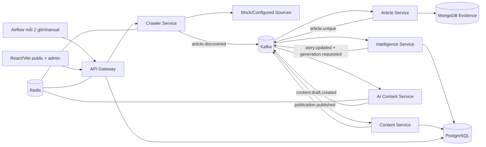

# FootballPulse — Kế hoạch triển khai

> Tài liệu này chỉ là kế hoạch. Không có application feature, dependency hoặc
> service scaffold nào được tạo trong task lập kế hoạch.

**Mục tiêu:** Trong 3 tuần, khoảng 4–8 giờ/ngày, xây dựng một vertical slice
localhost/offline từ thu thập nguồn đến story, draft, review, publication và
frontend, đồng thời chứng minh at-least-once correctness, retry, DLQ, outbox và
worker recovery.

**Kiến trúc:** Sáu Python backend services có ownership rõ ràng, Kafka là
inter-service event backbone, Airflow chỉ orchestration cấp workflow, MongoDB
lưu source evidence, PostgreSQL lưu normalized product/editorial data, Redis
chỉ rate limit/cache/coordination. Frontend React/Vite hiện hữu được nối dần vào
Gateway/read models.

**Technology direction:** Python 3.12 (đã chốt), `uv`, FastAPI, Pydantic,
HTTPX, `confluent-kafka`, PyMongo Async, SQLAlchemy 2, `psycopg`, Alembic,
`redis-py`, Apache Kafka, Airflow, MongoDB, PostgreSQL, Redis, React/Vite.

---

## 1. Project identity và nguyên tắc không đổi

- Tên: **FootballPulse**.
- Tiêu đề tiếng Việt: **Thiết kế và xây dựng nền tảng tự động thu thập, tổng
  hợp và xuất bản tin tức bóng đá theo kiến trúc microservices**.
- English: **FootballPulse — Automated Football News Intelligence Platform**.
- Thời gian: 21 ngày, 4–8 giờ/ngày.
- Chạy localhost, ưu tiên Docker Compose; offline demo là P0.
- Không dùng Go, Prometheus hoặc Grafana.
- Không dùng MongoDB polling để kích hoạt Intelligence.
- Không dùng ARQ trong MVP.
- Không thêm Elasticsearch/OpenSearch/vector DB/Kubernetes.
- Invariant:

```text
Source Article != Story != Published News Article
```

## 2. Repository assessment

Kiểm tra ngày 2026-07-30 cho thấy:

### Đã tồn tại

- Root: `AGENTS.md`, `.gitignore`, `README.md`.
- `README.md` chỉ có `# project3`; không có quick start/architecture/commands.
- `.gitignore` đã có Python/uv, test/build, frontend và env rules.
- `.venv/` local tồn tại nhưng ignored; chưa có root `pyproject.toml` hay
  `uv.lock`.
- `frontend/` là React 19 + Vite 8 + TypeScript strict + Tailwind CSS 4 +
  React Router 8, dùng pnpm và có lockfile.
- Public routes hiện có: homepage, Tin mới, Player/Club/Coach list/detail,
  article detail, search, 404.
- Admin routes hiện có: login, dashboard, sources, source articles, stories,
  drafts, published, failures.
- `frontend/src/data/mock.ts` và arrays trong admin pages cung cấp toàn bộ dữ
  liệu; chưa có API client.
- UI đã có loading skeleton/empty components và một số hard-coded error/loading
  states; chưa có data-fetch lifecycle thật.
- Thiết kế Figma import mô tả public/admin screens chi tiết.

### Chưa tồn tại

- Không có Python application/package/service.
- Không có backend/API/Kafka producer/consumer.
- Không có MongoDB/PostgreSQL/Redis schemas, migrations hay repositories.
- Không có event/OpenAPI contracts.
- Không có Dockerfile/Compose, Airflow DAG, mock news service.
- Không có backend/frontend tests hoặc CI.
- Không có verified build/test/start/migration/demo command ở root.
- Frontend `package.json` có `dev`, `build`, `preview`, `format`, nhưng trong
  task này không chạy/install nên vẫn chưa xác nhận.

### Mâu thuẫn và cách giải quyết

| Mâu thuẫn | Quyết định kế hoạch |
| --- | --- |
| `AGENTS.md` initialization nói root chỉ có ba file, nhưng hiện có `frontend/` | Coi đoạn đó là lịch sử; cập nhật khi implementation phase bắt đầu. |
| Kiến trúc cũ nói Next.js, repo thực tế là React/Vite | Giữ React/Vite trong MVP; migration Next.js là P2. |
| Chỉ dẫn cũ coi PostgreSQL authoritative cho source articles; yêu cầu mới giao source evidence cho MongoDB | MongoDB là authoritative cho Source Article; PostgreSQL chỉ lưu opaque source refs/snapshots cho story/content. |
| Layout cũ có Source Service riêng | Gộp source config/crawl history vào Crawler Service để tránh microservice giả. |
| UI có external Unsplash URLs | Demo offline phải thay bằng local placeholders/assets trước final demo. |
| UI có năm 2025/static credentials | Wire config/API thật; demo credential từ `.env`, không hard-code production path. |

## 3. Bộ tài liệu thiết kế

- [Kiến trúc, service matrix, Airflow, AI/NLP, security](./architecture.md)
- [MongoDB, PostgreSQL, state machines, story clustering](./data-model.md)
- [Kafka event catalog](./event-catalog.md)
- [Reliability, outbox, retry, DLQ, recovery](./reliability-plan.md)
- [Public/admin/internal API và frontend mapping](./api-plan.md)
- [Testing, failure và load plan](./testing-plan.md)
- [Docker Compose và deterministic demo](./demo-plan.md)

Các tài liệu trên là một phần của plan này; implementation chỉ bắt đầu sau khi
được duyệt.

## 4. Final proposed architecture



Synchronous:

- Web ↔ Gateway.
- Airflow → internal crawl/reprocess command.
- Gateway → đúng một owning service cho admin detail/command.
- Intelligence/Content → Article internal GET chỉ khi event snapshot không đủ.

Asynchronous:

- Mọi individual article/story/generation/publication work qua Kafka.
- Transactional outbox phát event sau durable state.
- Consumer manual commit sau durable processing.

Public page đọc `content_schema` read models qua Gateway; tránh synchronous
fan-out. Chi tiết đầy đủ ở `architecture.md`.

## 5. Phased delivery strategy

### Phase 0 — Decision lock và foundation (Days 1–2)

Chốt contract conventions, uv workspace, quality tools, Docker baseline và
first event. Chỉ tạo những phần Milestone 1 cần.

**Gate:** root environment có verified commands; Kafka/Mongo/Postgres/Redis và
mock source health; một contract fixture validate.

### Phase 1 — Ingestion vertical slice (Days 3–6)

```text
Manual trigger → Mock source → Crawler → Kafka
→ Article Service → MongoDB → article.unique
```

**Gate:** exact duplicate được giữ evidence nhưng chỉ một unique downstream;
429/500/timeout có test; worker restart/redelivery không duplicate.

### Phase 2 — Intelligence/story vertical slice (Days 7–11)

```text
article.unique → Intelligence → entity/alias/keyword
→ claim/story/timeline → PostgreSQL → generation request
```

**Gate:** multi-source transfer vào một story; injury/match tách; concurrent
workers không tạo duplicate story.

### Phase 3 — Editorial/public vertical slice (Days 12–16)

```text
story version → Mock AI → validated draft
→ review/approve/publish → read model/API → existing frontend
```

**Gate:** editor publish đúng current approved revision; public/search/entity
screens đọc API thật; offline.

### Phase 4 — Orchestration, recovery và final demo (Days 17–21)

```text
Airflow schedule/manual/demo → retry/DLQ/outbox/reconcile
→ failure/load/E2E → documentation
```

**Gate:** full Compose/demo documented; restart and failure scenarios pass;
scope/limitations/measurements trung thực.

## 6. Roadmap 21 ngày

Mỗi ngày là một checkpoint 4–8 giờ. Nếu mục tiêu chưa đạt, dùng scope fallback
ngay trong ngày thay vì chuyển sang breadth mới.

### Day 1 — Chốt foundation và contracts đầu tiên

- **Objective:** Biến quyết định TBD tối thiểu thành cấu hình có thể kiểm tra.
- **Tasks:** ADRs/README skeleton; root uv workspace; Python 3.12; Ruff/mypy/
  pytest config; `event-contracts` package; envelope + `article.discovered.v1`
  JSON Schema.
- **Expected files:** `pyproject.toml`, `uv.lock`, `.python-version`,
  `contracts/events/...`, `packages/event-contracts/...`, docs decisions.
- **Tests:** schema valid/invalid fixture; format/lint/type/unit smoke.
- **Dependencies:** user duyệt plan; network chỉ khi implementation được phép
  cài dependency.
- **DoD:** commands được chạy và ghi vào README/AGENTS; không có service giả.
- **Risk:** Airflow dependency conflict trong shared workspace.
- **Fallback:** Airflow giữ environment/image riêng, app services vẫn một uv
  workspace.

### Day 2 — Local infrastructure tối thiểu

- **Objective:** Dependency services và Mock Source chạy ổn định.
- **Tasks:** Compose Kafka KRaft, Mongo single-node replica set, PostgreSQL,
  Redis, mock news source; health/init scripts; `.env.example`.
- **Expected:** `docker-compose.yml`, infrastructure init/health files,
  `mock-news-source/` chỉ với fixture endpoints cần cho first slice.
- **Tests:** Compose config; health; replica transaction smoke; Kafka produce/
  consume smoke; fixture snapshot.
- **Dependencies:** Day 1.
- **DoD:** clean startup/shutdown; no Internet needed.
- **Risk:** Mongo replica/Kafka init race.
- **Fallback:** explicit idempotent init container/script và readiness retry;
  chưa thêm Airflow.

### Day 3 — Crawler fetch một source

- **Objective:** Manual command fetch RSS/HTML mock an toàn.
- **Tasks:** Crawler package; source config/crawl batch minimal migration;
  HTTPX client; URL allowlist/SSRF guard; one-source command.
- **Expected:** `services/crawler-service`, source migration, focused tests.
- **Tests:** RSS parse, allowed mock host, private target reject, timeout/size.
- **Dependencies:** mock source, Postgres.
- **DoD:** một source tạo bounded article candidates, chưa cần broad parsers.
- **Risk:** over-generalized crawler.
- **Fallback:** chỉ support explicit fixture RSS + simple HTML selectors.

### Day 4 — Bounded concurrency, rate/retry và Kafka produce

- **Objective:** Crawler phát durable `article.discovered`.
- **Tasks:** global/per-domain semaphore/rate policy; 429/5xx/timeout retry;
  Kafka producer delivery callback; batch counters.
- **Expected:** crawler adapters/domain policies, event fixtures.
- **Tests:** concurrency bound, Retry-After, delivery failure, only confirmed
  event increments queued.
- **Dependencies:** Day 3, Kafka.
- **DoD:** multi-source crawl không vượt limit; deterministic failures pass.
- **Risk:** async client + sync Kafka loop complexity.
- **Fallback:** dedicated producer thread/queue bounded, không dùng experimental
  async Kafka API.

### Day 5 — Article normalization và Mongo evidence

- **Objective:** Consume discovered event, persist immutable Source Article.
- **Tasks:** Article worker/repository; Mongo indexes; URL/title/content
  normalization; hash; processed events.
- **Expected:** `services/article-service`, Mongo init/index definitions,
  `article.unique` contract.
- **Tests:** normalization tables, transaction, invalid event no business write.
- **Dependencies:** Day 4.
- **DoD:** one discovered event → one evidence doc + trace metadata.
- **Risk:** PyMongo Async behavior/transactions.
- **Fallback:** sync PyMongo worker process if Async API blocks progress; giữ
  repository interface và transaction semantics.

### Day 6 — Duplicate, Article outbox và Milestone 1

- **Objective:** Chứng minh ingestion idempotent và recoverable.
- **Tasks:** URL/exact/near duplicate; identities; Mongo outbox publisher;
  retry/DLQ first path; integration scenario.
- **Expected:** duplicate/history collections, outbox worker, Milestone 1 tests.
- **Tests:** duplicate races, redelivery, crash after commit, outbox replay.
- **Dependencies:** Day 5.
- **DoD:** Milestone 1 gate đạt; duplicate evidence preserved.
- **Risk:** near-duplicate tuning.
- **Fallback:** URL + exact P0; near duplicate simple title/SimHash flag nhưng
  không auto-suppress.

### Day 7 — Intelligence schema và seed aliases

- **Objective:** Migrations cho entities/stories/claims và curated seed.
- **Tasks:** schema/migrations; repositories; entity/alias fixtures; processed
  event/outbox bases.
- **Expected:** `services/intelligence-service`, Alembic migrations, seeds.
- **Tests:** migration up/down policy, unique aliases/fingerprints/links.
- **Dependencies:** article.unique contract.
- **DoD:** schema owner isolation; aliases deterministic.
- **Risk:** data model breadth.
- **Fallback:** chỉ fields/indexes P0 trong `data-model.md`.

### Day 8 — Keyword/entity/category pipeline

- **Objective:** `article.unique` tạo normalized mentions/keywords/category.
- **Tasks:** dictionary longest match, alias resolution, event rules, unresolved
  review result.
- **Expected:** pure domain modules + golden fixtures.
- **Tests:** aliases, overlaps, accents, category examples.
- **Dependencies:** Day 7.
- **DoD:** mock articles có entity/category đúng, không phụ thuộc LLM.
- **Risk:** NLP ambiguity.
- **Fallback:** curated aliases/rules cho deterministic demo; OTHER/manual for
  unknown.

### Day 9 — Claims và story candidate scoring

- **Objective:** Structured claims và explainable story choice.
- **Tasks:** deterministic claim extractors cho five categories; candidate
  query; score/fingerprint; threshold result.
- **Expected:** claim/story matching modules, score explanation.
- **Tests:** score boundaries, transfer evolution, injury/match separation.
- **Dependencies:** Day 8.
- **DoD:** fixtures có expected candidate + reasons.
- **Risk:** claim extraction scope.
- **Fallback:** template rules cho demo categories; optional structured LLM P1.

### Day 10 — Concurrent story update/outbox

- **Objective:** Atomic create/attach/update/version.
- **Tasks:** transaction, lock/unique fingerprint, optimistic version retry;
  timeline/confirmation; story outbox.
- **Expected:** consumer, repositories, outbox publisher.
- **Tests:** same story race, no lost claim/timeline, duplicate event.
- **Dependencies:** Day 9.
- **DoD:** one active story; consistent version/history.
- **Risk:** lock/deadlock.
- **Fallback:** serialize per fingerprint partition + unique constraint; keep
  database protection.

### Day 11 — Editor corrections và Milestone 2

- **Objective:** Merge/reassign/entity correction and generation trigger.
- **Tasks:** minimal internal/admin Intelligence APIs; audit; trigger only
  meaningful story update.
- **Expected:** OpenAPI slice, command handlers.
- **Tests:** merge order, stale version, reassignment, regeneration condition.
- **Dependencies:** Day 10.
- **DoD:** Milestone 2 and correction workflow pass.
- **Risk:** admin breadth.
- **Fallback:** APIs and tests first; UI wiring moves to Day 16.

### Day 12 — AI job/provider abstraction

- **Objective:** Direct Kafka generation worker and deterministic mock provider.
- **Tasks:** job/attempt schema; adapter protocol; lease/restart; MockProvider;
  provider request schema.
- **Expected:** `services/ai-content-service`, migrations, fixtures.
- **Tests:** job idempotency, expired lease, deterministic result.
- **Dependencies:** generation event.
- **DoD:** same story/version produces one successful job.
- **Risk:** introducing ARQ.
- **Fallback:** explicitly stay direct Kafka; no ARQ.

### Day 13 — Grounding validation và real provider adapters

- **Objective:** Valid draft event; optional OpenAI/OpenRouter config.
- **Tasks:** strict structured response, claim/source validation, retry/limiter,
  usage metadata; provider adapters behind opt-in.
- **Expected:** adapters/config contracts, invalid/failure events.
- **Tests:** invalid schema, unsupported claim, 429/timeout/5xx, no key mock path.
- **Dependencies:** Day 12.
- **DoD:** invalid result cannot become reviewable/publishable draft.
- **Risk:** API/model changes/cost.
- **Fallback:** keep adapters config-tested, final demo uses mock only.

### Day 14 — Content state/revisions/publication

- **Objective:** Durable editorial workflow.
- **Tasks:** Content migrations; consume draft event; revisions/actions;
  approve/reject/publish commands; publication outbox/read model.
- **Expected:** `services/content-service`, OpenAPI slice.
- **Tests:** state matrix, stale edit, simultaneous/idempotent publish.
- **Dependencies:** draft event.
- **DoD:** exactly one successful publication per approved draft.
- **Risk:** state edge cases.
- **Fallback:** no schedule/unpublish; five-state MVP only.

### Day 15 — Gateway public/admin API

- **Objective:** Stable API façade, auth/RBAC/middleware/read endpoints.
- **Tasks:** identity schema; login; request/correlation/error/CORS/security/
  body/time/rate middleware; public news/detail/search/entities; admin commands
  needed for demo.
- **Expected:** `services/api-gateway`, OpenAPI, contract tests.
- **Tests:** middleware order/headers/error, RBAC, rate limits, pagination.
- **Dependencies:** Content/Intelligence APIs/read models.
- **DoD:** curl/API tests can review/publish/read.
- **Risk:** too many endpoints.
- **Fallback:** implement exact demo/UI endpoints P0; leave full CRUD P1.

### Day 16 — Frontend API integration và Milestone 3

- **Objective:** Existing React screens dùng real API.
- **Tasks:** API client/types/auth; homepage/article/search/entity; admin
  sources/story/draft/failure priority screens; route guards; states; local
  assets.
- **Expected:** frontend data/adapters/hooks and focused page updates.
- **Tests:** component states, frontend build, browser happy path.
- **Dependencies:** Gateway OpenAPI.
- **DoD:** no silent mock fallback in demo; full publish visible publicly.
- **Risk:** UI contract mismatch.
- **Fallback:** wire homepage/article/search + draft review only; remaining
  admin lists use API next.

### Day 17 — Airflow collection/manual/demo DAG

- **Objective:** Workflow orchestration every two hours.
- **Tasks:** Airflow local topology; collection DAG `0 */2 * * *`; manual
  backfill/reprocess/demo DAG; stable idempotency keys.
- **Expected:** `airflow/dags`, Compose Airflow profile.
- **Tests:** DAG import, task retry/timeout, duplicate DAG run.
- **Dependencies:** crawl batch API.
- **DoD:** Airflow calls batch API; no per-article task/business logic.
- **Risk:** Airflow RAM/startup.
- **Fallback:** scheduler + API server/executor light; turn Airflow profile on
  only for demo.

### Day 18 — Retry/DLQ/failure UI/reconciliation

- **Objective:** Complete recovery loop.
- **Tasks:** retry topics/dispatcher; DLQ/failure read model; admin retry;
  reconciliation commands; outbox/stuck job handling.
- **Expected:** failure contracts/workers/runbook/UI wiring.
- **Tests:** poison continues partition, replay causation, missing outbox recovery.
- **Dependencies:** all workers.
- **DoD:** exhausted failure visible and replayable.
- **Risk:** generic retry framework overengineering.
- **Fallback:** one shared convention + service-specific handlers, no framework.

### Day 19 — Full E2E và restart/failure suite

- **Objective:** Automated deterministic system proof.
- **Tasks:** happy/evolving/unrelated scenario; dependency outages; worker kill
  checkpoints; final invariants.
- **Expected:** `tests/end-to-end`, `tests/failure`, fixture control scripts.
- **Tests:** full suite itself.
- **Dependencies:** Phases 1–4.
- **DoD:** repeatable from clean volumes; failures diagnosed.
- **Risk:** flaky timing.
- **Fallback:** poll durable state with deadlines, no arbitrary sleeps; split
  slow cases into documented manual verification only if necessary.

### Day 20 — Load/concurrency và resource tuning

- **Objective:** Đo baseline localhost, không invent.
- **Tasks:** crawler/Kafka/Intelligence/API experiments; Docker resource tuning;
  record environment/percentiles/lag/invariants.
- **Expected:** load scripts + dated results.
- **Tests:** final invariant validation after each run.
- **Dependencies:** stable E2E.
- **DoD:** at least one recorded run per critical concurrency concern.
- **Risk:** laptop resource limit.
- **Fallback:** smaller datasets/duration, vẫn ghi rõ machine/config.

### Day 21 — Final reproducibility, docs và demo

- **Objective:** Một người mới chạy/hiểu/demo được project.
- **Tasks:** clean Compose rebuild; migrations/seeds; README/architecture/API/
  event/testing/demo/limitations; screenshots optional; final code review.
- **Expected:** verified commands, demo checklist, known limitations.
- **Tests:** full narrow→broad validation; offline/no-key run.
- **Dependencies:** all gates.
- **DoD:** project-level Definition of Done bên dưới đạt hoặc deviations được ghi.
- **Risk:** late failures.
- **Fallback:** cắt P1/P2, không cắt core story/reliability/offline path.

## 7. Prioritized backlog

### P0 — MVP bắt buộc

- Root uv/config/verified commands.
- Compose Kafka/Mongo replica/Postgres/Redis.
- Mock source + mock AI deterministic.
- Crawler bounded concurrency/rate/retry/SSRF.
- Versioned event contracts, manual commits, processed events, outbox, DLQ.
- Mongo source evidence + exact/near duplicate relationships.
- Entity/alias/category/claim/story/timeline/version/concurrency.
- Direct Kafka AI worker + grounded validation.
- Draft/revision/review/approve/reject/idempotent publish.
- Gateway middleware/auth/RBAC/rate limit.
- Public news/entity/search and essential admin APIs.
- Existing frontend integration.
- Airflow 2-hour/manual/demo workflow.
- Unit/integration/contract/E2E/failure/restart tests and docs.

### P1 — Nếu còn thời gian

- Full admin CRUD/details cho tất cả mock screens.
- Kafka UI local profile.
- More robust near-duplicate scoring/config UI.
- `SCHEDULED` publication/unpublish.
- OpenAPI TS code generation automation.
- CI, richer operational dashboard/counters.
- Schema Registry và retry tooling nâng cao.
- Real source adapters ngoài 1–2 configured examples.

### P2 — Future

- Next.js/SSR migration.
- Embeddings/vector clustering.
- Elasticsearch/OpenSearch.
- Kubernetes/cloud/production service identity.
- Recommendations/comments/personalization/live scores/social publishing.
- Full multilingual NLP.
- External image licensing pipeline.

## 8. Definition of Done

Project hoàn thành khi có evidence kiểm thử/documentation cho tất cả:

1. Full stack start localhost bằng command đã xác minh.
2. Airflow schedule hai giờ hoặc manual trigger tạo idempotent crawl batch.
3. Crawler fetch nhiều mock sources bounded concurrent.
4. 429, 500, timeout và `Retry-After` hoạt động đúng.
5. `article.discovered` được Kafka xác nhận trước queued.
6. Article Service lưu evidence ở MongoDB.
7. Exact duplicate không tạo unique downstream work lặp.
8. Mọi duplicate source vẫn traceable.
9. `article.unique` phát qua outbox an toàn.
10. Intelligence extract keywords/entities/category/claims.
11. Aliases resolve canonical entity.
12. Related transfer articles vào một story.
13. Concurrent processing không tạo duplicate story/lost update.
14. Timeline/confirmation/version update đúng.
15. Mock AI tạo deterministic grounded draft.
16. OpenAI/OpenRouter adapter bật được bằng config, không bắt buộc.
17. Editor review/edit/approve/reject/publish.
18. Public APIs phục vụ frontend React hiện có.
19. Search news/stories/player/club/coach/alias.
20. Featured entity fields/lists hoạt động.
21. Duplicate Kafka delivery không duplicate business state.
22. Retry exhausted vào DLQ và có replay/audit.
23. Worker restart không mất durable unfinished work.
24. README/testing/demo/limitations và actual commands được ghi.
25. `Source Article != Story != Published News Article` được chứng minh trong DB
    và UI.
26. Demo chạy không Internet/provider credentials.
27. Không dùng Prometheus/Grafana; local logs/health/admin failure visibility đủ.

## 9. Risks và scope cuts

| Risk | Probability | Impact | Mitigation | Fallback scope |
| --- | --- | --- | --- | --- |
| Sáu microservices quá nhiều | High | High | Chỉ scaffold service khi vertical slice đến; shared contracts nhỏ | Giữ deployable boundaries nhưng giảm admin breadth, không tách Source Service |
| Kafka/retry complexity | Medium | High | Một event convention, real integration tests, Kafka UI optional | Một retry topic + DLQ thay nhiều delay tiers |
| Mongo/Postgres dual consistency | High | High | Event snapshots + outbox + idempotent consumers + reconcile | Không cross-DB transaction; chấp nhận eventual consistency rõ ràng |
| Mongo replica-set setup | Medium | Medium | Idempotent init/health, test clean volume | Documented non-atomic fallback + reconcile chỉ tạm thời |
| Airflow resource use | High | Medium | Profile riêng, executor nhẹ, no Celery | Chỉ bật Airflow khi demo; manual API vẫn hoạt động |
| LLM cost/rate/output | High | Medium | Mock default, structured validation, concurrency/RPM budget | Real providers config-only demonstration |
| Real crawling instability | High | Medium | Mock P0, allowlist, 1–2 adapters | Demo hoàn toàn mock; real source là P1 |
| Story clustering accuracy | High | High | Explainable score, golden fixtures, editor correction | Curated rule thresholds cho 5 categories, no embeddings |
| Frontend/API mismatch | Medium | High | Contract-first, wire one screen at a time | Demo-critical screens trước |
| Three-week deadline | High | High | Phase gates, daily scope fallback, P0/P1/P2 | Cắt schedule/observability UI polish/real sources, không cắt core vertical slice |
| Local machine RAM | Medium | High | Compose profiles/resource caps | Airflow/tools profile on demand; small fixture datasets |
| Python package conflicts | Medium | Medium | uv lock; Airflow image/environment isolation | Airflow không là workspace member nếu conflict |

## 10. Baseline Phase 0 đã được chấp thuận

Các quyết định sau được user chấp thuận ngày 2026-07-31 và được ghi tại
[`ADR-0001`](./decisions/0001-phase-0-foundation.md):

1. Python 3.12 cho backend; một root `uv` workspace/lockfile, service manifest
   riêng; Ruff, mypy, pytest và pytest-asyncio.
2. Giữ `frontend/` React/Vite/pnpm; không chuyển Next.js.
3. MongoDB là source-of-truth cho Source Article; PostgreSQL cho Story/Content.
4. Sáu backend services, không có Source Service riêng.
5. Apache Kafka KRaft single-node local; JSON Schema/Pydantic; versioned topic;
   một retry topic và một DLQ cho mỗi input topic cần retry.
6. `article.discovered.v1` mang bounded parsed source snapshot.
7. MongoDB chạy single-node replica set để hỗ trợ Article transaction/outbox.
8. Airflow local profile dùng topology nhẹ, không CeleryExecutor; AI worker
   consume Kafka trực tiếp, không ARQ.
9. JWT/Argon2 với hai role: `EDITOR` review/edit/approve/reject; `ADMIN` có thêm
   publish và quyền vận hành. Local internal token bảo vệ internal APIs.
10. Không publication scheduling, Prometheus hoặc Grafana trong MVP.

Các điểm vẫn phải xác minh bằng implementation: dependency versions, exact
Airflow executor, Kafka partition/retention tuning và mọi command.

## 11. First 10 implementation tasks

Mỗi task nhỏ, độc lập, theo TDD; command là planned đến khi được chạy.

1. **Verify accepted foundation ADR.** Đối chiếu `ADR-0001` với root
   instructions và plan; mọi thay đổi quyết định sau này phải supersede ADR,
   không sửa lịch sử âm thầm.
2. **Initialize root uv workspace.** Chỉ root config + quality/test tools;
   generate/commit lock. Verify `uv sync --locked` và a smoke test.
3. **Define event envelope + `article.discovered.v1`.** Write invalid tests
   first, then JSON Schema/Pydantic package. Verify contract tests.
4. **Bring up Kafka only with health/topic init.** Compose smallest infra slice;
   verify produce/consume smoke and clean restart.
5. **Add Mock Source first RSS scenario.** One feed + one HTML article + reset;
   snapshot test; no failure breadth yet.
6. **Add Crawler URL safety/policy domain module.** Tests for allowlist/private
   IP/redirect/size/timeout before HTTP integration.
7. **Add one-source Crawler command.** Fetch fixture and produce one validated
   event; delivery callback test; no batch breadth yet.
8. **Bring up Mongo single-node replica set and indexes.** Transaction/index
   integration test from clean volume.
9. **Add Article normalization/hash repository path.** One event → one evidence
   + processed event + outbox, test before worker loop.
10. **Complete Milestone 1 thin path.** Article consumer/outbox publisher emits
    `article.unique`; redelivery and crash-window integration test; checkpoint
    review trước khi thêm duplicate breadth/Intelligence.

## 12. First recommended milestone

Bắt đầu bằng Milestone 1, nhưng theo đường mỏng nhất:

```text
one manual trigger
→ one deterministic RSS source
→ one bounded crawler fetch
→ one validated article.discovered event
→ one Mongo Source Article
→ one outbox-backed article.unique event
```

Chỉ sau khi path này có contract, test và restart behavior mới mở rộng nhiều
source, duplicate/failure scenarios, rồi đi vào Intelligence. Đây là checkpoint
đề nghị user duyệt trước khi implementation.
