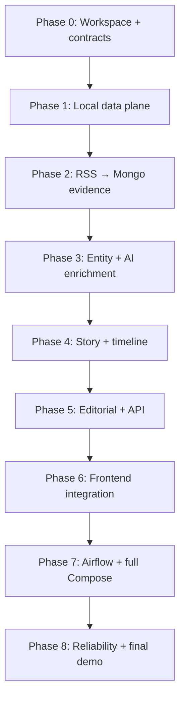

# FootballPulse Implementation Plan

> **For Codex:** REQUIRED SUB-SKILL: use `executing-plans` and execute exactly
> one work package at a time. Never continue past a Collaboration Gate without
> explicit user approval.

**Goal:** Xây dựng vertical slice local-first từ RSS → HTML evidence → AI
enrichment → Story/timeline song ngữ → editorial publication → React UI, có
offline demo và recovery tests.

**Architecture:** Airflow điều phối batch 6 giờ; Kafka mang business events;
MongoDB sở hữu immutable Source Article/enrichment; PostgreSQL+pgvector sở hữu
entity, Story, timeline, editorial và public read model. AI mạnh chạy private
Kaggle batch, local/mock adapters bảo đảm pipeline không mất dữ liệu và demo
offline.

**Tech Stack:** Python 3.12, uv, FastAPI, Pydantic, Kafka KRaft, MongoDB replica
set, PostgreSQL+pgvector, Redis, Airflow 3, GLiNER, BGE small English, Qwen3,
React 19/Vite 8/TypeScript, Docker Compose.

---

## 0. Quy tắc cộng tác bắt buộc

### 0.1 Đơn vị thực thi

- Một lần Codex chỉ triển khai **một Work Package (WP)**.
- Mỗi WP phải đủ nhỏ để hoàn thành, test và review trong một phiên tập trung.
- Không bắt đầu WP kế tiếp chỉ vì WP hiện tại đã pass.
- Mọi thay đổi ngoài scope WP phải ghi vào `Open Questions` hoặc backlog, không
  tự tiện triển khai.
- Trước khi viết code của mỗi WP, Codex phải trình **WP Kickoff** gồm mục tiêu,
  exact files dự kiến, test-first steps, decisions cần user chốt và câu hỏi
  “Bạn có cho phép bắt đầu WP này không?”. Chỉ bắt đầu sau khi user đồng ý.
- Nếu một WP vẫn quá lớn sau khi khám phá code, Codex phải viết mini-plan TDD
  chi tiết cho WP đó trong `docs/plans/`, xin user duyệt rồi mới triển khai;
  không âm thầm mở rộng master plan.

### 0.2 Collaboration Gate sau mọi WP

Sau khi hoàn thành một WP, Codex **phải dừng** và báo:

```text
WORK PACKAGE: <mã và tên>
STATUS: COMPLETE | PARTIAL | BLOCKED

Files changed:
- ...

Commands actually run:
- command → result

Acceptance evidence:
- tests/log/API/UI evidence

Contracts/migrations/invariants affected:
- ...

Open decisions or deviations:
- ...

Next proposed WP:
- ...

Approval request:
Bạn có đồng ý đóng WP này và cho phép bắt đầu WP tiếp theo không?
```

Codex chỉ tiếp tục khi user trả lời đồng ý. Nếu user yêu cầu sửa, sửa trong WP
hiện tại, verify lại và trình Collaboration Gate lần nữa.

### 0.3 Phase Gate

Sau WP cuối của phase:

- chạy toàn bộ quality gates được hỗ trợ tại thời điểm đó;
- demo vertical slice của phase;
- cập nhật README/docs/commands và `tasks/todo.md`;
- ghi debt, benchmark và decisions chưa khóa;
- chờ user duyệt phase trước khi sang phase mới.

### 0.4 Definition of Done cho một WP

- Test được viết trước cho logic/bug/behavior mới.
- Focused tests pass; broader tests chạy theo mức rủi ro.
- Ruff format/lint và mypy pass cho Python scope đã hỗ trợ.
- Contract/migration/docs thay đổi cùng behavior khi liên quan.
- Không log secret/full scraped body; không phá mock/offline mode.
- Git diff được review và commit chỉ sau user approval nếu user muốn review trước.

## 1. Dependency graph và thứ tự phase



Phases 0–2 là Week 1, phases 3–5 là Week 2, phases 6–8 là Week 3. Đây là thứ
tự dependency, không phải cam kết thời gian cứng.

---

## Phase 0 — Python workspace, conventions và contracts

### WP 0.1 — Root uv workspace và quality gates

**Mục tiêu:** Tạo baseline Python 3.12 tái lập được trước khi scaffold business
service.

**Files:**

- Create: `pyproject.toml`, `.python-version`, `uv.lock`, `.env.example`
- Create: `tests/smoke/test_workspace.py`
- Modify: `.gitignore`, `README.md`

**Steps:**

1. Viết smoke test kiểm tra Python version và import workspace packages dự kiến.
2. Tạo root non-package uv workspace và cấu hình Ruff/mypy/pytest/pytest-asyncio.
3. Lock dependency nền tảng; không thêm ML/database driver chưa dùng.
4. Chạy `uv sync --all-packages --locked`.
5. Chạy `uv run pytest tests/smoke -q`, Ruff và mypy trên scope hiện có.

**Acceptance:** môi trường tạo từ lockfile; commands được ghi lại chính xác;
không có service business code.

**Collaboration Gate 0.1:** báo dependency versions/commands và xin duyệt.

### WP 0.2 — Service package skeleton và runtime conventions

**Mục tiêu:** Sáu service có package riêng, liveness entrypoint tối thiểu và
không chia sẻ business logic.

**Files:**

- Create: `services/*/pyproject.toml`
- Create: `services/*/src/footballpulse_<service>/__init__.py`
- Create: `services/*/tests/test_package_smoke.py`
- Create: `packages/runtime-config/pyproject.toml`
- Create: `packages/runtime-config/src/footballpulse_runtime_config/`

**Steps:** test import fail → scaffold tối thiểu → typed env parsing/secret-safe
diagnostics → import tests pass → CodeGraph `sync` cho từng service.

**Acceptance:** mỗi service import độc lập; CodeGraph index có package source;
runtime-config chỉ chứa cross-cutting config.

**Collaboration Gate 0.2:** trình cây thư mục và boundary review.

### WP 0.3 — Event envelope và first contracts

**Mục tiêu:** Khóa naming/versioning/idempotency contract trước producer.

**Files:**

- Create: `packages/event-contracts/pyproject.toml`
- Create: `packages/event-contracts/src/footballpulse_event_contracts/`
- Create: `contracts/events/article.discovered/v1.schema.json`
- Create: `contracts/events/article.cleaned/v1.schema.json`
- Create: `tests/contract/fixtures/`, `tests/contract/test_event_contracts.py`
- Modify: `docs/api-design.md`

**Steps:** viết valid/invalid fixtures → Pydantic envelope/payload → JSON Schema
Draft 2020-12 → schema/runtime parity tests → document compatibility rules.

**Acceptance:** event IDs/correlation/causation/aggregate/bounded payload được
validate; breaking changes buộc version mới.

**Collaboration Gate 0.3:** user review payload trước khi producer tồn tại.

### WP 0.4 — Deterministic fixture catalog

**Mục tiêu:** Khóa test oracle cho toàn dự án.

**Files:**

- Create: `tests/fixtures/mock-news/catalog.json`
- Create: `tests/fixtures/mock-news/rss/`, `tests/fixtures/mock-news/articles/`
- Create: `tests/fixtures/ai/`
- Create: `tests/fixtures/test_catalog.py`

**Scenarios:** 00/06/12/18 transfer progression, aliases, URL/exact/near
duplicates, official denial, injury, match, 429, 500, slow/timeout, invalid and
partial Kaggle output.

**Acceptance:** stable IDs/text/timestamps/hashes; 18h fixture không tạo material
change; no Internet needed.

**Phase Gate 0:** workspace/contract/fixture tests + docs review + user approval.

---

## Phase 1 — Local data plane và owner migrations

### WP 1.1 — Minimal Compose dependencies

**Files:** `docker-compose.yml`, `.env.example`,
`infrastructure/{kafka,mongodb,postgres,redis}/`, `scripts/smoke-dependencies.sh`.

**Work:** Kafka KRaft single broker, Mongo single-node replica set,
PostgreSQL+pgvector, Redis; health checks and local volumes only.

**Verification:** render Compose config, start dependencies, assert Kafka/Mongo
transaction/PostgreSQL pgvector/Redis ping, stop without deleting volumes.

**Collaboration Gate 1.1:** report actual RAM/CPU/ports and smoke evidence.

### WP 1.2 — Source/identity schema migrations

**Files:** owner Alembic configs under `services/crawler-service/` and
`services/api-gateway/`; migration integration tests.

**Work:** create `source_schema` and `identity_schema`; no cross-owner FK/query;
verify upgrade from empty DB and idempotent bootstrap.

**Collaboration Gate 1.2:** present ER subset and migration logs.

### WP 1.3 — Mongo indexes, processed events và outbox baseline

**Files:** Article Service Mongo adapter/index definitions and integration tests.

**Work:** collections `source_articles`, `article_enrichments`, `duplicate_links`,
`processed_events`, `outbox`; unique keys for article version/event/outbox.

**Acceptance:** replica-set transaction proves evidence+processed-event+outbox
atomicity; duplicate write returns stable outcome.

**Phase Gate 1:** dependency smoke + owner migrations + transaction proof.

---

## Phase 2 — Vertical slice RSS → immutable Mongo evidence

### WP 2.1 — Source management domain và internal API

**Files:** Crawler domain/repository/use cases, FastAPI routes, OpenAPI contract,
unit/API/integration tests.

**Behavior:** CRUD/toggle sources, allowlist domains, reliability tier, due-source
query, crawl batch/idempotency key; Admin/internal authorization boundary.

**Collaboration Gate 2.1:** demo source create/list/toggle and error envelopes.

### WP 2.2 — Safe bounded RSS discovery

**Files:** Crawler HTTP/RSS adapters, safety policy, retry classifier, tests.

**Behavior:** global/per-domain semaphores, bounded queue/tasks, SSRF validation,
redirect revalidation, response limits, timeout, `Retry-After`, cancellation.

**Collaboration Gate 2.2:** show concurrency/failure tests before HTML crawl.

### WP 2.3 — HTML extraction và text normalization

**Files:** Crawler/Article parsing ports, Trafilatura adapter, BeautifulSoup
fallback, normalization tests using fixtures.

**Behavior:** preserve punctuation/currency; normalize whitespace/control chars;
record partial parse/failure explicitly.

**Collaboration Gate 2.3:** compare raw/cleaned fixture output with user.

### WP 2.4 — Immutable article version consumer

**Files:** Article consumer/use case/Mongo repository/outbox publisher tests.

**Behavior:** canonical URL identity, ETag/Last-Modified/hash, previous version,
manual offset commit after durable transaction, `article.cleaned.v1` outbox.

**Collaboration Gate 2.4:** demonstrate same URL unchanged vs changed version.

### WP 2.5 — URL/exact/near duplicate pipeline

**Files:** Article duplicate domain modules and focused tests.

**Behavior:** URL/exact stop before AI but preserve relationship; near duplicate
continues; reason/score inspectable.

**Phase Gate 2:** trigger mock RSS → Mongo evidence/outbox, including 429/500/
timeout and duplicate matrix; user approves Week-1 ingestion slice.

---

## Phase 3 — Entity, embedding và AI enrichment

### WP 3.1 — Canonical entity catalog

**Files:** Intelligence Alembic migration/domain/repository, seed fixtures,
Admin commands, alias tests.

**Behavior:** Player/Club/Coach/Competition, stable IDs/slugs, versioned aliases,
review state and audit; no model-created canonical entity.

**Collaboration Gate 3.1:** user reviews seed/alias workflow.

### WP 3.2 — GLiNER adapter và resolution pipeline

**Files:** Intelligence entity extraction port, GLiNER/mock adapters, worker and
contract tests.

**Behavior:** local labels, thresholds configurable, mention offsets/scores,
canonical/unresolved output; bounded model concurrency.

**Collaboration Gate 3.2:** show fixture precision and unresolved examples.

### WP 3.3 — English embedding adapter

**Files:** embedding port, BGE/mock adapters, vector metadata model/tests.

**Behavior:** deterministic input builder from English title/entities/claims;
384-dimension/version validation; batching and CPU limits.

**Collaboration Gate 3.3:** benchmark fixture latency/memory; user decides whether
to keep BGE model.

### WP 3.4 — AI input/output contracts và grounding validator

**Files:** AI Content Pydantic schemas, chunk/merge logic, predicate vocabulary,
validator tests and event schemas.

**Behavior:** article ID/hash, evidence quote, canonical entities, qualifiers,
partial claim success, EN/VI fact consistency for generated projections.

**Collaboration Gate 3.4:** user reviews JSON examples/predicate vocabulary.

### WP 3.5 — Kaggle batch adapter

**Files:** AI batch domain, private dataset builder, Kaggle CLI adapter, importer,
mock process tests; no credentials in repo.

**Behavior:** manifest/JSONL, job states, poll budget, partial import, retry state,
input-hash validation.

**Collaboration Gate 3.5:** first real Kaggle smoke requires user approval/network;
report quota/runtime/result quality separately.

### WP 3.6 — Local Qwen/mock fallback

**Files:** provider ports, deterministic mock, llama.cpp Qwen3-4B adapter and
fallback policy tests.

**Acceptance:** offline contract tests pass; Kaggle outage never loses article;
fallback only according to approved policy.

**Phase Gate 3:** article → entities/embedding → Kaggle/mock → validated English
enrichment in Mongo; report actual model metrics and unresolved questions.

---

## Phase 4 — Story, claims và six-hour timeline

### WP 4.1 — Story/claim PostgreSQL model

**Files:** Intelligence migrations, domain models, repositories and integration
tests for Story, StorySource, StoryEntity, Claim, processed-event/outbox.

**Acceptance:** unique links/claims, optimistic version and atomic event handling.

**Collaboration Gate 4.1:** user reviews schema/invariants before matching logic.

### WP 4.2 — Hybrid candidate retrieval

**Files:** pgvector repository, hard-filter/rule-score modules, tests.

**Behavior:** category/time hard filters → vector top-K → explainable scoring →
attach/create/review; injury/transfer conflict never merges.

**Collaboration Gate 4.2:** present score breakdown and threshold measurements;
user chooses thresholds.

### WP 4.3 — Confirmation and source independence

**Files:** confirmation/source-cluster policy and tests.

**Behavior:** RUMOUR/REPORTED/MULTI_SOURCE/OFFICIAL per claim; duplicate/
syndicated sources count once; official denial is conflicting/correction claim.

**Collaboration Gate 4.3:** user reviews edge cases before locking policy.

### WP 4.4 — Material Change Detector

**Files:** deterministic claim-diff module/tests.

**Behavior:** new/changed claim, qualifier correction, confirmation transition;
wording-only change returns false.

**Collaboration Gate 4.4:** demonstrate 00/06/12/18 expected decisions.

### WP 4.5 — Bilingual timeline aggregation

**Files:** timeline migration/domain/generator/validator/API projection tests.

**Behavior:** unique `(story_id, window_start)`, one aggregated entry/window,
`summary_en` source and `summary_vi` projection, used claim/source IDs.

**Phase Gate 4:** full fixture Story timeline; 18h has no row; duplicate delivery
and concurrent update tests pass; user approves core product behavior.

---

## Phase 5 — Long-form editorial, publication và API Gateway

### WP 5.1 — Long-form generation trigger và grounded draft

**Files:** AI generation jobs/prompts/validators/events and tests.

**Behavior:** milestone/manual trigger; business key
`story_id+story_version+prompt_version`; bilingual output with citation map.

**Collaboration Gate 5.1:** user reviews one generated draft/evidence mapping.

### WP 5.2 — Revision and review state machine

**Files:** Content migrations/domain/repository/routes/tests.

**Behavior:** DRAFT → NEEDS_REVIEW → APPROVED/REJECTED; edit creates revision;
approval tied to current revision; Story changes mark stale.

**Collaboration Gate 5.2:** demo edit/approve/reject and concurrency conflict.

### WP 5.3 — Idempotent publication

**Files:** publication use case/read model/outbox/API/tests.

**Behavior:** Admin only, approved current revision, conditional transaction,
unique successful publication, retry returns existing result.

**Collaboration Gate 5.3:** demonstrate two simultaneous publish requests.

### WP 5.4 — Authentication, RBAC và gateway middleware

**Files:** identity migrations/auth services/gateway routes/middleware/tests.

**Behavior:** JWT access token, Argon2, ADMIN/EDITOR, request IDs, body/rate limits,
CORS/security headers, consistent errors; public reads anonymous.

**Collaboration Gate 5.4:** user reviews role matrix and API examples.

### WP 5.5 — Public/admin OpenAPI façade

**Files:** Gateway clients/routes/OpenAPI tests for timeline, Story, publications,
batch/failure/editorial capabilities.

**Phase Gate 5:** API-only demo from source to published article; OpenAPI/contract/
security tests pass; user approves backend feature completeness.

---

## Phase 6 — React/Vite integration

Before every WP, read `frontend/AGENTS.md`; use browser-testing skill and do not
replace the existing design unnecessarily.

### WP 6.1 — Typed API client và application states

**Files:** `frontend/src/api/`, shared types, auth/error/loading primitives,
frontend test/tooling config.

**Acceptance:** no silent mock fallback; actionable Vietnamese errors; strict TS
and build command verified.

**Collaboration Gate 6.1:** user reviews API boundary and error UX.

### WP 6.2 — Public entity timelines

**Files:** Player/Club/Coach/Competition detail pages and reusable timeline UI;
browser tests.

**Behavior:** cursor/filter, Vietnamese entries, confirmation/source display,
empty/loading/error/stale states.

**Collaboration Gate 6.2:** provide screenshots and live browser walkthrough.

### WP 6.3 — Public articles and Story views

**Files:** home/latest/article/story routes/pages, metadata and browser tests.

**Collaboration Gate 6.3:** user approves public flow before admin integration.

### WP 6.4 — Admin batch/source/failure operations

**Files:** Admin dashboard/source/article/error pages and browser tests.

**Behavior:** drill-down batch → source → article → enrichment → Story/timeline;
retry/replay guarded by role and confirmations.

**Collaboration Gate 6.4:** user validates operational demo.

### WP 6.5 — Editorial and Story correction UI

**Files:** Admin Story/Draft/Published pages and browser tests.

**Behavior:** evidence/claims, EN/VI diff, edit/review/approve/reject/publish,
alias resolution and bounded merge/reassign scope.

**Phase Gate 6:** frontend build/type/browser tests and full UI walkthrough; user
approves before full orchestration.

---

## Phase 7 — Airflow workflows và full Compose

### WP 7.1 — Collection DAG

**Files:** `airflow/dags/footballpulse_collection.py`, DAG tests/docs.

**Behavior:** 00/06/12/18 Asia/Ho_Chi_Minh, stable batch idempotency key, batch
commands/sensor/timeout, no task per article.

**Collaboration Gate 7.1:** show DAG graph and one mock run.

### WP 7.2 — AI enrichment and reprocess DAGs

**Files:** AI/reprocess DAGs, tests and docs.

**Behavior:** private batch lifecycle, partial result handling, manual audited
reprocess; no direct cross-service DB queries.

**Collaboration Gate 7.2:** user reviews retry/manual parameters.

### WP 7.3 — Service images và Compose profiles

**Files:** service Dockerfiles, `docker-compose.yml`, init/migration jobs,
healthchecks and `.env.example`.

**Profiles:** `core`, `airflow`, `demo`, `tools`; mock defaults safe; provider
credentials optional.

**Collaboration Gate 7.3:** report image sizes, startup logs, idle resources and
all readiness results.

### WP 7.4 — Operational read models

**Files:** counters/failure projections/Admin API tests.

**Behavior:** batch outcome counts, retry/DLQ, article/AI/Story/timeline/editorial
states; no Prometheus/Grafana.

**Phase Gate 7:** cold-start full local stack and deterministic batch; exact
verified commands added to README only now.

---

## Phase 8 — Reliability, performance và final handoff

### WP 8.1 — Retry/DLQ/outbox recovery

**Work:** one retry topic + DLQ per retryable input, bounded dispatcher, outbox
redelivery, operator replay and redacted failure context.

**Collaboration Gate 8.1:** demonstrate poison message and successful replay.

### WP 8.2 — Restart and concurrency invariants

**Tests:** worker crash after durable write/before offset commit, concurrent Story
creation/update, duplicate timeline, simultaneous publication, stale revisions.

**Collaboration Gate 8.2:** report DB queries proving no duplicate/lost state.

### WP 8.3 — Offline end-to-end demo

**Files:** `scripts/demo.sh`, `tests/end-to-end/`, `docs/demo.md`.

**Behavior:** reset → 00/06/12/18/day-2 progression → review/publish → public UI;
no Internet/Kaggle/LLM credential.

**Collaboration Gate 8.3:** user runs/observes demo before acceptance.

### WP 8.4 — Kaggle integration acceptance

**Work:** explicitly authorized online run, record model/quantization, input size,
runtime, partial/failure behavior and output quality; never commit credentials.

**Collaboration Gate 8.4:** user decides whether Kaggle path is MVP-ready or
mock/local remains demonstrated path.

### WP 8.5 — Load measurement and final documentation

**Files:** load scripts/results, architecture/testing/limitations/roadmap and final
README commands.

**Report:** machine/container resources, worker/partition, payload, duration,
p50/p95/p99, errors, final invariants; never invent values.

**Final Phase Gate:** full quality suite, dependency smoke, E2E, browser tests,
restart tests, load report and documentation review. User explicitly decides
whether the MVP is complete.

---

## 2. Global risks and mitigations

| Risk | Impact | Mitigation / decision point |
| --- | --- | --- |
| Kaggle quota/network unavailable | AI batch delayed | Mock contract + AI_PENDING + approved local fallback; WP 8.4 gate |
| Model hallucination/translation drift | False timeline | Evidence quote, structured schema, numeric/entity validation, review queue |
| Story false merge/split | Core product incorrect | Hard filters + vector retrieval + rule score + threshold review gates |
| Full local stack exceeds RAM | Demo instability | Minimal profiles, bounded workers, resource measurement at WP 1.1/7.3 |
| Integration deferred too long | Late rework | Dependency smoke in Phase 1; vertical slices with real adapters thereafter |
| Three-week scope | Incomplete breadth | Timeline vertical slice first; optional polish deferred, Phase Gates can cut scope |
| External RSS markup changes | Crawl failures | Source adapters, raw HTML reprocess, mock deterministic baseline |

## 3. Decisions that require user approval during execution

The following cannot be silently chosen by Codex:

- exact dependency versions that materially affect architecture;
- crawl concurrency/timeouts/limits after measurement;
- GLiNER/BGE thresholds or replacement models;
- Kaggle model format, batch quota and fallback policy;
- Story scoring weights/thresholds/time windows;
- confirmation downgrade/conflict policy;
- stale draft/correction/unpublish behavior;
- frontend scope cuts;
- Airflow executor and Docker resource limits;
- acceptance of benchmark results and final MVP completion.

## 4. Commit strategy

- Prefer one reviewed commit per WP; split migrations/contracts from independent
  UI work when reviewability requires it.
- Never stage unrelated user changes.
- Commit message format: `feat|fix|test|docs|chore: <WP outcome>`.
- Push only when user authorizes it or the execution session began with explicit
  push authorization.
