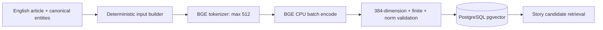

# WP 3.3 — English embedding design

## Quyết định đã duyệt

- Model local CPU: `BAAI/bge-small-en-v1.5`, output 384 chiều, context 512 tokens.
- Input English deterministic theo thứ tự `title`, canonical entity names đã sắp
  xếp, rồi phần đầu `cleaned_content`; không dùng raw HTML, tiếng Việt hoặc
  unresolved entity.
- Tokenizer đúng model cắt phần cuối khi vượt 512 tokens. Metadata giữ input hash,
  token count trước/sau và `truncated`.
- Model load một lần, batch mặc định 16, CPU concurrency mặc định 1 và tối đa 2.
- Vector được L2-normalize và kiểm tra dimension/finite values trước persistence.
- PostgreSQL+pgvector giữ immutable embedding version theo article/input/model;
  chưa tạo approximate vector index trong MVP.
- Mock adapter deterministic phục vụ test/demo. Runtime thật lỗi trả
  `EMBEDDING_FAILED`, không silently fallback.

## Data flow

Vector chỉ dùng để retrieval candidate. Event/category hard filters và rule engine
ở phase sau mới quyết định merge Story.

## Acceptance

Fixture cùng transfer phải gần nhau hơn injury và match. Benchmark thật ghi cold
load, warm latency cho một bài/batch 16, peak RSS và cosine matrix. Không đặt giả
định resource threshold trước khi có số đo trên máy local.
