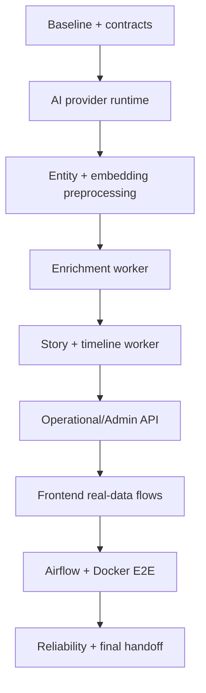

# FootballPulse MVP Completion Implementation Plan

> **For Codex:** REQUIRED SUB-SKILL: use `executing-plans`; execute tasks in
> dependency order, verify every slice, and do not claim completion without a
> fresh full-stack Docker run.

**Goal:** Hoàn thiện FootballPulse thành MVP local chạy thật từ crawl nguồn tin
đến AI enrichment, Story/timeline tiếng Việt, editorial publication và React UI.

**Architecture:** MongoDB giữ evidence/enrichment tiếng Anh; PostgreSQL+pgvector
giữ entity, vector, Story, timeline song ngữ, editorial và public read model.
Worker Python chạy theo batch idempotent; Airflow chỉ điều phối. Provider AI có
ba mode `mock`, `local`, `kaggle`; mock là baseline E2E không cần credential.

**Reference:** Pattern artifact lifecycle của
`/home/pmv259/Documents/experience_projects/news-aggregator`: tạo input → version
Kaggle Dataset → push Kernel → poll → download → import. FootballPulse bổ sung
timeout, terminal states, validation, retry và idempotency.

**Definition of complete:** Một lệnh Docker khởi động stack; một lệnh demo crawl
và xử lý ít nhất một article; dữ liệu đi qua MongoDB/PostgreSQL; API trả timeline
tiếng Việt; frontend hiển thị dữ liệu thật; unit/integration/E2E/build đều pass.

---

## Quy tắc thực thi

1. Không reset/xóa volume chứa dữ liệu của user; test destructive dùng database
   hoặc namespace riêng.
2. Mỗi task là một vertical slice: test fail → implementation → focused test →
   Docker smoke → commit nguyên tử.
3. Không log credential, raw body đầy đủ hoặc Kaggle token.
4. Mock provider phải chạy được khi offline; local/Kaggle là opt-in.
5. Sau mỗi phase, cập nhật `tasks/todo.md` và báo checkpoint ngắn. User đã cho
   phép tự triển khai/test; chỉ dừng khi cần credential, quota hoặc quyết định làm
   thay đổi phạm vi sản phẩm.

## Dependency graph



## Phase A — Baseline và đóng debt đã implement

### Task A1 — Baseline verification và trạng thái checklist

**Files:**
- Modify: `tasks/todo.md`
- Modify: `tasks/plan.md`
- Modify: `README.md`

**Work:** Chạy test/lint/type/build hiện có; phân loại lỗi thật, test cần infra và
docs stale. Xác minh WP 3.6 đã có local Qwen/mock fallback thay vì implement lại.

**Acceptance:** Có baseline số test pass/fail; checklist phản ánh code hiện tại;
không đánh dấu pass nếu chỉ có contract/mock.

**Verification:**

```bash
uv run pytest -q
uv run ruff format --check .
uv run ruff check .
uv run mypy
corepack pnpm --dir frontend install --frozen-lockfile
corepack pnpm --dir frontend build
docker compose --env-file .env config --quiet
```

### Task A2 — Chuẩn hóa runtime configuration

**Files:**
- Modify: `.env.example`
- Modify: `packages/runtime-config/src/footballpulse_runtime_config/settings.py`
- Modify: `docker-compose.yml`
- Test: `packages/runtime-config/tests/`
- Test: `tests/infrastructure/test_compose_contract.py`

**Work:** Khóa tên biến cho Mongo/Postgres/Kafka/AI provider/model/Kaggle, safe
defaults và validation. `.env` của user chỉ được bổ sung key thiếu, không ghi đè
secret.

**Acceptance:** `mock` chạy không credential; `local` báo rõ model path thiếu;
`kaggle` báo rõ credential/slug thiếu; Compose render được cho từng profile.

## Phase B — AI provider và enrichment chạy thật

### Task B1 — Wire provider factory vào AI service

**Files:**
- Modify: `services/ai-content-service/src/footballpulse_ai_content_service/server.py`
- Modify: `services/ai-content-service/src/footballpulse_ai_content_service/providers/factory.py`
- Modify: `services/ai-content-service/src/footballpulse_ai_content_service/providers/config.py`
- Test: `services/ai-content-service/tests/test_api.py`
- Test: `services/ai-content-service/tests/test_provider_config.py`

**Work:** Bỏ nhánh runtime chỉ dùng deterministic excerpt; tạo provider theo
environment. Giữ deterministic provider cho `mock/demo`, lazy-load Qwen GGUF cho
`local`, và fail-fast có thông báo với cấu hình sai.

**Acceptance:** API trả model/prompt metadata đúng provider; không gọi model lúc
healthcheck; một article crawl thật qua mock API thành batch terminal hợp lệ.

**Verification:** focused pytest; build image; `curl /health`; submit/poll batch.

### Task B2 — Hoàn thiện Kaggle execution lifecycle

**Files:**
- Modify: `services/ai-content-service/src/footballpulse_ai_content_service/batch/coordinator.py`
- Modify: `services/ai-content-service/src/footballpulse_ai_content_service/batch/kaggle_cli.py`
- Modify: `services/ai-content-service/src/footballpulse_ai_content_service/batch/importer.py`
- Modify: `services/ai-content-service/src/footballpulse_ai_content_service/persistence/mongo_batch_repository.py`
- Test: corresponding `test_batch_*`, `test_kaggle_cli.py`, integration test

**Work:** Dataset version → Kernel push → bounded poll → output download → hash/
schema validation → partial import. Persist every state and retry reason.

**Acceptance:** Mock CLI covers complete/error/timeout/partial/corrupt output;
restart resumes durable batch; duplicate submission returns same batch. Live
Kaggle smoke chỉ chạy nếu credential hiện có.

### Task B3 — Mongo article-to-enrichment worker

**Files:**
- Create: `services/ai-content-service/src/footballpulse_ai_content_service/worker.py`
- Create: `services/ai-content-service/src/footballpulse_ai_content_service/application/enrichment_worker.py`
- Modify: `services/ai-content-service/src/footballpulse_ai_content_service/persistence/mongo_batch_repository.py`
- Create: `services/ai-content-service/tests/test_enrichment_worker.py`
- Modify: `docker-compose.yml`

**Work:** Lease các Source Article `SUCCESS` chưa enrich, tạo bounded batch, gọi
provider, validate grounding và upsert `article_enrichments`. Retry được sau crash
và không xử lý lại cùng `article_version_id + input_hash + model_version`.

**Acceptance:** 10 article/source không tạo duplicate enrichment; failed article
có reason redacted; log hiển thị batch/article progress trong Docker.

## Phase C — Entity, embedding, Story và timeline

### Task C1 — Intelligence worker: entity và embedding

**Files:**
- Create: `services/intelligence-service/src/footballpulse_intelligence_service/worker.py`
- Modify: existing `application/entity_worker.py`
- Modify: existing `application/embedding_pipeline.py`
- Create: `services/intelligence-service/tests/test_intelligence_worker_runtime.py`
- Modify: `docker-compose.yml`

**Work:** Đọc Source Article hợp lệ trước bước AI, chạy GLiNER/catalog alias,
alias resolution, BGE/mock, persist vector vào PostgreSQL và projection entity
vào MongoDB. Không tự tạo canonical entity từ model output. Projection này là
đầu vào grounded cho enrichment worker ở Task B3.

**Acceptance:** Vector đúng 384 chiều; resolved/unresolved inspectable; duplicate
delivery idempotent; real model acceptance là opt-in vì phải tải model.

### Task C2 — Enrichment-to-Story orchestration

**Files:**
- Modify: `application/story_matching_worker.py`
- Modify: `application/story_matching.py`
- Modify: persistence repositories under intelligence service
- Test: `test_story_matching_worker.py`
- Test: PostgreSQL integration tests

**Work:** Chuyển validated claims/entity/vector thành candidate retrieval,
attach/create/review decision, source/claim links và confirmation state.

**Acceptance:** Có score audit; incompatible category không merge; replay không
tạo Story/claim/source duplicate.

### Task C3 — Material-change và timeline song ngữ

**Files:**
- Modify: `application/timeline_writer.py`
- Modify: `domain/material_change.py`
- Modify: `domain/timeline_projection.py`
- Test: material change/timeline tests
- Test: PostgreSQL integration test

**Work:** Gom theo cửa sổ Asia/Ho_Chi_Minh 00/06/12/18, tạo `summary_en` và
`summary_vi`, ghi used claim/source IDs. Không ghi row khi chỉ đổi wording hoặc
không có fact/confirmation mới.

**Acceptance:** Fixture 00/06/12 tạo entry; 18h không tạo; concurrent/replay vẫn
chỉ một row cho `(story_id, window_start)`.

## Phase D — API vận hành, editorial và frontend

### Task D1 — Operational read model và Admin API

**Files:**
- Modify: `services/api-gateway/src/footballpulse_api_gateway/api/editorial_admin.py`
- Modify: `application/editorial_admin_adapter.py`
- Modify/Create: gateway persistence read models
- Test: admin API/adapter tests

**Work:** Expose batch/source/article/enrichment/Story/timeline states, failure
reason, retry/reprocess actions và counts. RBAC + idempotency bắt buộc.

**Acceptance:** Admin xem được đường đi của một article; retry không nhân đôi;
EDITOR không gọi action ADMIN-only.

### Task D2 — Public API completeness

**Files:**
- Modify: `api/public.py`
- Modify: `persistence/public_read_repository.py`
- Test: `test_public_api.py`
- Test: public repository integration test

**Work:** Hoàn thiện pagination/search/entity chips/source metadata, Story detail,
Vietnamese timeline và published article projection.

**Acceptance:** Public endpoint không đọc chéo Mongo; response chỉ dùng public
projection/PostgreSQL; OpenAPI examples khớp runtime.

### Task D3 — Admin operations UI

**Files:**
- Modify: `frontend/src/api/*`
- Modify: `frontend/src/pages/admin/AdminDashboard.tsx`
- Modify: `AdminArticlesPage.tsx`, `AdminErrorsPage.tsx`, `AdminSourcesPage.tsx`
- Add browser tests under `frontend/e2e/`

**Work:** Dùng API thật cho batch/source/article/failure drill-down, trigger crawl,
retry/reprocess với confirm và loading/error states.

**Acceptance:** Không silent mock fallback khi API configured; JWT được dùng;
browser test hoàn thành một admin operational flow.

### Task D4 — Editorial và Story correction UI

**Files:**
- Modify: `AdminDraftPage.tsx`, `AdminStoryPage.tsx`, `AdminPublishedPage.tsx`
- Modify: frontend API hooks/types
- Add browser tests

**Work:** Evidence/claim/source view, EN/VI diff, edit/review/approve/reject/
publish và bounded entity/Story reassignment theo API đã có.

**Acceptance:** Draft thật đi tới publication; stale/conflict hiển thị rõ; public
article xuất hiện sau publish.

## Phase E — Airflow, Docker và observability

### Task E1 — Airflow enrichment/reprocess chạy worker thật

**Files:**
- Modify: `airflow/dags/footballpulse_ai_enrichment.py`
- Modify: `airflow/dags/footballpulse_ai_reprocess.py`
- Modify: Airflow tests/README

**Work:** Trigger batch bằng HTTP contract, poll terminal state, truyền manual
reprocess parameters và không truy cập DB service khác trực tiếp.

**Acceptance:** DAG mock tests cover success/partial/error/timeout; một manual
Docker DAG run tạo enrichment thật.

### Task E2 — Full Docker topology và readiness

**Files:**
- Modify: `docker-compose.yml`
- Modify/Create: service Dockerfiles
- Modify: `.env.example`
- Create: `scripts/start-local.sh`
- Create: `scripts/smoke-full-stack.sh`
- Modify: Compose contract tests

**Work:** Thêm article/AI/intelligence/content/outbox workers cần thiết, profiles,
healthchecks, dependency ordering, resource limits và persistent volumes.

**Acceptance:** Cold start từ images thành công; tất cả long-running services
healthy; one-shot jobs exit 0; log theo dõi được crawl/AI/Story/publish.

### Task E3 — Structured logs và operator visibility

**Files:** runtime config/logging modules, worker entrypoints, operational docs

**Work:** JSON log fields `batch_id`, `article_version_id`, `story_id`, stage,
duration, outcome; redaction; graceful shutdown; batch summary.

**Acceptance:** `docker compose logs -f` đủ xác định bài lỗi ở stage nào mà không
cần query DB thủ công.

## Phase F — Full acceptance và bàn giao

### Task F1 — Offline deterministic E2E

**Files:**
- Create/Modify: `tests/end-to-end/`
- Replace/extend: `scripts/offline-demo.sh`

**Work:** Reset test namespace → ingest 00/06/12/18 fixtures → enrich → Story →
timeline → editorial → publish → public API.

**Acceptance:** 18h không thêm timeline; retry/replay không duplicate; toàn bộ
chạy không Internet/credential trong Docker.

### Task F2 — Real-source smoke E2E

**Files:**
- Create: `scripts/real-source-demo.sh`
- Modify: crawler/AI operational docs

**Work:** Crawl tối đa 10 bài mỗi nguồn đã bật (Reuters bỏ qua), xử lý ít nhất một
bài qua mock/local/Kaggle provider đang available, kiểm tra Mongo/Postgres/API/UI.

**Acceptance:** Báo success/failure từng source; không tuyên bố nguồn pass nếu
content extraction rỗng/sai domain; lưu exact IDs để user kiểm tra.

### Task F3 — Reliability, restart và concurrency

**Files:** integration/recovery tests, `docs/reliability.md`

**Work:** Crash-after-write, duplicate event, provider timeout, corrupt Kaggle
output, concurrent Story/timeline/publication và worker restart.

**Acceptance:** Không mất evidence, không duplicate product rows, failed jobs có
retry/terminal state đúng.

### Task F4 — Browser, performance và final docs

**Files:** frontend E2E, load script, README/deployment/testing/final-handoff

**Work:** Playwright public/admin journeys; measure local p50/p95/error/resource;
ghi commands đã chạy thật và limitations.

**Final verification:**

```bash
uv run pytest -q
uv run ruff format --check .
uv run ruff check .
uv run mypy
corepack pnpm --dir frontend build
docker compose --env-file .env --profile core --profile app --profile airflow up -d --build
./scripts/smoke-full-stack.sh
./scripts/offline-demo.sh
./scripts/real-source-demo.sh
docker compose ps
```

Sau đó chạy browser E2E, kiểm tra DB invariants và thu log/container stats. Chỉ
khi toàn bộ baseline bắt buộc pass mới báo user kiểm tra.

## Credential/artifact có thể cần user cung cấp

- Kaggle: `KAGGLE_USERNAME`, `KAGGLE_KEY`, dataset slug và kernel slug nếu live
  acceptance không dùng được credential hiện có.
- Local Qwen: đường dẫn file GGUF hợp lệ nếu user muốn benchmark local model thật.
- Hugging Face: chỉ cần token nếu model chọn bị gated; GLiNER/BGE public không bắt
  buộc token.

Thiếu các mục trên không chặn offline MVP; chỉ làm các acceptance tương ứng thành
`SKIPPED_WITH_REASON`, không giả lập là live pass.

## Out of scope để tránh không bao giờ hoàn thành

- Kubernetes/cloud deployment, HA database, production secrets manager.
- Recommendation/social/live scores/SSR/search cluster riêng.
- Tự động publish bài dài không qua editorial approval.
