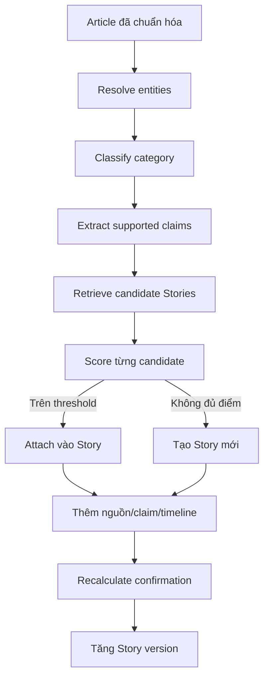

# Thiết kế Story

## 1. Vai trò của Story

Story là mô hình của **một sự kiện bóng đá đang phát triển**, không phải folder
chứa các bài giống nhau. Nó kết hợp entity, category, claims, nguồn và timeline
để biểu diễn điều hệ thống biết tại từng thời điểm.

Ví dụ: “CLB A quan tâm cầu thủ X”, “CLB A gửi đề nghị” và “CLB B xác nhận chuyển
nhượng” có thể là ba bước của cùng một transfer Story. Một bài về chấn thương
của X vẫn là Story khác vì category và event intent khác.

## 2. Pipeline cập nhật Story



## 3. Candidate retrieval và scoring

MVP dùng quy tắc giải thích được thay vì embedding. Candidate được giới hạn bởi
time window và category compatibility, sau đó chấm theo:

- trùng primary player, club, coach hoặc competition;
- overlap entity có trọng số;
- similarity của normalized title tokens;
- key action/claim tương thích;
- khoảng cách thời gian;
- stable fingerprint từ category và entity chính.

Không dùng một ngưỡng duy nhất chưa đo để mô tả như fact. Threshold và trọng số
phải được hiệu chỉnh bằng fixture, lưu reason breakdown và đưa vào
[Open Questions](open-questions.md) cho tới khi có bằng chứng test.

## 4. Claims

Claim là đơn vị sự thật nhỏ nhất mà hệ thống có thể dẫn nguồn. Ví dụ:

```text
subject: Club A
predicate: interested_in
object: Player X
confirmation: REPORTED
sources: [article-01]
```

Một article có thể bổ sung claim mới hoặc nguồn support mới cho claim cũ. Claim
key được chuẩn hóa để chống duplicate delivery, nhưng qualifier quan trọng như
giá trị đề nghị hoặc trạng thái “bị từ chối” phải tạo khác biệt có chủ đích.

## 5. Confirmation

- `RUMOUR`: suy đoán/tin đồn chưa có nguồn báo chí đủ rõ.
- `REPORTED`: ít nhất một nguồn đưa tin rõ ràng nhưng chưa chính thức.
- `MULTI_SOURCE`: nhiều nguồn độc lập hỗ trợ cùng claim cốt lõi.
- `OFFICIAL`: nguồn có thẩm quyền xác nhận sự kiện tương ứng.

Số lượng bài không tự động đồng nghĩa nhiều nguồn độc lập; syndicated copy và
exact duplicate chỉ là một cụm bằng chứng. Một official article chỉ nâng những
claim nó xác nhận, không biến mọi chi tiết rumor trước đó thành official.

## 6. Timeline và version

Timeline entry được tạo khi có thay đổi có ý nghĩa: claim mới, confirmation đổi,
official update hoặc editor correction. Mỗi update hợp lệ tăng Story version.
Generation request dùng cặp `(story_id, story_version)` để draft luôn gắn với
một snapshot xác định.

## 7. Concurrency và thao tác editor

Khi hai article cùng lúc tạo/cập nhật Story, stable fingerprint, unique links,
unique claim keys và optimistic version ngăn duplicate/lost update. Conflict
được đọc lại và retry có giới hạn.

Editor có thể merge hai Story, reassign Source Article hoặc sửa entity mapping.
Thao tác phải lưu actor, reason, before/after và phát thay đổi để projection hoặc
draft liên quan được đánh dấu stale; không sửa âm thầm lịch sử bằng chứng.
