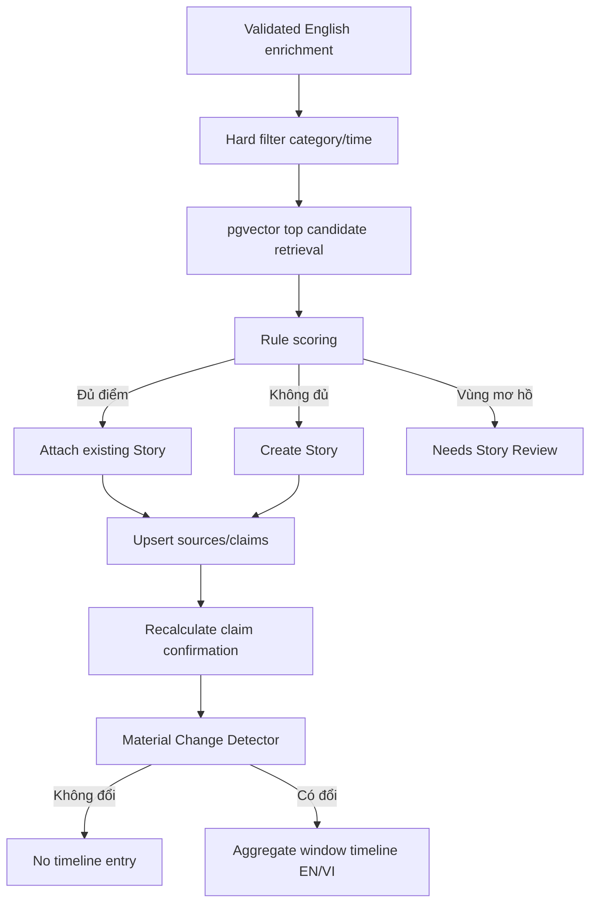

# Thiết kế Story và timeline

## 1. Story là trung tâm

Story mô hình hóa một sự kiện bóng đá đang phát triển, không chỉ là nhóm bài có
từ khóa giống nhau. “Quan tâm”, “liên hệ”, “gửi đề nghị” và “hoàn tất chuyển
nhượng” có thể là các bước của cùng Story; injury hoặc match cùng cầu thủ vẫn là
Story khác.

## 2. Pipeline cập nhật



## 3. Hybrid candidate matching

Candidate retrieval gồm ba lớp:

1. Hard filter theo event category, time window và Story lifecycle.
2. `pgvector` lấy tập nhỏ Story gần nhất bằng English embedding.
3. Rule engine chấm lại primary entity, entity overlap, predicate/qualifier,
   source independence, title/claim compatibility và khoảng cách thời gian.

Vector không được tự merge Story. Category xung đột loại candidate dù cosine
similarity cao. Score breakdown được lưu để editor hiểu quyết định; threshold
được hiệu chỉnh bằng fixture, không chọn tùy ý rồi mô tả như fact.

## 4. Canonical entities

GLiNER tìm mention; alias resolver quyết định canonical ID từ catalog seed trong
PostgreSQL. Ví dụ `Vini Jr`, `Vinicius Junior`, `Vinícius Júnior` cùng ánh xạ
`player-vinicius-junior`. Qwen chỉ dùng canonical IDs hoặc trả
`unresolved_entity`; model không tự tạo entity chuẩn.

## 5. Predicate vocabulary

Predicate được kiểm soát và version, không để model sinh tên tự do. Baseline:

| Category | Predicates chính |
| --- | --- |
| TRANSFER | `INTERESTED_IN`, `CONTACTED`, `NEGOTIATING`, `SUBMITTED_BID`, `BID_REJECTED`, `BID_ACCEPTED`, `AGREEMENT_REACHED`, `TRANSFER_COMPLETED`, `CONTRACT_RENEWED` |
| INJURY | `INJURED`, `DIAGNOSED`, `RECOVERY_UPDATE`, `RETURNED_TO_TRAINING`, `AVAILABLE_TO_PLAY` |
| MATCH | `MATCH_SCHEDULED`, `LINEUP_CONFIRMED`, `MATCH_STARTED`, `GOAL_SCORED`, `MATCH_FINISHED` |
| PRESS_CONFERENCE | `COMMENTED_ON`, `CONFIRMED`, `DENIED` |
| OFFICIAL_ANNOUNCEMENT | `ANNOUNCED`, `CONFIRMED`, `DENIED`, `CORRECTED` |

Official article về transfer vẫn có thể tạo predicate cụ thể như
`TRANSFER_COMPLETED`; `OFFICIAL_ANNOUNCEMENT` không thay thế event intent.
Hành động chưa biết dùng `OTHER` và review, không tự mở rộng enum.

## 6. Claim và confirmation

Claim gồm subject, predicate, object, qualifiers, confirmation và evidence
quotes/source IDs. Mức xác thực:

- `RUMOUR`: nguồn mô tả tin đồn/suy đoán.
- `REPORTED`: một nguồn trực tiếp đưa claim rõ ràng.
- `MULTI_SOURCE`: ít nhất hai nguồn độc lập hỗ trợ cùng claim.
- `OFFICIAL`: nguồn có thẩm quyền xác nhận đúng claim đó.

Exact duplicate, syndicated copy hoặc bài chỉ dẫn lại một nguồn không được tính
thành nguồn độc lập. Official denial tạo claim phủ định/correction chính thức;
nó không biến claim rumor trước đó thành official.

## 7. Material Change Detector

Change Detector dùng rule trên canonical claims, không giao quyền quyết định cho
LLM. Material change gồm:

- claim mới;
- predicate/qualifier thay đổi, ví dụ giá `180m → 150m`;
- correction hoặc denial;
- confirmation của claim tăng/giảm theo policy.

Nếu không đổi, Story vẫn nhận source support nhưng không tăng timeline. Summary
khác câu chữ không được xem là thay đổi.

## 8. Cửa sổ timeline

Airflow chạy theo `00:00`, `06:00`, `12:00`, `18:00` tại Việt Nam. Một Story có
tối đa một aggregated entry cho mỗi cửa sổ 6 giờ. Entry tổng hợp các material
changes theo thời gian, nhưng vẫn giữ source publication times và claim IDs.

Ví dụ:

```text
00:00 — Real Madrid đang đàm phán gia hạn với Vinícius.
06:00 — Arsenal đã liên hệ với đại diện Vinícius.
12:00 — Arsenal được cho là đã gửi đề nghị €180m; nhiều nguồn xác nhận.
18:00 — Không có thay đổi → không tạo entry.
```

English timeline là dữ liệu chuẩn; Vietnamese timeline là projection phục vụ
API. Translation có version và validation; thay đổi bản Việt không làm đổi
claim, embedding hoặc Story match.

## 9. Concurrency và correction

Unique fingerprint/link/claim/window keys và optimistic Story version ngăn
duplicate Story, lost update và timeline lặp. Conflict được đọc lại và retry có
giới hạn. Merge, reassign, alias correction và confirmation correction phải lưu
actor, reason, before/after; các draft liên quan được đánh dấu stale.
